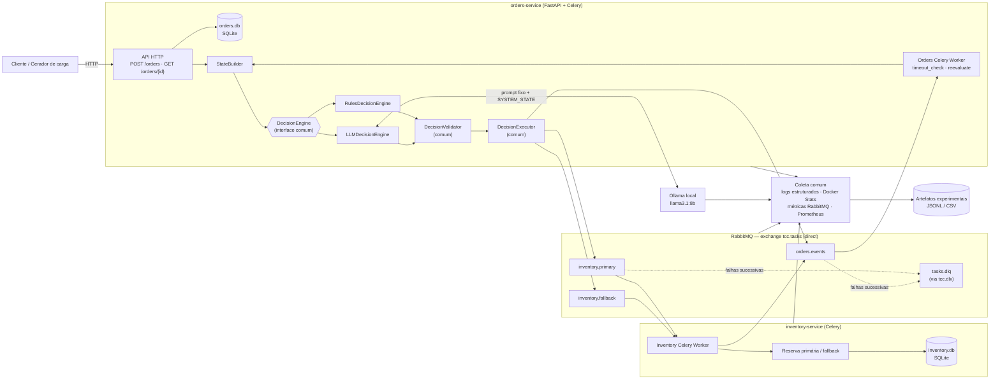
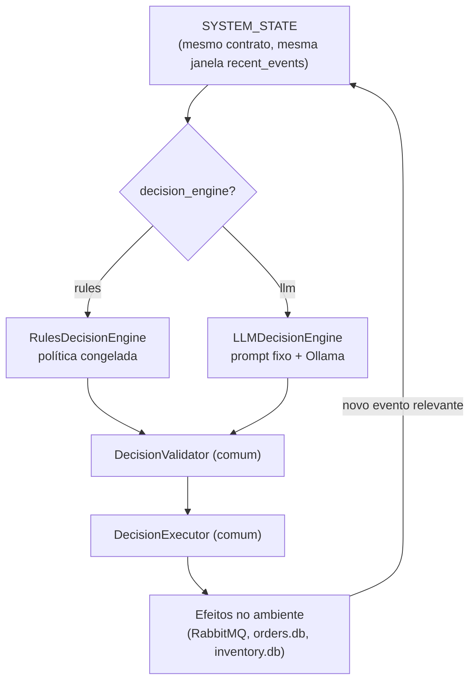

# 02 — Arquitetura

> Fonte: `TCC_METODOLOGIA.pdf` §4.3, §4.3.1, FIGURA 7; `piloto-do-experimento.md` §3–4;
> [`CLAUDE.md`](../CLAUDE.md) §4.

## 2.1 Princípio arquitetural

A arquitetura possui **exatamente dois microsserviços de negócio**:

- `orders-service` — recebe, valida e coordena o pedido; hospeda a **camada de coordenação
  decisória**.
- `inventory-service` — realiza a reserva simulada (rota primária ou fallback).

`StateBuilder`, `DecisionEngine`, `RulesDecisionEngine`, `LLMDecisionEngine`,
`DecisionValidator` e `DecisionExecutor` **não são microsserviços**: são módulos internos da
camada de coordenação do `orders-service`. Isso preserva o recorte de dois serviços exigido
pela metodologia.

Cada serviço tem **seu próprio SQLite**. Não há banco compartilhado e nenhum serviço acessa
o banco do outro (ver [08-modelo-de-dados-mer.md](08-modelo-de-dados-mer.md), RNF-003).

## 2.2 Diagrama de arquitetura



**A arquitetura física é idêntica nas duas condições.** A única troca é `DE --> RULES` ou
`DE --> LLM`, definida por `decision_engine` na configuração.

## 2.3 Componentes e responsabilidades

### 2.3.1 `orders-service`

1. Receber e validar a solicitação de pedido (`POST /orders`).
2. Persistir o pedido e a tarefa no seu SQLite; atribuir `order_id` e `task_id`.
3. Manter o estado lógico do processamento.
4. Coordenar os **pontos de decisão** (ver [06 §6.7](06-modelo-de-decisao.md)).
5. Acionar o `StateBuilder` para construir o `SYSTEM_STATE`.
6. Chamar o motor de decisão selecionado (`RulesDecisionEngine` **ou** `LLMDecisionEngine`).
7. Submeter a decisão ao `DecisionValidator` comum.
8. Executar a ação validada via `DecisionExecutor` comum.
9. Publicar solicitações para o `inventory-service` (RabbitMQ).
10. Consumir eventos de retorno de `orders.events`.
11. Detectar **timeout operacional** (ausência de evento de conclusão dentro do limite).
12. Concluir (`COMPLETED`) ou abortar (`ABORTED`) a tarefa.
13. Produzir rastreabilidade (`states.jsonl`, `decisions.jsonl`, `task_events.jsonl`, …).

### 2.3.2 `inventory-service`

1. Consumir solicitações de reserva de `inventory.primary` / `inventory.fallback`.
2. Validar o envelope e os dados da reserva.
3. Detectar reentrega (redelivery) por `message_id` — **idempotência de transporte**.
4. Impedir segunda reserva para o mesmo `task_id` — **idempotência de negócio**.
5. Realizar a reserva **simulada** e persistir em `inventory.db`.
6. Executar a rota primária ou a rota fallback (mesmo serviço).
7. Publicar evento de sucesso ou falha em `orders.events`.
8. Registrar eventos e erros para rastreabilidade.

### 2.3.3 Camada de coordenação do `orders-service`

| Módulo | Responsabilidade | Não faz |
|---|---|---|
| `StateBuilder` | Coletar, correlacionar e normalizar sinais em um `SYSTEM_STATE`; atribuir `state_id`; selecionar a janela `recent_events`; registrar em `states.jsonl` | Não escolhe ação |
| `DecisionEngine` | Interface comum `decide(state) -> Decision` | — |
| `RulesDecisionEngine` | Política determinística e ordenada sobre o `SYSTEM_STATE` | Não executa a ação; não usa contexto além do `SYSTEM_STATE` |
| `LLMDecisionEngine` | Montar prompt fixo + estado, chamar Ollama, exigir resposta estruturada | Não mantém memória conversacional; não executa a ação |
| `DecisionValidator` | Validação determinística (ação, target, `reason_code`, limites) — **o mesmo para Rules e LLM** | Não corrige a decisão |
| `DecisionExecutor` | Traduzir a decisão validada em operação do ambiente | Não decide; não reinterpreta a saída do LLM |

### 2.3.4 Infraestrutura

| Componente | Papel | Não é |
|---|---|---|
| RabbitMQ | Broker; intermedeia toda a comunicação assíncrona Orders ↔ Inventory; filas para rota primária, fallback, eventos e DLQ | Não decide políticas de orquestração |
| Celery | Executa tarefas assíncronas sobre RabbitMQ (workers, dispatch, agendamento interno) | Não é o mecanismo de decisão; `autoretry` **não** é usado para o `RETRY` experimental |
| Ollama | Runtime local do `LLMDecisionEngine` (`llama3.1:8b`) | Não tem acesso a shell, Docker, SQLite ou arquivos do host |
| Prometheus / Docker Stats / métricas RabbitMQ | Instrumentação **comum** às duas abordagens | Não fornece informação operacional adicional a uma das abordagens |

Detalhes em [03-stack-tecnologica.md](03-stack-tecnologica.md).

## 2.4 Princípio de equivalência (comparabilidade)



Consequências práticas (RNF-001, RNF-002, RNF-009 a RNF-013, RNF-019, RNF-029):

- A camada de observação que alimenta o `StateBuilder` é a mesma nas duas condições.
- O `LLM` **não** recebe mais contexto que o `Rules` sem justificativa metodológica.
- O `Validator` e o `Executor` são **um só** — não há versão "especial para LLM".
- O tamanho e a política de `recent_events` são idênticos.
- A instrumentação é comum e não altera a variável experimental.

## 2.5 Fluxo funcional mínimo (caminho feliz)

```
POST /orders
  → orders-service: validar + persistir pedido + tarefa
  → StateBuilder → SYSTEM_STATE
  → DecisionEngine → CONTINUE
  → DecisionValidator (valid) → DecisionExecutor
  → RabbitMQ (tcc.tasks / inventory.primary)
  → inventory-service: idempotência → reserva simulada → persistir
  → RabbitMQ (orders.events) : STOCK_RESERVATION_SUCCEEDED
  → orders-service: consumir evento terminal de sucesso
  → Task = COMPLETED  →  Order = COMPLETED
```

Quando o evento recebido é terminal e representa sucesso, **não** é necessário consultar o
`DecisionEngine` novamente.

O primeiro objetivo de implementação é fazer esse caminho funcionar de ponta a ponta
**antes** de adicionar idempotência avançada, LLM, falhas e instrumentação
(`piloto-do-experimento.md` §28–29, §37; [`CLAUDE.md`](../CLAUDE.md) §29, §48).

## 2.6 Estrutura de diretórios do projeto (sugerida)

> Fonte: `piloto-do-experimento.md` §22; metodologia Quadro 4. A pasta
> `services/orders/app/orchestration/` **não** é um terceiro microsserviço.

```
rule2llm-orch-lab/
├── docker-compose.yml
├── config/
│   ├── experiment_config.yml        # fonte de verdade dos parâmetros
│   ├── scenarios/                   # normal.yml, overload.yml, intermittent_failure.yml, timeout.yml, ...
│   ├── rabbitmq/definitions.json
│   └── prometheus/prometheus.yml
├── contracts/
│   ├── message_envelope.schema.json
│   ├── decision.schema.json
│   └── system_state.schema.json
├── services/
│   ├── orders/app/
│   │   ├── api/                     # orders.py
│   │   ├── db/                      # connection.py, models.py, repositories.py
│   │   ├── messaging/               # celery_app.py, publisher.py, consumers.py
│   │   ├── orchestration/           # state_builder.py, decision_engine.py, rules_engine.py,
│   │   │                            # llm_engine.py, validator.py, executor.py, decision.py
│   │   ├── tasks/                   # timeout_check.py, reevaluate.py
│   │   └── observability/           # logger.py
│   └── inventory/app/
│       ├── db/                      # connection.py, models.py, repositories.py
│       ├── messaging/               # celery_app.py, consumers.py, publisher.py
│       ├── reservation/             # primary.py, fallback.py
│       └── observability/           # logger.py
├── datasets/orders_v1.json
├── scripts/
│   ├── reset_environment.py
│   ├── readiness.py
│   ├── workload/generate_load.py
│   ├── faults/                      # timeout.py, intermittent_failure.py, overload.py, inconsistent_data.py
│   └── pilot/
├── data/
│   ├── pilot/
│   └── experiment/
└── tests/
    ├── unit/  integration/  contracts/
```
