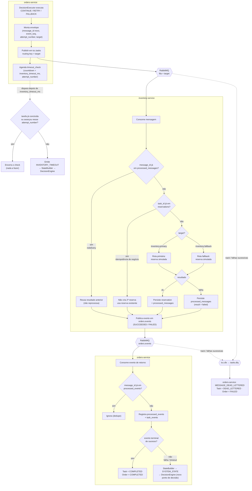

# 04 — Contrato de mensageria

> Fonte: `TCC_METODOLOGIA.pdf` §4.3 (Código 1), §4.3.2; `piloto-do-experimento.md` §6–10, §24;
> [`CLAUDE.md`](../CLAUDE.md) §7–10.

## 4.1 Topologia lógica

```
Exchange principal : tcc.tasks        (tipo: direct)
Dead-letter exchange: tcc.dlx

Routing key / fila:
  - inventory.primary
  - inventory.fallback
  - orders.events

DLQ:
  - tasks.dlq   (vinculada via tcc.dlx)
```

| Fila | Produtor | Consumidor | Finalidade |
|---|---|---|---|
| `inventory.primary` | `orders-service` (`DecisionExecutor`) | `inventory-service` | Rota normal de reserva |
| `inventory.fallback` | `orders-service` (`DecisionExecutor`) | `inventory-service` | Rota alternativa **do mesmo serviço** |
| `orders.events` | `inventory-service` + eventos internos de coordenação | `orders-service` | Retorno do estoque e eventos internos |
| `tasks.dlq` | `tcc.dlx` (roteamento automático) | Análise experimental | Mensagens que não puderam permanecer no fluxo normal |

**Não** criar novos microsserviços para representar o fallback: `inventory.fallback` é uma
rota lógica do próprio `inventory-service` (ver [06 §6.5](06-modelo-de-decisao.md)).

## 4.2 Envelope lógico versionado

Toda mensagem de negócio usa este envelope:

```json
{
  "schema_version": "1.0",
  "execution_id": "EXP_0042",
  "message_id": "MSG_0192",
  "task_id": "TASK_0187",
  "event_type": "STOCK_RESERVATION_REQUESTED",
  "event_seq": 2,
  "attempt_number": 1,
  "published_at": "2026-08-27T12:00:00.000Z",
  "decision_id": "DEC_0091",
  "target": "inventory.primary",
  "payload": {
    "order_id": "ORD_0187",
    "items": [
      { "sku": "SKU-001", "quantity": 2 }
    ]
  }
}
```

| Campo | Obrigatório | Papel |
|---|---|---|
| `schema_version` | sim | Versão do contrato lógico da mensagem |
| `execution_id` | sim | Associa a mensagem à execução experimental |
| `message_id` | sim | Identifica **a mensagem** — base da idempotência de transporte |
| `task_id` | sim | Correlaciona todos os eventos da **mesma tarefa** — base da idempotência de negócio |
| `event_type` | sim | Semântica do evento (ver §4.6) |
| `event_seq` | sim | Sequência lógica local por tarefa (ver §4.4) |
| `attempt_number` | sim | Tentativa lógica do fluxo |
| `published_at` | sim | Tempo físico de publicação (UTC, ISO 8601) |
| `decision_id` | condicional | Decisão que originou a mensagem (quando aplicável) |
| `target` | condicional | Rota lógica selecionada (`inventory.primary` \| `inventory.fallback`) |
| `payload` | sim | Dados mínimos necessários ao processamento |

O contrato **não** permite instruções arbitrárias, comandos de shell, código ou consultas
diretas ao RabbitMQ/SQLite dentro do envelope.

Schema: `contracts/message_envelope.schema.json`.

## 4.3 Política de ordenação

- **Não** há garantia de ordenação global do sistema (RNF-016).
- A unidade relevante é a **tarefa**. Para cada `task_id`, `event_seq = 1, 2, 3, …`,
  monotonicamente crescente dentro da trajetória.

## 4.4 `event_seq` **não é** relógio de Lamport

`event_seq` é apenas a sequência lógica local da aplicação por tarefa. Não implementa
relógio lógico nem inferência de causalidade distribuída (RNF-017). A reconstrução da
trajetória usa duas referências temporais distintas:

- `published_at` / `timestamp` — instante físico observado;
- `event_seq` — posição lógica local do evento na tarefa.

## 4.5 Redelivery **não é** `RETRY`

Distinção obrigatória ([`CLAUDE.md`](../CLAUDE.md) §9; `piloto-do-experimento.md` §7.4).

### Redelivery do broker
A **mesma** mensagem é entregue novamente pelo RabbitMQ. Preserva tudo:

```
message_id      = igual
task_id         = igual
event_seq       = igual
attempt_number  = igual
redelivered     = true
```

### `RETRY` decidido pelo orquestrador
Nova **tentativa lógica** decidida pelo `DecisionEngine`:

```
message_id      = novo
task_id         = igual
event_seq       = novo
attempt_number  = anterior + 1
target          = mesmo target da etapa atual
```

O `RETRY` experimental **nunca** é delegado ao `autoretry` do Celery.

## 4.6 Eventos mínimos

> Fonte: `piloto-do-experimento.md` §24. Conjunto estável durante a coleta definitiva.

| Evento | Origem | Significado |
|---|---|---|
| `ORDER_CREATED` | orders | Pedido persistido |
| `TASK_CREATED` | orders | Tarefa criada e associada ao pedido |
| `STOCK_RESERVATION_REQUESTED` | orders → inventory | Solicitação de reserva publicada |
| `STOCK_RESERVATION_SUCCEEDED` | inventory → orders | Reserva efetivada (evento terminal de sucesso) |
| `STOCK_RESERVATION_FAILED` | inventory → orders | Reserva falhou |
| `INVENTORY_TIMEOUT` | orders (interno) | Nenhum evento de conclusão dentro de `inventory_timeout_ms` |
| `TRANSIENT_ERROR` | inventory / orders | Falha transitória observada |
| `WAIT_SCHEDULED` | orders | Ação `WAIT` agendada |
| `WAIT_FINISHED` | orders | Fim da espera; nova avaliação do estado |
| `RETRY_SCHEDULED` | orders | Nova tentativa lógica agendada |
| `FALLBACK_SCHEDULED` | orders | Troca para `inventory.fallback` agendada |
| `TASK_COMPLETED` | orders | Tarefa concluída |
| `TASK_ABORTED` | orders | Tarefa encerrada de forma controlada |
| `MESSAGE_DEAD_LETTERED` | broker / orders | Mensagem encaminhada à `tasks.dlq` |

## 4.7 Idempotência

Duas proteções **conceitualmente distintas** ([`CLAUDE.md`](../CLAUDE.md) §10;
`piloto-do-experimento.md` §8).

### 4.7.1 Idempotência de transporte — base `message_id`
Uma redelivery da mesma mensagem não pode repetir o efeito já confirmado.
Implementação: tabela `processed_messages` (inventory) / `processed_events` (orders), com
`message_id` como chave primária (ver [08](08-modelo-de-dados-mer.md)).

### 4.7.2 Idempotência de negócio — base `task_id`
Uma **nova tentativa lógica** (`RETRY`) tem `message_id` novo — proteger só `message_id`
não basta. O `inventory-service` deve garantir que uma tarefa **já reservada** não reserve
novamente.
Implementação: `reservations.task_id UNIQUE`.

Caso coberto:

```
Inventory efetivou a reserva
+ o evento de resposta se perdeu
+ Orders decidiu RETRY
=  NÃO produz uma segunda reserva
```

## 4.8 Diagrama de atividades da mensageria

Raias lógicas: **orders-service**, **RabbitMQ**, **inventory-service**. Mostra o percurso de
uma mensagem de reserva, as duas verificações de idempotência, a rota primária/fallback, o
evento de retorno, a corrida com o `timeout_check` e o roteamento para a DLQ.



Notas:

- `timeout` aqui é **operacional** (Orders publicou uma tentativa e não recebeu o evento de
  conclusão dentro do limite), **não** timeout de chamada HTTP síncrona.
- O `timeout_check` verifica `attempt_number` para não agir sobre uma tentativa já superada
  (evita agir em cima de um `RETRY` mais recente).
- A `tasks.dlq` serve para análise experimental; mensagens nela não retornam ao fluxo normal.

## 4.9 Fluxo em caso de timeout (resumo)

```
DISPATCH → (nenhuma resposta em inventory_timeout_ms) → INVENTORY_TIMEOUT
  → StateBuilder → SYSTEM_STATE → DecisionEngine
      ├── RETRY     (novo message_id / event_seq, mesmo target)
      ├── WAIT      (espera wait_delay_ms, reavalia, não incrementa attempt_number)
      ├── FALLBACK  (troca para inventory.fallback, se admissível)
      └── ABORT     (Task = ABORTED, Order = FAILED)
```

Ver os diagramas de sequência correspondentes em [07-diagramas-uml.md §7.4](07-diagramas-uml.md).
