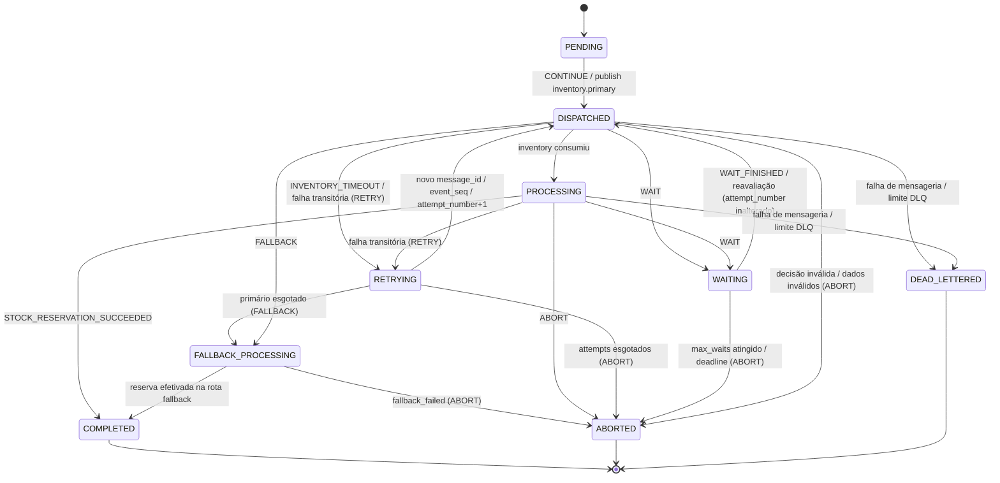
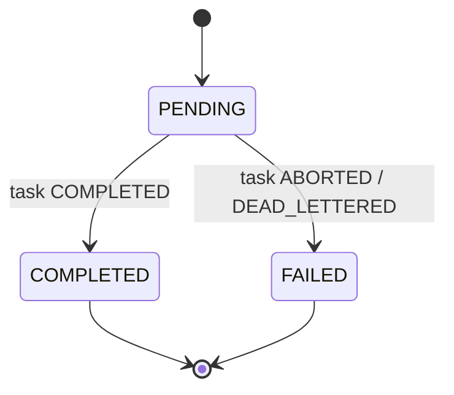

# 05 — Máquina de estados

> Fonte: `TCC_METODOLOGIA.pdf` §4.3 (Quadro 1); `piloto-do-experimento.md` §9;
> [`CLAUDE.md`](../CLAUDE.md) §11.

## 5.1 Estados internos da tarefa

| Estado | Terminal | Significado |
|---|:---:|---|
| `PENDING` | não | Tarefa criada e ainda não despachada |
| `DISPATCHED` | não | Solicitação de reserva publicada para o `inventory-service` |
| `PROCESSING` | não | Reserva em processamento no `inventory-service` |
| `WAITING` | não | Novo despacho suspenso temporariamente após ação `WAIT` |
| `RETRYING` | não | Nova tentativa lógica em andamento após ação `RETRY` |
| `FALLBACK_PROCESSING` | não | Processamento pela rota `inventory.fallback` após ação `FALLBACK` |
| `COMPLETED` | **sim** | Reserva efetivada e pedido concluído |
| `ABORTED` | **sim** | Tarefa encerrada de forma controlada após ação `ABORT` |
| `DEAD_LETTERED` | **sim** | Mensagem encaminhada à `tasks.dlq` após falhas sucessivas |

Estados terminais: `COMPLETED`, `ABORTED`, `DEAD_LETTERED`. Nenhuma decisão pode agir sobre
uma tarefa em estado terminal (`DecisionValidator` → `TERMINAL_TASK`, ver
[06 §6.9](06-modelo-de-decisao.md)).

Não adicionar novos estados sem necessidade clara e sem atualizar
`piloto-do-experimento.md` ([`CLAUDE.md`](../CLAUDE.md) §11, §43).

## 5.2 Diagrama de estados da tarefa

### Observações sobre transições

- **`WAIT`** leva a `WAITING` e volta a `DISPATCHED` sem incrementar `attempt_number`
  (incrementa `wait_count`).
- **`RETRY`** leva a `RETRYING` e volta a `DISPATCHED` com `attempt_number + 1`, novo
  `message_id` e novo `event_seq`, mesmo `target`.
- **`FALLBACK`** só é admissível quando `fallback_available = true` e `fallback_used = false`
  e a rota primária está degradada de forma localizada (não quando o `inventory-service`
  inteiro está indisponível — nesse caso as ações são `WAIT` ou `ABORT`).
- **`CONTINUE`** executa a próxima transição normal prevista (ex.: `PENDING → DISPATCHED`).

## 5.3 Estados externos do pedido

O domínio do pedido é deliberadamente mais simples:

| Estado | Significado |
|---|---|
| `PENDING` | Em processamento |
| `COMPLETED` | Concluído com sucesso |
| `FAILED` | Encerrado sem sucesso |

## 5.4 Mapeamento tarefa → pedido

| Estado da tarefa | Estado do pedido |
|---|---|
| `COMPLETED` | `COMPLETED` |
| `ABORTED` | `FAILED` |
| `DEAD_LETTERED` | `FAILED` |
| `PENDING`, `DISPATCHED`, `PROCESSING`, `WAITING`, `RETRYING`, `FALLBACK_PROCESSING` | `PENDING` |

## 5.5 Relação com as ações e o `SYSTEM_STATE`

| Ação | Efeito no estado da tarefa | Contadores |
|---|---|---|
| `CONTINUE` | Próxima transição normal (`PENDING → DISPATCHED`) | — |
| `RETRY` | `→ RETRYING → DISPATCHED` | `attempt_number += 1` |
| `WAIT` | `→ WAITING → DISPATCHED` | `wait_count += 1` |
| `FALLBACK` | `→ FALLBACK_PROCESSING` | `fallback_used = true` |
| `ABORT` | `→ ABORTED` (pedido `FAILED`) | — |

Os contadores `attempt_number`, `wait_count`, `fallback_used` e `phase` entram no
`SYSTEM_STATE` a cada ponto de decisão (ver [06 §6.2](06-modelo-de-decisao.md)).
