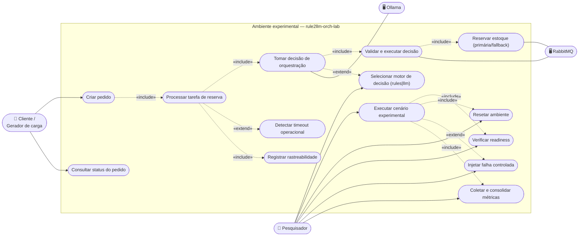
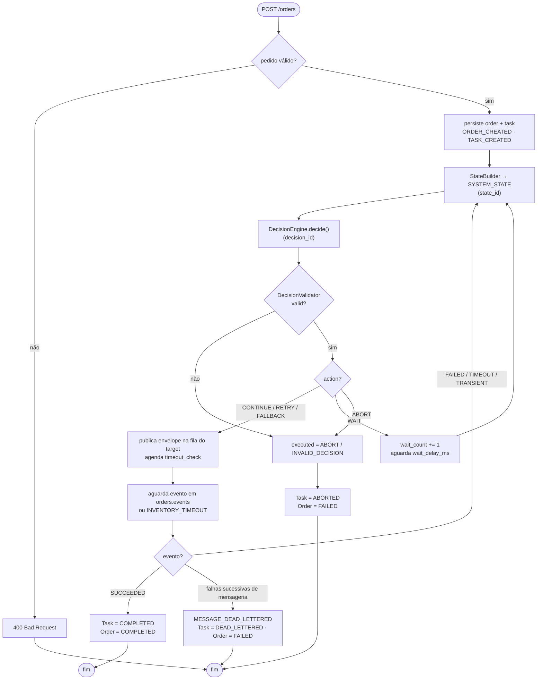
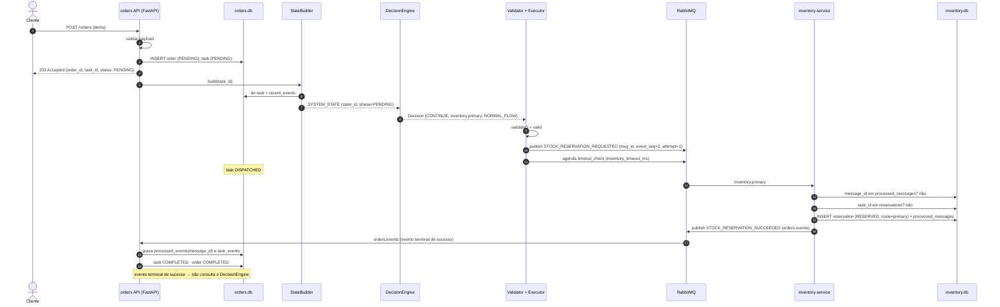
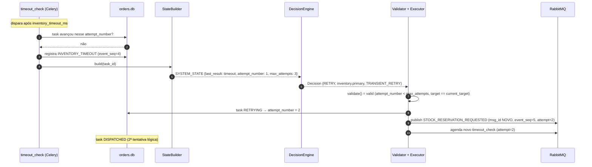
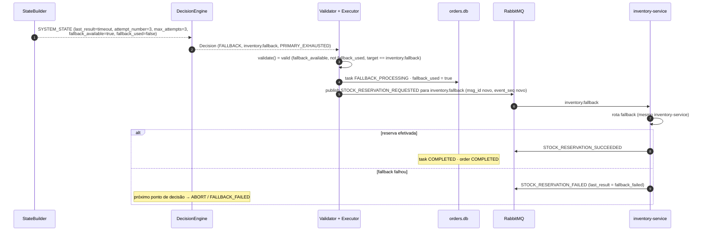
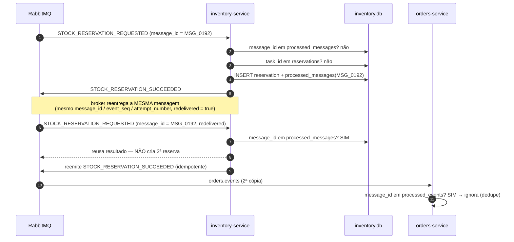
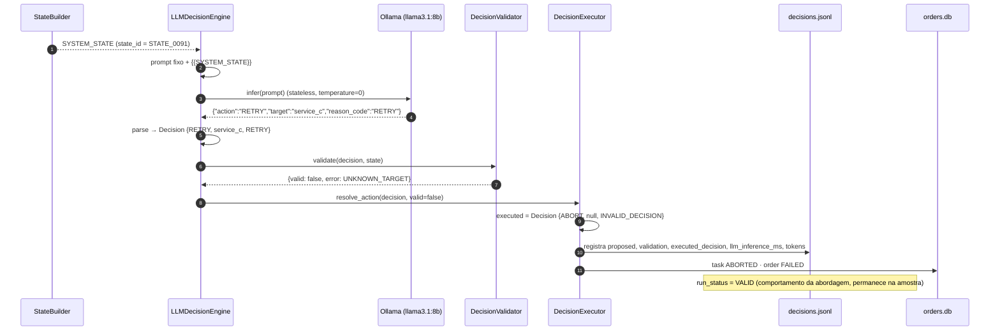
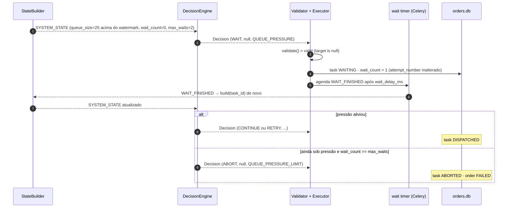

# 07 — Diagramas UML

> Notação: Mermaid. Fonte de conteúdo: `TCC_METODOLOGIA.pdf` §4.3 (FIGURA 7, Códigos 3–10),
> §4.4; `piloto-do-experimento.md` §3–22.
>
> Nota sobre casos de uso: o Mermaid não tem diagrama de caso de uso nativo. Usa-se um
> `flowchart` estilizado com fronteira de sistema (atores fora, elipses `([caso de uso])`
> dentro do `subgraph`). Relações `«include»` / `«extend»` aparecem como arestas rotuladas.

Índice:

- [7.1 Casos de uso](#71-casos-de-uso)
- [7.2 Diagrama de classes](#72-diagrama-de-classes)
- [7.3 Diagrama de atividades da mensageria](#73-diagrama-de-atividades-da-mensageria)
- [7.4 Diagramas de sequência](#74-diagramas-de-sequência)

---

## 7.1 Casos de uso

### 7.1.1 Atores

| Ator | Tipo | Papel |
|---|---|---|
| **Cliente / Gerador de carga** | primário | Cria pedidos e consulta status (no experimento, um script de carga) |
| **Pesquisador** | primário | Configura, executa, reseta e mede o experimento |
| **Ollama** | secundário (sistema externo) | Executa a inferência do `LLMDecisionEngine` |
| **RabbitMQ** | secundário (sistema externo) | Transporta as mensagens assíncronas |

### 7.1.2 Diagrama

### 7.1.3 Descrição resumida dos casos de uso

| UC | Ator | Pré-condição | Fluxo principal | Pós-condição |
|---|---|---|---|---|
| Criar pedido | Cliente | Serviço no ar | `POST /orders` com itens → validação → persiste `order` + `task` → `202 Accepted` | `Order = PENDING`, `Task = PENDING` |
| Consultar status | Cliente | Pedido existe | `GET /orders/{id}` → lê `orders.db` | Retorna `PENDING`/`COMPLETED`/`FAILED` |
| Processar tarefa de reserva | (sistema) | `Task` criada | Ciclo `StateBuilder → DecisionEngine → Validator → Executor → RabbitMQ → evento` até estado terminal | `Task` em estado terminal |
| Tomar decisão de orquestração | (sistema) / Ollama | `SYSTEM_STATE` disponível | Rules aplica política **ou** LLM infere; retorna `Decision` | `Decision` registrada em `decisions.jsonl` |
| Validar e executar decisão | (sistema) / RabbitMQ | `Decision` produzida | `DecisionValidator` → `resolve_action` → `DecisionExecutor` publica/agenda | Ação efetivada; `executed_decision` registrada |
| Reservar estoque | (sistema) / RabbitMQ | Mensagem em `inventory.primary`/`inventory.fallback` | Idempotência (`message_id`, `task_id`) → reserva simulada → persiste → publica em `orders.events` | `reservation` persistida; evento publicado |
| Detectar timeout operacional | (sistema) | Dispatch realizado | `timeout_check` após `inventory_timeout_ms`; se a tarefa não avançou → `INVENTORY_TIMEOUT` | Novo ponto de decisão |
| Registrar rastreabilidade | (sistema) | Execução em curso | Grava `states.jsonl`, `task_events.jsonl`, `decisions.jsonl`, logs | Artefatos correlacionáveis por identificadores |
| Selecionar motor de decisão | Pesquisador | Ambiente configurado | Define `decision_engine: rules\|llm` em `experiment_config.yml` | Execução usa o motor escolhido |
| Executar cenário experimental | Pesquisador | Readiness OK | Reset → readiness → warm-up (LLM) → carga → falha → coleta → validação → consolidação | `run_status = VALID\|INVALID`; artefatos gerados |
| Resetar ambiente | Pesquisador | — | Limpa filas/DLQ; restaura os dois SQLite; remove estados transitórios | Estado inicial previsto |
| Verificar readiness | Pesquisador | Containers subindo | Checa containers, filas declaradas, health checks, SQLite inicial, coletores, (LLM) modelo carregado + warm-up | `readiness_status = PASS\|FAIL` |
| Injetar falha controlada | Pesquisador | Cenário de falha | Script Python / controle Docker degrada rota primária, provoca timeout, sobrecarga ou dados inconsistentes | `fault_events.jsonl` registrado |
| Coletar e consolidar métricas | Pesquisador | Execução concluída | Agrega `decisions.jsonl`, `queue_metrics.csv`, `container_stats.csv`, timestamps | `metrics_summary.csv`, `results.csv` |

---

## 7.2 Diagrama de classes

> Camada de coordenação do `orders-service` + domínio + repositórios + mensageria + LLM.
> Métodos e atributos são **conceituais** (o código ainda não existe). `Validator` e
> `Executor` são compartilhados pelas duas abordagens (RNF-009, RNF-010).

```mermaid
classDiagram
    direction LR

    class DecisionEngine {
        <<abstract>>
        +decide(state: SystemState) Decision
    }
    class RulesDecisionEngine {
        -config: RulesConfig
        +decide(state: SystemState) Decision
    }
    class LLMDecisionEngine {
        -client: OllamaClient
        -promptBuilder: PromptBuilder
        -parser: DecisionParser
        +decide(state: SystemState) Decision
    }
    DecisionEngine <|-- RulesDecisionEngine
    DecisionEngine <|-- LLMDecisionEngine

    class StateBuilder {
        -recentEventsLimit: int
        +build(task_id: str) SystemState
    }
    class SystemState {
        +execution_id: str
        +task_id: str
        +state_id: str
        +timestamp: datetime
        +current_event_seq: int
        +task: TaskView
        +service: ServiceView
        +messaging: MessagingView
        +alternatives: AlternativesView
        +recent_events: List~EventView~
    }
    class Decision {
        +action: Action
        +target: Target
        +reason_code: ReasonCode
    }
    class ValidationResult {
        +valid: bool
        +error: str
    }
    class DecisionValidator {
        +validate(decision: Decision, state: SystemState) ValidationResult
    }
    class DecisionExecutor {
        +execute(decision: Decision, state: SystemState) void
        -continue_flow(state) void
        -retry(state, target) void
        -wait(state) void
        -fallback(state, target) void
        -abort(state) void
    }
    class Orchestrator {
        -engine: DecisionEngine
        -builder: StateBuilder
        -validator: DecisionValidator
        -executor: DecisionExecutor
        +handle_decision_point(task_id: str) void
    }

    Orchestrator --> DecisionEngine
    Orchestrator --> StateBuilder
    Orchestrator --> DecisionValidator
    Orchestrator --> DecisionExecutor
    StateBuilder --> SystemState
    DecisionEngine --> Decision
    DecisionValidator --> ValidationResult
    DecisionValidator ..> Decision
    DecisionValidator ..> SystemState
    DecisionExecutor ..> Decision

    class OllamaClient {
        -model: str
        -temperature: float
        -seed: int
        -request_timeout_s: int
        +infer(prompt: str) str
    }
    class PromptBuilder {
        -template: str
        +build(state: SystemState) str
    }
    class DecisionParser {
        +parse(raw: str) Decision
    }
    LLMDecisionEngine --> OllamaClient
    LLMDecisionEngine --> PromptBuilder
    LLMDecisionEngine --> DecisionParser

    class Order {
        +order_id: str
        +status: OrderStatus
        +items: List~OrderItem~
        +created_at: datetime
        +updated_at: datetime
    }
    class OrderItem {
        +sku: str
        +quantity: int
    }
    class Task {
        +task_id: str
        +order_id: str
        +status: TaskStatus
        +phase: str
        +current_target: Target
        +attempt_number: int
        +max_attempts: int
        +wait_count: int
        +max_waits: int
        +fallback_used: bool
        +decision_engine: str
    }
    class MessageEnvelope {
        +schema_version: str
        +execution_id: str
        +message_id: str
        +task_id: str
        +event_type: EventType
        +event_seq: int
        +attempt_number: int
        +published_at: datetime
        +decision_id: str
        +target: Target
        +payload: dict
    }
    class Reservation {
        +reservation_id: str
        +task_id: str
        +order_id: str
        +status: str
        +route: str
        +items: List~ReservationItem~
    }
    class ReservationItem {
        +sku: str
        +quantity: int
    }
    Order "1" o-- "1..*" OrderItem
    Order "1" -- "1" Task
    Reservation "1" o-- "1..*" ReservationItem

    class Publisher {
        +publish(env: MessageEnvelope) void
    }
    class Consumer {
        +on_message(env: MessageEnvelope) void
    }
    class TimeoutCheckTask {
        +run(task_id: str, attempt_number: int) void
    }
    class ReevaluateTask {
        +run(task_id: str) void
    }
    DecisionExecutor --> Publisher
    DecisionExecutor --> TimeoutCheckTask
    Consumer --> Orchestrator

    class OrderRepository
    class TaskRepository
    class TaskEventRepository
    class ProcessedEventRepository
    class ReservationRepository
    class ProcessedMessageRepository
    Orchestrator ..> OrderRepository
    Orchestrator ..> TaskRepository
    StateBuilder ..> TaskEventRepository
    Consumer ..> ProcessedEventRepository
    Consumer ..> ReservationRepository
    Consumer ..> ProcessedMessageRepository

    class Action {
        <<enumeration>>
        CONTINUE
        RETRY
        WAIT
        FALLBACK
        ABORT
    }
    class Target {
        <<enumeration>>
        inventory_primary
        inventory_fallback
        null
    }
    class TaskStatus {
        <<enumeration>>
        PENDING
        DISPATCHED
        PROCESSING
        WAITING
        RETRYING
        FALLBACK_PROCESSING
        COMPLETED
        ABORTED
        DEAD_LETTERED
    }
    class OrderStatus {
        <<enumeration>>
        PENDING
        COMPLETED
        FAILED
    }
    class EventType {
        <<enumeration>>
        ORDER_CREATED
        TASK_CREATED
        STOCK_RESERVATION_REQUESTED
        STOCK_RESERVATION_SUCCEEDED
        STOCK_RESERVATION_FAILED
        INVENTORY_TIMEOUT
        TRANSIENT_ERROR
        WAIT_SCHEDULED
        WAIT_FINISHED
        RETRY_SCHEDULED
        FALLBACK_SCHEDULED
        TASK_COMPLETED
        TASK_ABORTED
        MESSAGE_DEAD_LETTERED
    }
    class ReasonCode {
        <<enumeration>>
        NORMAL_FLOW
        TRANSIENT_RETRY
        PRIMARY_EXHAUSTED
        SERVICE_UNAVAILABLE
        SERVICE_UNAVAILABLE_LIMIT
        QUEUE_PRESSURE
        QUEUE_PRESSURE_LIMIT
        ATTEMPTS_EXHAUSTED
        FALLBACK_FAILED
        INVALID_DATA
        TASK_DEADLINE_EXCEEDED
        UNMAPPED_STATE
        INVALID_DECISION
        LLM_DECISION_TIMEOUT
    }
```

---

## 7.3 Diagrama de atividades da mensageria

O diagrama de atividades da mensageria (raias orders-service / RabbitMQ / inventory-service,
com as duas verificações de idempotência, rota primária/fallback, evento de retorno, corrida
com o `timeout_check` e roteamento para a DLQ) está em
**[04-contrato-mensageria.md §4.8](04-contrato-mensageria.md)**.

Versão compacta (ciclo de vida da tarefa como atividade):

---

## 7.4 Diagramas de sequência

### 7.4.1 Fluxo normal (`POST /orders` → `COMPLETED`)

### 7.4.2 Timeout → `RETRY`

### 7.4.3 Tentativas esgotadas → `FALLBACK`

### 7.4.4 Redelivery do broker (idempotência)

### 7.4.5 Decisão LLM inválida → `ABORT`

### 7.4.6 `WAIT` → reavaliação

