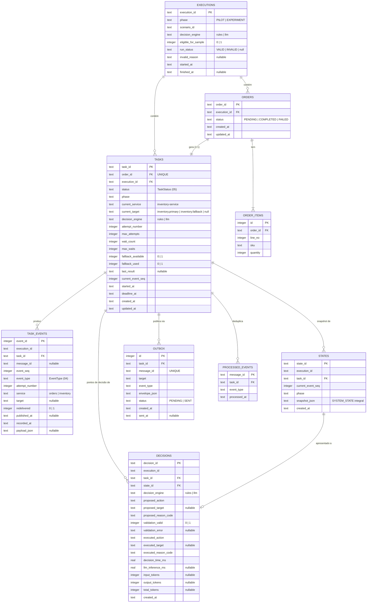
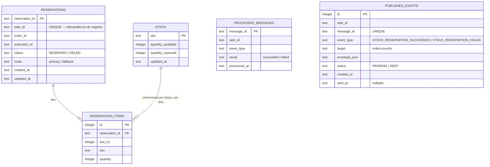
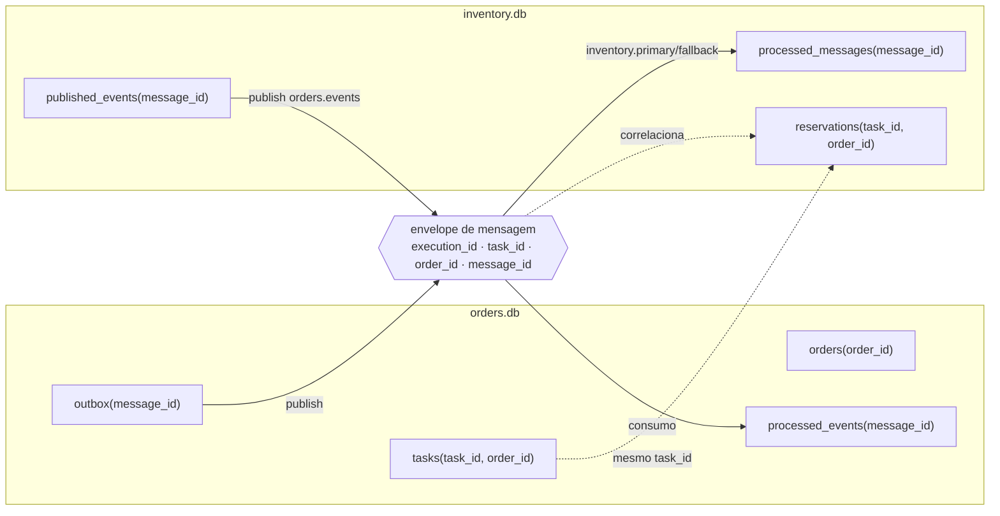

# 08 — Modelo de dados (MER)

> Fonte: `piloto-do-experimento.md` §8, §23; `TCC_METODOLOGIA.pdf` §4.3, §4.3.10;
> [`CLAUDE.md`](../CLAUDE.md) §4.3, §10.
>
> **Escopo deste MER.** Conforme decidido com o responsável pelo projeto, este documento
> apresenta um **modelo relacional normalizado completo**, que vai além das "tabelas
> mínimas" do piloto (`piloto-do-experimento.md` §23). Tudo que ultrapassa o piloto ou a
> metodologia está marcado com **⚠ divergência** e deve ser refletido em
> `piloto-do-experimento.md` antes do congelamento da configuração definitiva
> ([`CLAUDE.md`](../CLAUDE.md) §43, §45). A **fonte de verdade** da rastreabilidade continua
> sendo os arquivos JSONL/CSV descritos em [10-rastreabilidade-e-metricas.md](10-rastreabilidade-e-metricas.md);
> as tabelas `task_events`, `states` e `decisions` aqui são espelho operacional para
> consulta pelo `StateBuilder` e correlação.

## 8.1 Regras gerais

| Regra | Origem |
|---|---|
| Dois bancos SQLite **independentes**: `orders.db` (orders-service) e `inventory.db` (inventory-service) | RNF-003, CLAUDE §4.3 |
| **Sem** chave estrangeira entre bancos; **sem** banco compartilhado; nenhum serviço acessa o banco do outro | RNF-003 |
| A correlação entre bancos é **lógica**, por identificadores compartilhados (`execution_id`, `task_id`, `order_id`, `message_id`) transportados no envelope | §4.2 |
| Idempotência de transporte: `message_id` como chave primária nas tabelas de deduplicação | §4.7.1 |
| Idempotência de negócio: `reservations.task_id` **UNIQUE** | §4.7.2 |
| No recorte atual, **1 pedido ↔ 1 tarefa**: `tasks.order_id` **UNIQUE** | piloto §5, §23 |
| Timestamps em texto UTC ISO 8601 | CLAUDE §37 |
| SQLite: afinidades `TEXT`, `INTEGER`, `REAL`; booleanos como `INTEGER` (0/1) | piloto §23 |

## 8.2 MER — `orders.db`

### Tabelas de `orders.db`

| Tabela | No piloto §23? | Papel |
|---|:---:|---|
| `orders` | sim | Pedido e seu estado externo |
| `tasks` | sim | Tarefa de processamento e todos os contadores do `SYSTEM_STATE` |
| `processed_events` | sim (nome citado em §23.1) | Idempotência de transporte no consumo de `orders.events` |
| `order_items` | ⚠ divergência | Normalização dos itens do pedido (o payload tem `items[]`; §23 não os persiste) |
| `executions` | ⚠ divergência | Metadados da execução (espelha `execution_metadata.json`) |
| `task_events` | ⚠ divergência | Espelho operacional de `task_events.jsonl` (o `StateBuilder` consulta `recent_events`) |
| `states` | ⚠ divergência | Espelho operacional de `states.jsonl` |
| `decisions` | ⚠ divergência | Espelho operacional de `decisions.jsonl` |
| `outbox` | ⚠ divergência | Publicação transacional (evita perder/duplicar mensagem entre commit e publish) |

### Cardinalidades

- `executions (1) — (0..N) orders` / `executions (1) — (0..N) tasks`
- `orders (1) — (1) tasks` (1 tarefa por pedido; `tasks.order_id` UNIQUE)
- `orders (1) — (1..N) order_items`
- `tasks (1) — (0..N) task_events` / `states` / `decisions` / `outbox`
- `states (1) — (0..1) decisions` (um `state_id` é apresentado ao decisor uma vez → no
  máximo uma decisão)

### Índices e restrições

| Objeto | Restrição |
|---|---|
| `tasks.order_id` | `UNIQUE` |
| `outbox.message_id` | `UNIQUE` |
| `task_events` | índice `(task_id, event_seq)` — **não** único: redelivery gera nova linha com o mesmo `event_seq` (`redelivered = 1`) |
| `decisions.state_id` | índice; opcionalmente `UNIQUE` |
| `order_items` | `UNIQUE (order_id, line_no)` |
| `orders.status`, `tasks.status` | valores restritos aos enums de [05](05-maquina-de-estados.md) (checado na aplicação) |

## 8.3 MER — `inventory.db`

### Tabelas de `inventory.db`

| Tabela | No piloto §23? | Papel |
|---|:---:|---|
| `reservations` | sim | Reserva efetivada; `task_id UNIQUE` garante idempotência de negócio |
| `processed_messages` | sim | Idempotência de transporte no consumo de `inventory.primary`/`inventory.fallback` |
| `reservation_items` | ⚠ divergência | Normalização dos itens reservados |
| `stock` | ⚠ divergência | Suporte à **reserva simulada** e ao cenário "dados inconsistentes"; a metodologia fala em "reserva simulada" sem exigir tabela de estoque |
| `published_events` | ⚠ divergência | Outbox para publicação confiável em `orders.events` |

### Cardinalidades e restrições

- `reservations (1) — (1..N) reservation_items`
- `reservations.task_id` **UNIQUE** (regra central de idempotência de negócio — `piloto §8.2`)
- `processed_messages.message_id` **PK** (regra central de idempotência de transporte)
- `published_events.message_id` **UNIQUE**
- `reservation_items (reservation_id, line_no)` **UNIQUE**
- `stock.sku` **PK**; relação com `reservation_items.sku` é **lógica** (SKU do dataset), sem
  FK obrigatória — a reserva é simulada.

## 8.4 Correlação lógica entre os dois bancos

Nenhuma seta acima é uma FK — é correlação por identificador transportado no envelope.

## 8.5 Notas de divergência (consolidado)

Antes do congelamento da configuração definitiva, decidir e registrar em
`piloto-do-experimento.md`:

1. Persistir `task_events` / `states` / `decisions` **também** em tabela, ou manter só JSONL
   e o `StateBuilder` lê os últimos `K` eventos de outra forma.
2. Manter `order_items` / `reservation_items` normalizados, ou guardar `payload` como JSON.
3. Incluir `stock` real (habilita o cenário "dados inconsistentes" de forma mais rica) ou
   manter reserva 100% simulada sem tabela de estoque.
4. Adotar o padrão **outbox** (`outbox` / `published_events`) para publicação confiável, ou
   aceitar publicação direta pós-commit.
5. Incluir `executions` no banco, ou manter apenas `execution_metadata.json`.

Qualquer uma dessas decisões tem impacto metodológico e deve ser refletida no TCC
([`CLAUDE.md`](../CLAUDE.md) §43 itens: "mudar contrato do `SYSTEM_STATE`",
"alterar a rastreabilidade").
