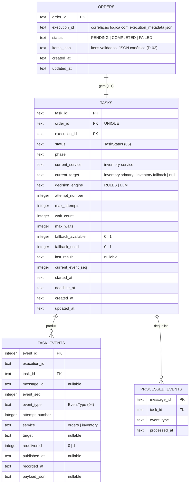
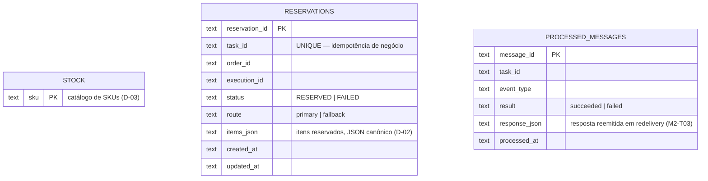
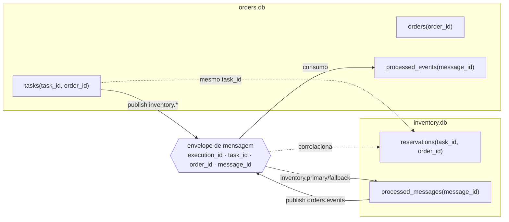

# 08 — Modelo de dados (MER)

> Fonte: `piloto-do-experimento.md` §8, §23; `TCC_METODOLOGIA.pdf` §4.3, §4.3.10;
> [`CLAUDE.md`](../CLAUDE.md) §4.3, §10.
>
> **Escopo deste MER.** Conforme decidido com o responsável pelo projeto, este documento
> apresenta um **modelo relacional normalizado completo**, que vai além das "tabelas
> mínimas" do piloto (`piloto-do-experimento.md` §23). Tudo que ultrapassa o piloto ou a
> metodologia está marcado com **⚠ divergência** e deve ser refletido em
> `piloto-do-experimento.md` antes do congelamento da configuração definitiva
> ([`CLAUDE.md`](../CLAUDE.md) §43, §45). A **fonte de verdade** da rastreabilidade continua
> sendo os arquivos JSONL/CSV descritos em [10-rastreabilidade-e-metricas.md](10-rastreabilidade-e-metricas.md);
> as tabelas `task_events`, `states` e `decisions` aqui são espelho operacional para
> consulta pelo `StateBuilder` e correlação.

## 8.1 Regras gerais

| Regra | Origem |
|---|---|
| Dois bancos SQLite **independentes**: `orders.db` (orders-service) e `inventory.db` (inventory-service) | RNF-003, CLAUDE §4.3 |
| **Sem** chave estrangeira entre bancos; **sem** banco compartilhado; nenhum serviço acessa o banco do outro | RNF-003 |
| A correlação entre bancos é **lógica**, por identificadores compartilhados (`execution_id`, `task_id`, `order_id`, `message_id`) transportados no envelope | §4.2 |
| Idempotência de transporte: `message_id` como chave primária nas tabelas de deduplicação | §4.7.1 |
| Idempotência de negócio: `reservations.task_id` **UNIQUE** | §4.7.2 |
| No recorte atual, **1 pedido ↔ 1 tarefa**: `tasks.order_id` **UNIQUE** | piloto §5, §23 |
| Timestamps em texto UTC ISO 8601 | CLAUDE §37 |
| SQLite: afinidades `TEXT`, `INTEGER`, `REAL`; booleanos como `INTEGER` (0/1) | piloto §23 |

## 8.2 MER — `orders.db`

```mermaid
erDiagram
    ORDERS ||--|| TASKS : "gera (1:1)"
    TASKS ||--o{ TASK_EVENTS : "produz"
    TASKS ||--o{ PROCESSED_EVENTS : "deduplica"

    ORDERS {
        text order_id PK
        text execution_id "correlação lógica com execution_metadata.json"
        text status "PENDING | COMPLETED | FAILED"
        text items_json "itens validados, JSON canônico (D-02)"
        text created_at
        text updated_at
    }

    TASKS {
        text task_id PK
        text order_id FK "UNIQUE"
        text execution_id FK
        text status "TaskStatus (05)"
        text phase
        text current_service "inventory-service"
        text current_target "inventory.primary | inventory.fallback | null"
        text decision_engine "RULES | LLM"
        integer attempt_number
        integer max_attempts
        integer wait_count
        integer max_waits
        integer fallback_available "0 | 1"
        integer fallback_used "0 | 1"
        text last_result "nullable"
        integer current_event_seq
        text started_at
        text deadline_at
        text created_at
        text updated_at
    }

    TASK_EVENTS {
        integer event_id PK
        text execution_id
        text task_id FK
        text message_id "nullable"
        integer event_seq
        text event_type "EventType (04)"
        integer attempt_number
        text service "orders | inventory"
        text target "nullable"
        integer redelivered "0 | 1"
        text published_at "nullable"
        text recorded_at
        text payload_json "nullable"
    }


    PROCESSED_EVENTS {
        text message_id PK
        text task_id FK
        text event_type
        text processed_at
    }

```

### Tabelas de `orders.db`

| Tabela | No piloto §23? | Papel |
|---|:---:|---|
| `orders` | sim | Pedido, seu estado externo e os itens em `items_json` (D-02) |
| `tasks` | sim | Tarefa de processamento e todos os contadores do `SYSTEM_STATE` |
| `processed_events` | sim (nome citado em §23.1) | Idempotência de transporte no consumo de `orders.events` |
| ~~`order_items`~~ | descartada (D-02) | Itens guardados como JSON em `orders.items_json` — ver §8.5 |
| ~~`executions`~~ | descartada (D-05) | Metadados só em `execution_metadata.json` — ver §8.5 |
| `task_events` | ⚠ divergência (D-01, adotada) | Trajetória da tarefa: fonte do `recent_events` do `StateBuilder` e de `task_events.jsonl`, exportado ao fim da execução |
| ~~`states`~~ | descartada (D-01) | Somente `states.jsonl` |
| ~~`decisions`~~ | descartada (D-01) | Somente `decisions.jsonl` |
| ~~`outbox`~~ | descartada (D-04) | Publicação direta após o commit — ver §8.5 |

### Cardinalidades

- `orders (1) — (1) tasks` (1 tarefa por pedido; `tasks.order_id` UNIQUE)
- `tasks (1) — (0..N) task_events` / `states` / `decisions`
- `states (1) — (0..1) decisions` (um `state_id` é apresentado ao decisor uma vez → no
  máximo uma decisão)

### Índices e restrições

| Objeto | Restrição |
|---|---|
| `tasks.order_id` | `UNIQUE` |
| `task_events` | índice `(task_id, event_seq)` — **não** único: redelivery gera nova linha com o mesmo `event_seq` (`redelivered = 1`) |
| `decisions.state_id` | índice; opcionalmente `UNIQUE` |
| `orders.status`, `tasks.status` | valores restritos aos enums de [05](05-maquina-de-estados.md) (checado na aplicação) |

## 8.3 MER — `inventory.db`

```mermaid
erDiagram
    STOCK {
        text sku PK "catálogo de SKUs (D-03)"
    }

    RESERVATIONS {
        text reservation_id PK
        text task_id "UNIQUE — idempotência de negócio"
        text order_id
        text execution_id
        text status "RESERVED | FAILED"
        text route "primary | fallback"
        text items_json "itens reservados, JSON canônico (D-02)"
        text created_at
        text updated_at
    }

    PROCESSED_MESSAGES {
        text message_id PK
        text task_id
        text event_type
        text result "succeeded | failed"
        text response_json "resposta reemitida em redelivery (M2-T03)"
        text processed_at
    }
```

### Tabelas de `inventory.db`

| Tabela | No piloto §23? | Papel |
|---|:---:|---|
| `reservations` | sim | Reserva efetivada; `task_id UNIQUE` garante idempotência de negócio; itens em `items_json` (D-02) |
| `processed_messages` | sim | Idempotência de transporte no consumo de `inventory.primary`/`inventory.fallback` |
| ~~`reservation_items`~~ | descartada (D-02) | Itens guardados como JSON em `reservations.items_json` — ver §8.5 |
| `stock` | ⚠ adotada (D-03) | Catálogo de SKUs, sem saldo, carregado de `datasets/inventory_catalog_v1.json` na inicialização; base da validação que gera `invalid_data` (cenário "dados inconsistentes") |
| ~~`published_events`~~ | descartada (D-04) | A resposta fica em `processed_messages.response_json` e é reemitida em redelivery — ver §8.5 |

### Cardinalidades e restrições

- `reservations.task_id` **UNIQUE** (regra central de idempotência de negócio — `piloto §8.2`)
- `processed_messages.message_id` **PK** (regra central de idempotência de transporte)
- `stock.sku` **PK** (D-03); a relação com os SKUs de `reservations.items_json` é
  **lógica** (a reserva só é gravada se todos os SKUs estão no catálogo), sem FK e sem
  saldo — a reserva continua simulada.

## 8.4 Correlação lógica entre os dois bancos

```mermaid
flowchart LR
    subgraph ODB["orders.db"]
        O_orders["orders(order_id)"]
        O_tasks["tasks(task_id, order_id)"]
        O_pe["processed_events(message_id)"]
    end
    subgraph IDB["inventory.db"]
        I_res["reservations(task_id, order_id)"]
        I_pm["processed_messages(message_id)"]
    end
    ENV{{"envelope de mensagem<br/>execution_id · task_id · order_id · message_id"}}

    O_tasks -->|publish inventory.*| ENV
    ENV -->|inventory.primary/fallback| I_pm
    ENV -.correlaciona.-> I_res
    I_pm -->|publish orders.events| ENV
    ENV -->|consumo| O_pe
    O_tasks -.mesmo task_id.-> I_res
```

Nenhuma seta acima é uma FK — é correlação por identificador transportado no envelope.

## 8.5 Notas de divergência (consolidado)

Antes do congelamento da configuração definitiva, decidir e registrar em
`piloto-do-experimento.md`:

1. ~~Persistir `task_events` / `states` / `decisions` **também** em tabela, ou manter só JSONL
   e o `StateBuilder` lê os últimos `K` eventos de outra forma.~~
   **Decidido (D-01, 2026-09-28):** `task_events` em tabela no `orders.db`, gravada na mesma
   transação que numera cada evento (D-16); é a fonte da janela `recent_events` e do
   `task_events.jsonl`, exportado ao fim da execução (sem gravação dupla). `states` e
   `decisions` ficam **somente** em JSONL (`states.jsonl`, `decisions.jsonl`).
2. ~~Manter `order_items` / `reservation_items` normalizados, ou guardar `payload` como JSON.~~
   **Decidido (D-02, 2026-09-27): JSON.** Os itens são validados na entrada e não mudam depois;
   ficam em `orders.items_json` e `reservations.items_json`, serializados de forma canônica.
   Assim, toda nova tentativa (`RETRY`/`FALLBACK`) republica exatamente o mesmo conteúdo. Nenhuma
   métrica nem o `SYSTEM_STATE` dependem de consultas por item. Sem impacto metodológico: vale
   igualmente para Rules e LLM.
3. ~~Incluir `stock` real (habilita o cenário "dados inconsistentes" de forma mais rica) ou
   manter reserva 100% simulada sem tabela de estoque.~~
   **Decidido (D-03, 2026-09-29): catálogo de SKUs, sem saldo.** `stock` guarda só o `sku`;
   pedido com SKU fora do catálogo gera `STOCK_RESERVATION_FAILED / invalid_data`. Saldo
   foi descartado porque o resultado dependeria da ordem de processamento e das reservas de
   tarefas abortadas, o que reduz a reprodutibilidade entre Rules e LLM.
4. ~~Adotar o padrão **outbox** (`outbox` / `published_events`) para publicação confiável, ou
   aceitar publicação direta pós-commit.~~
   **Decidido (D-04, 2026-09-28): sem outbox; publicação direta após o commit.** Os dois lados já cobrem a janela entre o commit e a publicação sem tabela extra: no Inventory, a resposta fica em `processed_messages.response_json` e é reemitida na redelivery da solicitação (a mensagem só recebe ack depois do processamento, `acks_late`); no Orders, um despacho gravado como `DISPATCHED` cuja publicação se perdeu é detectado pelo `timeout_check` (M4-T06) e vira ponto de decisão. Pode ser revista se o piloto mostrar perda de mensagem. Sem impacto sobre a comparação Rules × LLM (vale para as duas condições).
5. ~~Incluir `executions` no banco, ou manter apenas `execution_metadata.json`.~~
   **Decidido (D-05, 2026-09-28): sem tabela `executions`.** A metodologia registra os
   metadados de cada execução em `execution_metadata.json` (§4.5, Código 12) e as inválidas
   em `invalid_runs.csv`; o SQLite é persistência de negócio dos serviços. Além disso, o
   reset entre repetições restaura os bancos ao estado inicial (§4.4.1), o que apagaria a
   tabela, e `run_status` só é conhecido pela bancada após a execução. A correlação usa a
   coluna `execution_id` de `orders`/`tasks` e o envelope.

Qualquer uma dessas decisões tem impacto metodológico e deve ser refletida no TCC
([`CLAUDE.md`](../CLAUDE.md) §43 itens: "mudar contrato do `SYSTEM_STATE`",
"alterar a rastreabilidade").
