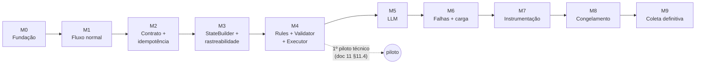

# 13 — Roadmap

> Fonte: [`CLAUDE.md`](../CLAUDE.md) §29, §48; `piloto-do-experimento.md` §28, §32, §34, §37;
> documentos 01–12 deste diretório.
>
> Este documento é a **fonte de verdade do progresso** do projeto. Ele organiza o
> desenvolvimento em **marcos** (M0–M9), cada um com um conjunto de **tasks**. A ordem dos
> marcos segue exatamente a sequência de implementação definida no `CLAUDE.md` §29 e no
> piloto §28 — não inverter sem necessidade técnica clara.

## 13.1 Como usar este roadmap

### Convenções de trabalho

| Regra | Descrição |
|---|---|
| Identificador | Cada task tem ID `Mx-Tyy` (ex.: `M1-T03`) |
| 1 task = 1 commit | Mensagem em Conventional Commits, PT-BR, com o ID ao final: `feat(orders): adiciona endpoint POST /orders [M1-T03]` |
| Status no mesmo commit | O commit que conclui a task também marca a task como ✅ neste documento — o roadmap nunca fica defasado em relação ao código |
| Branch | Commits direto na `main` local |
| Fechamento de marco | Verificar o critério de conclusão → atualizar o painel (§13.2) → commit `docs(roadmap): conclui Mx` → tag anotada `mx-<slug>` → `git push origin main --follow-tags` |
| Comunicação | Avisar o responsável sempre que uma task ou um marco for concluído |
| Honestidade | Não marcar ✅ sem entregável e verificação reais ([`CLAUDE.md`](../CLAUDE.md) §44) |

### Legenda

| Símbolo | Significado |
|---|---|
| ⬜ | Pendente |
| 🔄 | Em andamento |
| ✅ | Concluída |
| ⏸ | Bloqueada (registrar o motivo) |
| **(D)** | Exige **decisão do responsável** antes ou durante a task |
| 🔬 | **Impacto metodológico** ([`CLAUDE.md`](../CLAUDE.md) §43): a decisão precisa ser refletida em `piloto-do-experimento.md` e no TCC |

Maturidade dos entregáveis ([`CLAUDE.md`](../CLAUDE.md) §44): **implementado**, **testado**,
**planejado**, **provisório** — indicado nas tasks quando relevante.

## 13.2 Painel de status

| Marco | Objetivo | Status | Tag | Concluído em |
|---|---|:---:|---|---|
| [M0](#m0--fundação-do-repositório) | Fundação do repositório, roadmap, configuração base | ✅ | `m0-fundacao` | 2026-09-26 |
| [M1](#m1--fluxo-normal-ponta-a-ponta) | Fluxo normal Pedido → Estoque → `COMPLETED` | ✅ | `m1-fluxo-normal` | 2026-09-27 |
| [M2](#m2--contrato-de-mensagens-e-idempotência) | Envelope versionado, `event_seq`, idempotência, redelivery | ✅ | `m2-idempotencia` | 2026-09-28 |
| [M3](#m3--statebuilder-system_state-e-rastreabilidade) | `StateBuilder`, `SYSTEM_STATE`, JSONL de rastreabilidade | ✅ | `m3-rastreabilidade` | 2026-09-28 |
| [M4](#m4--rules--validator--executor) | `RulesDecisionEngine`, Validator, Executor, 5 ações, 1º piloto | ✅ | `m4-rules` | 2026-09-28 |
| [M5](#m5--llmdecisionengine) | Ollama + `LLMDecisionEngine` stateless | ✅ | `m5-llm` | 2026-09-29 |
| [M6](#m6--cenários-de-falha-e-carga) | Dataset, carga e scripts de falha dos 6 cenários | ✅ | `m6-falhas-carga` | 2026-09-29 |
| [M7](#m7--instrumentação-e-protocolo-experimental) | Reset, readiness, métricas, protocolo de execução | 🔄 | `m7-instrumentacao` | — |
| [M8](#m8--congelamento) | Congelamento da configuração experimental | ⬜ | `freeze-v1` | — |
| [M9](#m9--coleta-definitiva) | Coleta definitiva da amostra | ⬜ | `coleta-v1` | — |

## 13.3 Dependências entre marcos

Piloto técnico (M0–M7): dados em `data/pilot/`, `phase: PILOT`, `eligible_for_sample: false`.
Coleta definitiva (M9): dados em `data/experiment/`, `phase: EXPERIMENT`,
`eligible_for_sample: true` — somente após `freeze-v1`.

---

## M0 — Fundação do repositório

**Objetivo:** preparar o repositório para o desenvolvimento: roadmap, regras de progresso,
estrutura de diretórios, dependências, configuração experimental base e testes.
**Pré-requisitos:** documentação 01–12 consolidada. **Tag:** `m0-fundacao`.

| ID | Task | Commit | Entregáveis | Refs | Status |
|---|---|---|---|---|:---:|
| M0-T01 | Roadmap detalhado por marcos | `docs(roadmap)` | `docs/13-roadmap.md`; linha 13 no `docs/README.md` | CLAUDE §29, §48 | ✅ |
| M0-T02 | Regras de roadmap e progresso no `CLAUDE.md` | `docs(claude)` | Seção "Roadmap e registro de progresso" (§49) + item no resumo operacional (§50) | — | ✅ |
| M0-T03 | Manter `docs/ref` versionado e corrigir referências | `chore(repo)` | `.gitignore` sem `/docs/ref`; `docs/README.md` e caminho do piloto no `CLAUDE.md` corrigidos | Inconsistência I-10 | ✅ |
| M0-T04 | Esqueleto de diretórios | `chore(repo)` | `services/orders/app`, `services/inventory/app`, `shared/`, `contracts/`, `config/`, `datasets/`, `scripts/`, `data/pilot/`, `data/experiment/`, `tests/{unit,integration,contracts}`; `.gitignore` (`*.db`, execuções em `data/`, `.venv`, `__pycache__`, `.env`) | [02 §2.6](02-arquitetura.md) | ✅ |
| M0-T05 | Dependências e ambiente | `build` | `requirements.txt` por serviço; `requirements-dev.txt` (pytest); `.env.example`; imagem base Python 3.12 (**provisória** — pin no M8) | [03](03-stack-tecnologica.md), CLAUDE §34 | ✅ |
| M0-T06 | Configuração experimental e pacote comum | `feat(config)` | `config/experiment_config.yml` (piloto §31 + `task_deadline_ms` + `decision_engine`); `shared/` com carga de config, geração de IDs (`ORD_`, `TASK_`, `MSG_`, `STATE_`, `DEC_`) e timestamps UTC ISO 8601 (ms) | [03 §3.6](03-stack-tecnologica.md), I-04, RNF-022 | ✅ |
| M0-T07 | Testes base | `test` | pytest configurado; testes da carga de config e dos utilitários de `shared/` | CLAUDE §35 | ✅ |
| M0-T08 | README raiz | `docs` | `README.md` (objetivo, como subir, onde estão a documentação e o roadmap) | — | ✅ |

**Critério de conclusão**

- [x] Roadmap publicado e referenciado no índice de `docs/`.
- [x] `CLAUDE.md` contém as regras de atualização do roadmap e de aviso de conclusão.
- [x] `docs/ref` continua versionado (`git check-ignore` não o ignora).
- [x] Estrutura de diretórios criada; `data/pilot/` e `data/experiment/` separados.
- [x] `experiment_config.yml` carrega com todas as chaves do piloto §31 + `task_deadline_ms`.
- [x] `pytest` passa (19 testes, Python 3.12).

> `shared/` é uma **biblioteca** comum (contratos, IDs, tempo, config). Não compartilha banco
> nem estado em tempo de execução entre os serviços (RNF-003).

---

## M1 — Fluxo normal ponta a ponta

**Objetivo:** o caminho funcional mínimo do [`CLAUDE.md`](../CLAUDE.md) §6 funcionando,
sem LLM, sem falhas e sem carga (piloto §28 Fase 1).
**Pré-requisitos:** M0. **Tag:** `m1-fluxo-normal`.

| ID | Task | Commit | Entregáveis | Refs | Status |
|---|---|---|---|---|:---:|
| M1-T01 | Infraestrutura RabbitMQ | `feat(infra)` | `docker-compose.yml` com RabbitMQ (management); `config/rabbitmq/definitions.json` com `tcc.tasks` (direct), `tcc.dlx`, `inventory.primary`, `inventory.fallback`, `orders.events`, `tasks.dlq` | [04 §4.1](04-contrato-mensageria.md) | ✅ |
| M1-T02 | Configuração Celery nos dois serviços | `feat(messaging)` | Filas/rotas sobre `tcc.tasks`; `acks_late`, `prefetch=1`, `task_reject_on_worker_lost`; **sem `autoretry`**; envelope como argumento único da task; publicação sem rota explícita cai na DLQ | [03 §3.3](03-stack-tecnologica.md), CLAUDE §9 | ✅ |
| M1-T03 | `orders-service`: API e `orders.db` | `feat(orders)` | FastAPI; `orders`, `tasks`, `processed_events`; `POST /orders` (202; pedido inválido → 400); `GET /orders/{id}`; health check; Dockerfile e serviço `orders-api` no compose. **(D)** D-02, D-14 | RF-001–RF-004, [08](08-modelo-de-dados-mer.md) | ✅ |
| M1-T04 | `inventory-service`: worker e `inventory.db` | `feat(inventory)` | Worker em `inventory.primary`; `reservations`, `processed_messages`; reserva simulada da rota primária; publica `STOCK_RESERVATION_SUCCEEDED` em `orders.events` após o commit; Dockerfile e serviço `inventory-worker` (sem mingle/gossip/heartbeat, incompatíveis com o RabbitMQ 4) | RF-006, RF-007, RF-010 | ✅ |
| M1-T05 | Despacho inicial **provisório** | `feat(orders)` | `CONTINUE` fixo para `inventory.primary`, sem motor de decisão (`orchestration/provisional_dispatch.py`) — **provisório**, substituído em M4-T04. Tarefa gravada como `DISPATCHED` antes da publicação | RF-005 | ✅ |
| M1-T06 | Consumo de `orders.events` | `feat(orders)` | Worker Celery do Orders (serviço `orders-worker`); evento terminal de sucesso → Task e Order `COMPLETED`, sem consultar o DecisionEngine; tarefa terminal não é alterada | RF-011, [05](05-maquina-de-estados.md) | ✅ |
| M1-T07 | Smoke test do fluxo normal | `test` | `scripts/pilot/smoke_test.py` (pedidos `COMPLETED`, 1 reserva por tarefa, filas e DLQ vazias); `tests/integration` (marcador `integration`); README com o passo a passo | CLAUDE §35 | ✅ |

**Critério de conclusão** (piloto §28 Fase 1)

- [x] `docker compose up` inicializa RabbitMQ, Orders e Inventory.
- [x] `POST /orders` → RabbitMQ → Inventory → `inventory.db` → evento de sucesso → Orders → `orders.db` → `COMPLETED`.
- [x] Pedido e tarefa terminam como `COMPLETED`.
- [x] Nenhuma chamada HTTP síncrona entre os serviços; nenhum banco compartilhado.

> Verificado em 2026-09-27 a partir de ambiente limpo (`docker compose down -v`): smoke test com 3 pedidos `COMPLETED`, 1 reserva por tarefa, filas e DLQ vazias; volumes `orders-data` e `inventory-data` separados. Pendências conhecidas, tratadas nos próximos marcos: despacho inicial provisório (M4-T04) e `event_seq` do evento de retorno provisório (M2-T02).

---

## M2 — Contrato de mensagens e idempotência

**Objetivo:** envelope versionado, sequência lógica por tarefa e as duas idempotências
(transporte e negócio), com redelivery distinta de `RETRY` (piloto §28 Fase 2).
**Pré-requisitos:** M1. **Tag:** `m2-idempotencia`.

| ID | Task | Commit | Entregáveis | Refs | Status |
|---|---|---|---|---|:---:|
| M2-T01 | Schema do envelope | `feat(contracts)` | Modelos em `shared/envelope.py` (envelope + `payload` por evento); `contracts/message_envelope.schema.json` e `message_payloads.schema.json` gerados e checados por teste de contrato; consumidores rejeitam mensagem fora do contrato para `tasks.dlq`. **(D)** D-13 | [04 §4.2](04-contrato-mensageria.md) | ✅ |
| M2-T02 | `event_seq`, `attempt_number`, `message_id` | `feat(orders)` | Orders numera a trajetória (D-16): `TASK_CREATED` = 1, cada mensagem publicada e cada evento novo recebido consomem o próximo número, na mesma transação que o aplica; Inventory repete o `event_seq` da solicitação (correlação); `message_id` novo por mensagem | RF-012, RNF-016, RNF-017 | ✅ |
| M2-T03 | Idempotência de transporte | `feat(inventory)` | Verificação por `message_id` na mesma transação da reserva; `processed_messages` guarda resultado e resposta; redelivery reemite a MESMA resposta (mesmo `message_id`) sem reprocessar, o que também recupera resposta perdida entre commit e publicação; `redelivered` lido de `delivery_info` e registrado em log | RF-008, [04 §4.7.1](04-contrato-mensageria.md) | ✅ |
| M2-T04 | Idempotência de negócio | `feat(inventory)` | `reservations.task_id UNIQUE` como barreira no banco; nova tentativa lógica (novo `message_id`, mesmo `task_id`) de tarefa já reservada não cria 2ª reserva e recebe resposta nova com o resultado da reserva existente | RF-009, [04 §4.7.2](04-contrato-mensageria.md) | ✅ |
| M2-T05 | Dedupe no Orders | `feat(orders)` | `processed_events` verificado e gravado na mesma transação que numera e aplica o evento; evento repetido (mesmo `message_id`) é ignorado e não consome `event_seq`; resultado (`recorded`/`duplicate`/`unknown_task`) registrado em log | [04 §4.8](04-contrato-mensageria.md) | ✅ |
| M2-T06 | Testes de contrato e idempotência | `test` | `tests/contracts` (schema em dia com o código, envelopes e payloads inválidos); unitários de redelivery, nova tentativa e dedupe; `scripts/pilot/duplicate_message_test.py` (ao vivo: nova tentativa + 2 redeliveries → 1 reserva, estado e `event_seq` corretos, filas vazias) e `tests/integration/test_idempotency.py`. Limitação: redelivery simulada por republicação (flag `redelivered` só em reentrega real) | CLAUDE §35 | ✅ |
| M2-T07 | **(D) 🔬** Decisão sobre outbox | `docs(decisoes)` | D-04 registrada: sem outbox, publicação direta após o commit; `outbox`/`published_events` descartadas nos docs 08/09 | [08 §8.5](08-modelo-de-dados-mer.md) | ✅ |

**Critério de conclusão** (piloto §28 Fase 2)

- [x] Reenviar a mesma mensagem **não** cria uma segunda reserva.
- [x] Nova tentativa lógica com `message_id` novo **não** cria uma segunda reserva.
- [x] `message_id`, `task_id` e `event_seq` aparecem nos registros.

> Verificado em 2026-09-28 a partir de ambiente limpo: 94 testes unitários/contrato e 3 de
> integração; `duplicate_message_test` com nova tentativa e 2 redeliveries → 1 reserva por
> tarefa, `event_seq` correto no Orders, filas e DLQ vazias; `processed_messages` e
> `processed_events` correlacionam solicitação, resposta, `task_id` e `event_seq`. Decisões
> tomadas no marco: D-13, D-16, D-04. Limitação conhecida: a redelivery é simulada por
> republicação (o flag `redelivered` só aparece numa reentrega real do broker).

---

## M3 — StateBuilder, `SYSTEM_STATE` e rastreabilidade

**Objetivo:** construir o snapshot normalizado apresentado ao decisor e os artefatos de
rastreabilidade (piloto §28 Fase 3).
**Pré-requisitos:** M2. **Tag:** `m3-rastreabilidade`.

| ID | Task | Commit | Entregáveis | Refs | Status |
|---|---|---|---|---|:---:|
| M3-T01 | **(D) 🔬** Formato final do `SYSTEM_STATE` | `docs(decisoes)` | D-06 registrada: formato aninhado; `phase` = estado da tarefa com regra de `CONTINUE` em `PENDING`/`WAITING`; `decision_engine` = `RULES`/`LLM` (config, código e docs) | I-01, I-02, I-03 | ✅ |
| M3-T02 | Schema do `SYSTEM_STATE` | `feat(contracts)` | `shared/system_state.py` (modelo aninhado estrito) e `contracts/system_state.schema.json` gerado; `TaskStatus`/`TaskResult` movidos para `shared/task.py`; teste de contrato valida o exemplo do doc 06 e rejeita `READY`/`RECOVERED` e a forma plana antiga | [06 §6.2](06-modelo-de-decisao.md), RF-013 | ✅ |
| M3-T03 | Execução e metadados | `feat(observability)` | `shared/artifacts.py`: diretório derivado do `execution_id` (`PILOT_` → `data/pilot/`, `EXP_` → `data/experiment/`) e escritor JSONL com um arquivo por processo (`<artefato>.<writer>.jsonl`); `scripts/pilot/new_execution.py` aloca `PILOT_nnnn` e grava `execution_metadata.json` (`PILOT`, `eligible_for_sample: false`, desconhecidos `null`); `./data` montado nos serviços. **(D)** D-05 | RF-035, RF-036, [10 §10.3](10-rastreabilidade-e-metricas.md) | ✅ |
| M3-T04 | Eventos da tarefa | `feat(orders)` | Tabela `task_events` gravada na mesma transação que numera cada evento (`TASK_CREATED`, mensagens publicadas, eventos recebidos, `TASK_COMPLETED`; repetição com `event_seq` original e `redelivered = 1`; flag do broker registrado); `scripts/pilot/collect_artifacts.py` exporta `task_events.jsonl` e consolida os arquivos por processo. **(D)** D-01 | RF-032 | ✅ |
| M3-T05 | `StateBuilder` | `feat(orders)` | `state_builder.py`: snapshot validado pelo contrato, `state_id` único, janela K de ocorrências distintas, `elapsed_ms`, `latency_ms`, `last_result`; `queue_size` e consumidores via `queue.declare` passivo (mesma fonte para Rules e LLM); regras de `service.status` e `fallback_available` documentadas no doc 06 §6.2.4 (I-08); `states.<writer>.jsonl` gravado no ponto de decisão inicial | RF-013–RF-015, RF-031, RNF-012, RNF-019, I-08 | ✅ |
| M3-T06 | Logs estruturados | `feat(observability)` | `shared/structured_logging.py`: JSON por linha (timestamp UTC ms, nível, serviço, `execution_id`, mensagem e campos de correlação num dicionário próprio, imune a colisões como o `task_id` que o Celery injeta) em `microservices_logs.<writer>.jsonl` nos três processos; consumidores e API registram com correlação | RF-034, CLAUDE §36 | ✅ |
| M3-T07 | Registro de decisões | `feat(orders)` | `DecisionRecord` (Códigos 7–9 da metodologia: `RULES`/`LLM`, `llm_inference_ms`/`token_usage` nulos para `RULES`, `reason_code` sempre na decisão executada) e `DecisionRecorder` → `decisions.<writer>.jsonl`; disponível na `Coordination`, ligado ao Orchestrator em M4-T04 | RF-033 | ✅ |
| M3-T08 | Testes de estado e correlação | `test` | Unitários da janela K, do contrato e do `StateBuilder`; `scripts/pilot/check_traceability.py` verifica metadados, trajetória contígua por tarefa, snapshots ligados à trajetória, decisões ligadas a estados e logs da mesma execução (base da etapa 11 do protocolo); `tests/integration/test_traceability.py` roda pedidos, coleta e verifica ao vivo | RNF-007 | ✅ |

**Critério de conclusão** (piloto §28 Fase 3)

- [x] Para qualquer decisão é possível localizar o snapshot exato usado pelo decisor.
- [x] `task_events.jsonl` permite reconstruir a trajetória anterior.
- [x] `recent_events` contém somente a janela K configurada.

> Verificado em 2026-09-28 a partir de ambiente limpo (`PILOT_0005`): 170 testes
> unitários/contrato e 4 de integração; `check_traceability` sem erros (46 eventos, 10
> snapshots, 110 linhas de log). O snapshot é gravado em todo ponto de decisão e
> `check_traceability` exige que cada decisão aponte para um `state_id` da mesma tarefa; as
> decisões propriamente ditas começam a ser registradas no M4 (motor de decisão). Decisões
> do marco: D-06, D-05, D-01. Ajustes a levar ao TCC: §13.6.

---

## M4 — Rules + Validator + Executor

**Objetivo:** as cinco ações reais executadas pelo `RulesDecisionEngine`, passando pelo
Validator e Executor comuns, sem LLM (piloto §28 Fase 4). Fecha o **1º piloto técnico**.
**Pré-requisitos:** M3. **Tag:** `m4-rules`.

| ID | Task | Commit | Entregáveis | Refs | Status |
|---|---|---|---|---|:---:|
| M4-T01 | Contrato de decisão | `feat(contracts)` | `shared/decision.py`: `ProposedDecision` (o que o motor propôs, sem restrição), `Decision` executável (5 ações, target compatível com a ação), `ValidationResult`, enums de ação, `reason_code` e erros; `resolve_action` (inválida → `ABORT / INVALID_DECISION`); `contracts/decision.schema.json` | [06 §6.4](06-modelo-de-decisao.md), [12 §12.4](12-glossario.md), RF-017 | ✅ |
| M4-T02 | `RulesDecisionEngine` | `feat(orchestration)` | Interface `DecisionEngine` / `EngineOutput` comum; `RulesDecisionEngine` com a política ordenada literal (Código 4 / piloto §14.3, ajuste D-06) e limiares do config; testes de cada regra e das prioridades | [06 §6.6](06-modelo-de-decisao.md), RF-024 | ✅ |
| M4-T03 | `DecisionValidator` | `feat(orchestration)` | Validador comum do Código 6 / piloto §18 + `TERMINAL_TASK` + `MALFORMED_DECISION`; acréscimos 🔬: `CONTINUE` só para `inventory.primary` e antes do primeiro despacho, `RETRY` em `inventory.fallback` inválido (D-15) | [06 §6.9](06-modelo-de-decisao.md), RF-028, RNF-009 | ✅ |
| M4-T04 | Orchestrator e `CONTINUE` | `feat(orchestration)` | `Orchestrator.handle_decision_point` (build → decide → validate → `resolve_action` → `decisions.jsonl` → execute; `decision_time_ms` sem a construção do estado); motor escolhido por `decision_engine`; Executor `CONTINUE` (primeiro despacho com `decision_id` e `timeout_check` agendado em `orders.events`); API usa o Orchestrator e o despacho provisório de M1-T05 foi removido | [07 §7.2](07-diagramas-uml.md), RF-016, RF-018 | ✅ |
| M4-T05 | `RETRY` | `feat(orchestration)` | Executor `RETRY`: `attempt_number + 1`, tarefa `RETRYING`, `RETRY_SCHEDULED` na trajetória e despacho agendado (`orders.dispatch_attempt`) após `retry_delay_ms`; no despacho, novo `message_id` e `event_seq`, mesmo `task_id` e target, novo `timeout_check`; despacho idempotente e ignorado se a tarefa já terminou | RF-019 | ✅ |
| M4-T06 | Detector de timeout e falha reportada | `feat(orders)` | `orders.timeout_check` agendado a cada despacho: só age se a solicitação ainda é a corrente, sem resposta e sem timeout já registrado; registra `INVENTORY_TIMEOUT`, `last_result = timeout` (`fallback_failed` no fallback, D-15) e abre ponto de decisão. `STOCK_RESERVATION_FAILED` (payload com `failure_reason`) da solicitação corrente também abre ponto de decisão. Worker do Orders com prefetch sem limite (D-17) | RF-023, [04 §4.9](04-contrato-mensageria.md) | ✅ |
| M4-T07 | `WAIT` | `feat(orchestration)` | Executor `WAIT`: `wait_count + 1`, tarefa `WAITING`, `WAIT_SCHEDULED`, reavaliação agendada (`orders.reevaluate`) após `wait_delay_ms`; `attempt_number` inalterado. A reavaliação registra `WAIT_FINISHED` uma única vez e abre novo ponto de decisão; ignorada se a tarefa terminou ou a espera foi superada. Verificado ao vivo (PILOT_0008): Inventory parado → WAIT, WAIT, ABORT `SERVICE_UNAVAILABLE_LIMIT` | RF-020 | ✅ |
| M4-T08 | Rota fallback e `FALLBACK` | `feat(inventory)` | Executor `FALLBACK`: tarefa `FALLBACK_PROCESSING`, `fallback_used = 1`, `attempt_number` inalterado (D-15), `FALLBACK_SCHEDULED` e solicitação imediata para `inventory.fallback`; `reservation/fallback.py` no mesmo inventory-service e worker consumindo as duas filas. Verificado ao vivo (PILOT_0009, Inventory pausado): CONTINUE → RETRY → RETRY → FALLBACK → ABORT `FALLBACK_FAILED`; ao retomar, 4 solicitações retidas → 1 reserva | RF-021, [06 §6.5](06-modelo-de-decisao.md), I-06 | ✅ |
| M4-T09 | `ABORT` e decisão inválida | `feat(orchestration)` | `DecisionExecutor` (uma transação por ação; efeitos externos só após o commit) com `ABORT`: Task `ABORTED`, Order `FAILED`, `TASK_ABORTED` na trajetória com `decision_id` e `reason_code`; decisão inválida → `ABORT / INVALID_DECISION`; tarefa terminal não muda. Feita antes da T04, que depende do fail-safe | RF-022, RF-029 | ✅ |
| M4-T10 | **(D) 🔬** DLQ | `feat(messaging)` | D-07: falha de processamento não prevista → rejeição sem requeue → `tasks.dlq` (sem retentativa automática); consumidor bruto da `tasks.dlq` no worker do Orders registra `MESSAGE_DEAD_LETTERED` (tarefa Celery, fila de origem, motivo) e leva a tarefa a `DEAD_LETTERED` / pedido `FAILED`. Verificado ao vivo (PILOT_0010) | RF-030, I-07 | ✅ |
| M4-T11 | Testes das ações | `test` | Rules (cada regra), Validator (cada erro), Executor por ação; teste de equivalência (mesmo estado, validação, execução e registro para Rules e outro motor); `scripts/pilot/decision_scenarios.py` (Inventory parado / pausado) com testes de integração; `tests/README.md` mapeia cada item do CLAUDE §35 | CLAUDE §35 | ✅ |
| M4-T12 | 1º piloto técnico | `chore(pilot)` | `PILOT_0012` (RULES, cenário normal, commit limpo `7074368`): 5 pedidos + teste de duplicação, coleta e `check_traceability` sem erros; checklist do doc 11 §11.4 marcado com a evidência. As execuções `PILOT_0001`–`0011` foram de desenvolvimento | piloto §32 | ✅ |

**Critério de conclusão** (piloto §28 Fase 4 e §32)

- [x] `CONTINUE`, `RETRY`, `WAIT`, `FALLBACK` e `ABORT` validados sem LLM.
- [x] Checklist do 1º piloto técnico ([11 §11.4](11-requisitos.md)) completo.

> Verificado em 2026-09-28: 294 testes unitários/contrato e 6 de integração, incluindo os
> cenários reais Inventory parado (WAIT → ABORT) e pausado (RETRY → FALLBACK → ABORT);
> 1º piloto técnico formal `PILOT_0012`. Decisões do marco: D-15, D-07 e D-17 (técnica);
> acréscimos ao Validator 🔬 e ajustes do TCC em §13.6; achados do piloto em §13.7.

---

## M5 — `LLMDecisionEngine`

**Objetivo:** trocar **somente** o componente que seleciona a ação (piloto §28 Fase 5).
**Pré-requisitos:** M4. **Tag:** `m5-llm`.

| ID | Task | Commit | Entregáveis | Refs | Status |
|---|---|---|---|---|:---:|
| M5-T01 | **(D) 🔬** Onde roda o Ollama | `docs(decisoes)` | D-08: Ollama no host (bare-metal, GPU Metal), acessado por `host.docker.internal`; D-09: `format: "json"`; parâmetros novos `response_format`, `num_ctx`, `keep_alive` no config; critérios de viabilidade do 8B registrados antes da medição | [03 §3.5](03-stack-tecnologica.md), RNF-021 | ✅ |
| M5-T02 | `OllamaClient` | `feat(llm)` | `/api/generate` com `stream: false`, `format: "json"` (D-09), `keep_alive` e opções do config (`temperature`, `top_p`, `num_predict = max_tokens`, `seed`, `num_ctx`); sem `context` (stateless); devolve texto, `done_reason`, contagens de tokens e tempos; timeout → `LLMTimeout`, demais falhas → `LLMRuntimeError`; recusa config com `stream` ou `session_memory`. Biblioteca padrão (sem dependência nova) | RF-025, RF-026 | ✅ |
| M5-T03 | `PromptBuilder` | `feat(llm)` | Template = texto literal do Quadro 2 da metodologia em `config/prompts/decision_prompt_v1.txt` (`llm.prompt_template` no config); prompt reconstruído a cada decisão com o `SYSTEM_STATE` corrente em JSON; hash do template no `execution_metadata.json`. Ambiguidade registrada: `"<TARGET ou null>"` entre aspas pode induzir a string `"null"` (target inválido) — medida na bancada antes de propor ajuste | [06 §6.8](06-modelo-de-decisao.md), RNF-027 | ✅ |
| M5-T04 | `DecisionParser` | `feat(llm)` | Leitura estrita, sem correção: só objeto JSON com chaves do contrato e valores texto/null vira proposta; texto em volta, bloco markdown, JSON cortado, campos extras ou tipos errados → saída malformada (`ABORT / INVALID_DECISION`); erros de conteúdo (maiúsculas, `"null"` como texto, campo ausente) ficam para o Validator comum | RF-027, CLAUDE §23 | ✅ |
| M5-T05 | `LLMDecisionEngine` | `feat(orchestration)` | Motor LLM na interface comum: prompt fixo + `SYSTEM_STATE`, chamada independente ao Ollama, leitura estrita; `llm_inference_ms`, tokens informados pelo runtime e saída bruta no log estruturado (com `decision_id`); timeout → `ABORT / LLM_DECISION_TIMEOUT` (novo erro do Validator comum); falha do runtime sobe como exceção (bancada). Motor escolhido por `decision_engine`. Verificado com chamada real ao `llama3.1:8b` | RF-026, RNF-013, [06 §6.13](06-modelo-de-decisao.md) | ✅ |
| M5-T06 | Readiness, warm-up e motor por execução | `feat(scripts)` | `scripts/pilot/llm_readiness.py`: runtime respondendo, modelo presente, descarga + 1 inferência de warm-up (modelo frio a cada execução), 100% na GPU e contexto ≥ `num_ctx`; versão, digest, quantização, `model_load_ms` e `warmup_inference_ms` lidos do runtime. `new_execution --engine RULES\|LLM` grava a config efetiva na execução (config base intacta) e, para LLM, registra a readiness; reprovação → `run_status = INVALID`. Verificado com o Ollama real | RF-038, RF-039 | ✅ |
| M5-T07 | Testes do LLM e de equivalência | `test` | Cliente falso: JSON inválido, target inventado, saída malformada e timeout → `ABORT` (T04/T05); equivalência com o `LLMDecisionEngine` real (cliente devolvendo a decisão do Rules → mesma validação, execução e trajetória); stateless e parâmetros do runtime; `tests/README.md` atualizado | RNF-009, RNF-010, CLAUDE §35 | ✅ |
| M5-T08 | Bancada de viabilidade | `chore(pilot)` | `scripts/pilot/llm_bench.py` (12 estados representativos × 5, containers ativos, após warm-up). `llama3.1:8b` **viável** (2026-09-29): 100% GPU; p95 3,2 s (p50 2,6 s) ≤ 7 s; prompt máx. 547 tokens < 4096; 60/60 `done_reason = stop`. Mantido, sem troca de modelo | piloto §20.4 | ✅ |
| M5-T09 | **(D) 🔬** Destino do `CONTINUE` (D-18) | `fix(orchestration)` | `CONTINUE` aceita target nulo ou `inventory.primary`; o executor sempre despacha para `inventory.primary`. Corrige a assimetria de informação observada na 1ª chamada real ao LLM | [06 §6.9](06-modelo-de-decisao.md) | ✅ |
| M5-T10 | Piloto com LLM | `chore(pilot)` | `decision_scenarios --observe` (registra as decisões sem exigir a sequência do Rules). `PILOT_0014` (LLM, commit `f9c42ab`; único arquivo alterado: este script): fluxo normal 3/3 `COMPLETED`; duplicação ok; Inventory parado → `RETRY` sem target, inválido → `ABORT / INVALID_DECISION`; Inventory pausado → `CONTINUE`, `RETRY`, `RETRY`, `RETRY` na 3ª tentativa (inválido) → `ABORT / INVALID_DECISION`, 1 reserva ao retomar; `check_traceability` sem erros; `decision_time_ms` ≈ `llm_inference_ms` (mediana ~3,0 s). Dado de piloto | piloto §28 Fase 5 | ✅ |
| M5-T11 | **(D) 🔬** Limites de `WAIT` e de prazo no Validator (D-19) | `feat(orchestration)` | `WAIT_LIMIT_EXCEEDED` e `TASK_DEADLINE_EXCEEDED` no Validator comum; testes mostram que o Rules nunca os viola | [06 §6.9](06-modelo-de-decisao.md), RNF-009 | ✅ |
| M5-T12 | Correção: `RETRY` sem target antes do despacho | `fix(orchestration)` | O Validator aprovava `RETRY` com target nulo numa tarefa ainda não despachada (`null == current_target nulo`), e a construção da `Decision` falhava (API 500, tarefa presa em `PENDING`) — visto no piloto LLM (PILOT_0013). `RETRY` passa a exigir target igual ao `current_target` não nulo; teste exaustivo garante que toda proposta aprovada é uma `Decision` executável | [06 §6.9](06-modelo-de-decisao.md) | ✅ |
| M5-T13 | Correção: config por execução sem vazar para o host | `fix(orders)` | A API deixa de montar a aplicação no import (`uvicorn --factory ...:create_app`, sem estado global); `new_execution` passa a exportar `EXECUTION_CONFIG_PATH` (caminho do container, repassado pelo compose), sem alterar `EXPERIMENT_CONFIG_PATH` no host; o teste de cenários usa a config do repositório e é pulado se o motor em uso não for o Rules. Regressão completa com Rules (PILOT_0016): 366 + 6 testes | CLAUDE §38 | ✅ |

**Critérios de viabilidade do `llama3.1:8b` (M5-T08)** — técnicos, fixados antes da medição.
A troca de modelo só ocorre se algum falhar (metodologia §4.3.7); desempenho nas decisões
não é critério (o Rules não é gabarito e escolher pelo resultado enviesaria o tratamento).
Candidato de substituição registrado: `qwen2.5:3b`.

1. Com os containers do experimento ativos, o modelo fica 100% na GPU (`ollama ps`), sem swap.
2. p95 de `llm_inference_ms` com o prompt real ≤ 7 s. Derivação com os parâmetros atuais
   (provisórios): ~11 s de timers no pior caso (4 timeouts de 2 s, 2 esperas de `RETRY` de
   0,5 s, 2 `WAIT`s de 1 s) + ~7 pontos de decisão devem caber em `task_deadline_ms` = 60 s.
3. `prompt_eval_count` < `num_ctx` em todas as chamadas (prompt nunca truncado).
4. `done_reason = stop` em todas as chamadas (resposta nunca cortada por `max_tokens`).

**Critério de conclusão** (piloto §28 Fase 5)

- [x] O LLM troca somente o componente que seleciona a ação.
- [x] Decisão inválida do LLM → registrada → `ABORT`, sem autocorreção e sem fallback para Rules.

> Verificado em 2026-09-29: `llama3.1:8b` viável na bancada (M5-T08); piloto LLM `PILOT_0014`
> com decisões inválidas registradas e abortadas; equivalência com o `LLMDecisionEngine` real;
> regressão completa com Rules (`PILOT_0016`): 366 testes unitários/contrato e 6 de integração.
> Decisões do marco: D-08, D-09, D-18, D-19 (🔬, ajustes do TCC em §13.6); achados em §13.7.

---

## M6 — Cenários de falha e carga

**Objetivo:** tornar os seis cenários reproduzíveis e controláveis (piloto §28 Fase 6).
**Pré-requisitos:** M5 (fluxo + Rules + LLM funcionando). **Tag:** `m6-falhas-carga`.

> Tasks revisadas em 2026-09-29 com as decisões D-03, D-20, D-21, D-22 e D-23 (M6-T01): um
> único ponto de injeção no Inventory e um executor de cenários substituem um script por
> falha; os seis cenários passam a ser arquivos de configuração.

| ID | Task | Commit | Entregáveis | Refs | Status |
|---|---|---|---|---|:---:|
| M6-T01 | **(D) 🔬** Decisões dos cenários | `docs(decisoes)` | D-03, D-20, D-21, D-22, D-23 registradas; tasks do M6 revisadas; docs 02, 03, 04, 06, 08, 09, 10 e piloto atualizados | metodologia §4.4, Código 11 | ✅ |
| M6-T02 | Catálogo e dataset | `feat(datasets)` | `scripts/datasets/generate_dataset.py` (seed) → `datasets/inventory_catalog_v1.json` e `datasets/orders_v1.json` (1000 pedidos, seed 1042, 50 SKUs; `shared/catalog.py` lê os dois); teste que regenera os arquivos e compara | RNF-005 | ✅ |
| M6-T03 | Catálogo no Inventory e `invalid_data` | `feat(inventory)` | Tabela `stock` (catálogo) carregada na inicialização; SKU fora do catálogo → `STOCK_RESERVATION_FAILED / invalid_data` nas duas rotas; D-23 no Orders; scripts de piloto com SKUs do catálogo; seção `inventory.catalog` no config. Verificado ao vivo (PILOT_0017): SKU fora do catálogo → `CONTINUE` → `ABORT / INVALID_DATA`, pedido `FAILED`, sem reserva | D-03, D-23 | ✅ |
| M6-T04 | Rotas em processos distintos e tempo de serviço | `feat(inventory)` | `services/inventory/app/run_workers.py`: um processo Celery por rota no mesmo container, cada um com seus arquivos de artefatos (`inventory-primary`, `inventory-fallback`); se um cai, o container sai; parada limpa com `stop_grace_period` de 30 s (o padrão do ambiente, 1 s, matava com SIGKILL). `inventory.service_time_ms` = 100 (provisório) aplicado antes da transação. Verificado ao vivo (PILOT_0018): um consumidor por fila, 6 testes de integração | D-21, D-22 | ✅ |
| M6-T05 | Injeção controlada na rota primária | `feat(inventory)` | `fault_control.json` da execução lido a cada solicitação; sorteio por hash de (`seed`, `task_id`, `attempt_number`); `intermittent_error` → falha `transient_error`; `timeout` → atraso `delay_ms`; `FAULT_APPLIED` em `fault_events` (`shared/faults.py`, comum à bancada e ao serviço; `collect_artifacts` consolida `fault_events.jsonl`); fallback não afetado. Verificado ao vivo (PILOT_0019, falha forçada com probabilidade 1): intermitente → `CONTINUE`, `RETRY`, `RETRY`, `FALLBACK` e reserva pela rota fallback; atraso → timeout, `RETRY` e conclusão pela resposta tardia | D-20, piloto §35.7 | ✅ |
| M6-T06 | Configuração dos cenários | `feat(config)` | Seção `fault` do Código 11 validada por tipo; `config/scenarios/*.yml` (6 cenários); `new_execution --scenario` grava a config efetiva (base + cenário) e o hash do cenário. Valores provisórios de piloto: 30 pedidos a 0,25/s; janelas a partir de 20 s; sobrecarga 15/s por 10 s (170 pedidos); intermitente e atraso com p = 0,5 (atraso 3 s); dados inconsistentes p = 0,3; indisponibilidade de 15 s | RF-041 | ✅ |
| M6-T07 | Gerador de carga | `feat(workload)` | `scripts/workload/generate_load.py`: malha aberta (taxa fixa, independente do tempo de resposta), rajada da sobrecarga e pedidos inconsistentes na janela; `workload.jsonl`. Plano determinístico testado; envio verificado ao vivo (PILOT_0019: 3 pedidos a 2/s, atraso de envio ≤ 5 ms, `FAULT_APPLIED` por pedido alterado) | RF-040 | ✅ |
| M6-T08 | Scripts de falha e executor de cenário | `feat(faults)` | `scripts/faults/` (rota primária e indisponibilidade do Inventory) com `FAULT_STARTED`/`FAULT_ENDED` em `fault_events`; `scripts/scenarios/run_scenario.py` (confere a execução dos serviços; carga + falha com o mesmo instante zero; espera pedidos terminais e filas vazias; coleta; `scenario_summary.json`); `check_traceability` verifica `fault_events` (mesma execução, janelas fechadas). Verificado ao vivo (PILOT_0020, Rules, falha intermitente): 30/30 `COMPLETED`, 16 falhas aplicadas, 13 `RETRY`, 3 `FALLBACK` com reserva no fallback, rastreabilidade ok | RF-041 | ✅ |
| M6-T09 | Testes dos cenários | `test` | Unitários escritos com cada task (423 no total: dataset, catálogo, falha injetada, sorteio, processos por rota, config e cenários, plano de carga, janelas); `integration/test_fault_scenarios.py` (rota primária degradada → `FALLBACK` com reserva no fallback; SKU fora do catálogo → `ABORT / INVALID_DATA`); 8 testes de integração passando; `tests/README.md` atualizado | CLAUDE §35 | ✅ |
| M6-T10 | Piloto dos cenários | `chore(pilot)` | 6 cenários × Rules e LLM em piloto, reset (`down -v`) antes de cada execução, host na tomada. **Rules** (PILOT_0041–0046, commit `670aef4`): os 6 cenários encerrados, filas vazias, rastreabilidade ok; `FALLBACK` executado com reserva no fallback (intermitente 3, atraso 8); resultados iguais aos da rodada na bateria (PILOT_0021–0026), o que confirma o sorteio reprodutível. **LLM** (PILOT_0033, 0035–0038 em `04e82c2` e PILOT_0040 em `670aef4`, sobrecarga refeita após M6-T11): os 6 cenários encerrados, rastreabilidade ok. Inválidas por falha da bancada e registradas nos metadados: PILOT_0027–0032 (sleep, Low Power Mode), 0034 (bug M6-T11), 0039 (verificação). Achados em §13.7 | piloto §35.7 | ✅ |
| M6-T11 | Correção: conexão da API entre threads | `fix(orders)` | A dependência do FastAPI abria a conexão SQLite numa thread do pool e o endpoint a usava em outra: sob requisições simultâneas e lentas (decisão do LLM), `ProgrammingError` → HTTP 500 (107 de 170 pedidos na sobrecarga com LLM, PILOT_0034, invalidada). Conexão por requisição com `check_same_thread=False` (nunca usada por duas threads ao mesmo tempo); teste de regressão; verificado ao vivo (PILOT_0039: 60 POST simultâneos → 60 × 202) | CLAUDE §38 | ✅ |

**Critério de conclusão**

- [x] Os seis cenários são acionáveis por script/config e registrados em `fault_events.jsonl`.
- [x] Nenhuma perturbação aleatória não registrada.
- [x] Degradação da rota primária é distinguível de indisponibilidade total do Inventory.
- [x] `FALLBACK` executado de fato na degradação da rota primária (piloto §35.7).

> Verificado em 2026-09-29: `config/scenarios/*.yml` + `run_scenario` executaram os seis
> cenários com Rules (PILOT_0041–0046) e LLM (PILOT_0033, 0035–0038, 0040), com
> `FAULT_STARTED`/`FAULT_ENDED`/`FAULT_APPLIED` em `fault_events.jsonl` e janelas fechadas
> verificadas por `check_traceability`. Todo sorteio é por hash da seed registrada (a rodada
> Rules repetida deu os mesmos números). Degradação da primária → `RETRY`/`FALLBACK` com
> reserva no fallback (processo próprio, D-21); `inventory-service` parado → só `WAIT`/`ABORT`
> e fallback sem consumidor. 424 testes unitários/contrato e 8 de integração. Decisões do
> marco: D-03, D-20, D-21, D-22, D-23 (🔬, §13.6); correção M6-T11; achados em §13.7
> (incluindo o controle do host, que entra na readiness do M7).

---

## M7 — Instrumentação e protocolo experimental

**Objetivo:** instrumentação comum e o protocolo operacional completo (piloto §28 Fase 7;
doc 10 §10.6).
**Pré-requisitos:** M6. **Tag:** `m7-instrumentacao`.

> Tasks revisadas em 2026-09-29 com as decisões D-10, D-24, D-25 e D-26 (M7-T01). O ambiente
> final será um servidor Fedora Linux (informado pelo responsável): as verificações de host
> dependem da plataforma, e a viabilidade do LLM é refeita no servidor antes do congelamento
> (M8-T03).

| ID | Task | Commit | Entregáveis | Refs | Status |
|---|---|---|---|---|:---:|
| M7-T01 | **(D) 🔬** Decisões de instrumentação | `docs(decisoes)` | D-10, D-24, D-25, D-26 registradas; tasks do M7 revisadas; docs 03, 10 e piloto atualizados | I-09, metodologia Tabelas 15–16 | ✅ |
| M7-T02 | Prometheus e exporters | `feat(infra)` | Prometheus 3.15.0, cAdvisor v0.55.1 e node-exporter 1.12.1 no compose (versões lidas das imagens); `rabbitmq_prometheus` com métricas por fila (`/metrics/per-object`) e estatísticas a cada 1 s; `config/prometheus/prometheus.yml` (1 s); `metrics.sampling_interval_seconds` no config, com teste de coerência entre as fontes. No Docker Desktop, o cAdvisor precisa dos sockets do Docker e do containerd montados explicitamente (mesmos caminhos no Linux). Verificado ao vivo (PILOT_0047): 3 alvos `up`, 7 containers por serviço, 1 amostra/s; 8 testes de integração | D-10, D-26 | ✅ |
| M7-T03 | Reset do ambiente | `feat(scripts)` | `scripts/experiment/reset_environment.py`: `down -v` (bancos, filas, DLQ e base do Prometheus) e subida já apontada para a execução; `initial_state.json` com hash lógico (esquema + linhas) e contagens de cada tabela dos dois SQLite, filas e consumidores, lidos dentro do container dono de cada banco; `reset.log`. Verificado ao vivo (PILOT_0048): reset → smoke test → reset deu os mesmos hashes | RF-037, RNF-024 | ✅ |
| M7-T04 | Readiness completo | `feat(scripts)` | `scripts/experiment/readiness.py` → `readiness_status`/`readiness_timestamp`: containers saudáveis, filas e consumidores, health da API, bancos no estado inicial, alvos do Prometheus ativos, host (macOS: na tomada, sem Low Power Mode, sleep impedido; Linux: não se aplica) e Ollama ocioso; para LLM, a readiness do M5. Implementado: 7 critérios (containers ativos/saudáveis, serviços na execução, filas declaradas vazias com consumidor, health da API, hash lógico dos bancos igual ao de bancos recém-criados pelo mesmo código, alvos do Prometheus `up`, energia do host); a readiness do LLM ganhou uma inferência de prova com o modelo quente limitada a 7 s (critério de viabilidade), que detecta runtime ocupado ou host degradado. Verificado ao vivo (PILOT_0048: PASS) e por testes de cada reprovação | RF-038, RNF-023, achados M6-T10 | ✅ |
| M7-T05 | Métricas de fila, containers e Ollama | `feat(metrics)` | `scripts/metrics/prometheus_export.py`: `queue_metrics.csv` (por fila: mensagens, prontas, sem ack, consumidores e contadores de publicação/entrega/reentrega/ack) e `container_stats.csv` (CPU em % de um núcleo e memória por serviço do compose, host pelo node-exporter) extraídos do Prometheus com passo de 1 s; `scripts/metrics/host_sampler.py`: processo `ollama serve` e descendentes (o runner `llama-server`) pelo tempo de CPU acumulado (`psutil`, dependência só da bancada), na mesma tabela. Célula vazia = série inexistente, nunca valor inventado; GPU não medida. Verificado ao vivo (PILOT_0048) | RNF-020, D-10 | ✅ |
| M7-T06 | Executor do protocolo | `feat(experiment)` | `scripts/experiment/run_experiment.py` (TABELA 14, etapas 1–12) para uma execução e para um lote (cenário × repetição, abordagem que abre cada repetição alternada; inválida repetida com a mesma config até `--max-attempts`; `caffeinate` no macOS); `execution_metadata.json` com `repetition_id`, readiness e seus critérios, hashes iniciais, versões (Python, Celery, RabbitMQ, Docker, Compose, imagens com ID), hardware e host; `warmup.log`; validação da integridade (artefatos, encerramento, rastreabilidade, erros HTTP da API, suspensão do host pelo relógio de parede × monotônico) → `run_status`; `invalid_runs.csv`. `run_scenario` separado em etapas reutilizáveis. Verificado ao vivo: PILOT_0049 (Rules) e PILOT_0050 (LLM) `VALID` | RNF-005, RNF-006 | ✅ |
| M7-T07 | Consolidação de métricas | `feat(analysis)` | `scripts/analysis/consolidate.py`, chamado pelo executor em toda execução válida: `latency_metrics.csv` (por tarefa), `throughput_metrics.csv`, `error_metrics.csv`, `recovery_metrics.csv` (D-24, `k` em `metrics.recovery_window_tasks`), `blast_radius.csv` (D-25) e `metrics_summary.csv` (uma linha por execução: latência, throughput, erro, recuperação, blast radius, custo decisório, tokens, picos de fila, CPU/RAM e CPU·s por componente) — **somente** dos arquivos. Junto: o reset reconstrói as imagens com o commit no rótulo OCI e a readiness exige o commit da execução (`images_match_commit`), depois que PILOT_0051 subiu com imagem antiga (inválida); falha da bancada no reset vira execução inválida. Verificado ao vivo (PILOT_0052, Rules, falha intermitente) | RF-042, [10 §10.4](10-rastreabilidade-e-metricas.md) | ✅ |
| M7-T08 | Testes dos artefatos | `test` | Unitários das métricas e do protocolo; todos os artefatos do doc 10 §10.2 gerados e íntegros | RNF-029 | ⬜ |
| M7-T09 | Piloto do protocolo | `chore(pilot)` | Execuções completas pelo protocolo com Rules e LLM; artefatos e métricas conferidos | piloto §28 Fase 7 | ⬜ |

**Critério de conclusão**

- [ ] Uma execução completa segue o protocolo de ponta a ponta e gera todos os artefatos.
- [ ] Instrumentação idêntica para Rules e LLM.

---

## M8 — Congelamento

**Objetivo:** congelar e versionar tudo o que define a comparabilidade (piloto §28 Fase 8, §34).
**Pré-requisitos:** M7. **Tag:** `freeze-v1`.

| ID | Task | Commit | Entregáveis | Refs | Status |
|---|---|---|---|---|:---:|
| M8-T01 | **(D) 🔬** Divergências e inconsistências | `docs(decisoes)` | Decisões pendentes (§13.4) e inconsistências (§13.5) resolvidas; `piloto-do-experimento.md` e docs atualizados | [08 §8.5](08-modelo-de-dados-mer.md) | ⬜ |
| M8-T02 | **(D) 🔬** Valores finais | `feat(config)` | D-11: `queue_high_watermark` (a partir do steady state), K, timeouts/retry/wait, dataset, carga, seeds, `N_rep`, ordem Rules/LLM | [11 §11.5](11-requisitos.md) | ⬜ |
| M8-T03 | Pin de versões | `chore(build)` | Bibliotecas, digests de imagem, Python, versão do Ollama, digest/quantização do modelo, hardware | RNF-006, RNF-026 | ⬜ |
| M8-T04 | Congelamento de prompt e Rules | `chore(freeze)` | Prompt, Rules, `reason_code`s congelados; manifesto de hashes | RNF-027, RNF-028 | ⬜ |
| M8-T05 | Ensaio geral | `test` | Execução completa (ainda `PILOT`): reset → readiness → warm-up → carga → falha → coleta | piloto §28 Fase 8 | ⬜ |
| M8-T06 | Ativação da fase experimental | `chore(config)` | `phase: experiment` no config; tag `freeze-v1` | RNF-025 | ⬜ |

**Critério de conclusão**

- [ ] Nenhum campo crítico `null` no `experiment_config.yml`.
- [ ] Tag `freeze-v1` publicada; a partir daqui nada congelado é alterado.

---

## M9 — Coleta definitiva

**Objetivo:** produzir a amostra do TCC com a configuração congelada.
**Pré-requisitos:** M8 (`freeze-v1`). **Tag:** `coleta-v1`.

| ID | Task | Commit | Entregáveis | Refs | Status |
|---|---|---|---|---|:---:|
| M9-T01 | Execuções da amostra | `chore(experiment)` | `N_rep` × 6 cenários × 2 abordagens na ordem definida → `data/experiment/` | [10 §10.6](10-rastreabilidade-e-metricas.md) | ⬜ |
| M9-T02 | Execuções inválidas | `chore(experiment)` | `invalid_runs.csv`; repetição até completar `N_rep` válidas por combinação | [06 §6.12](06-modelo-de-decisao.md) | ⬜ |
| M9-T03 | Consolidação dos resultados | `feat(analysis)` | `results.csv`, `analysis_summary.md` — apenas com dados reais | CLAUDE §42, §44 | ⬜ |
| M9-T04 | **(D)** Versionamento dos dados | `docs(decisoes)` | D-12: como versionar/publicar os dados experimentais | RNF-006 | ⬜ |

**Critério de conclusão**

- [ ] `N_rep` execuções válidas por cenário × abordagem.
- [ ] Nenhum dado de piloto na amostra.

---

## 13.4 Registro de decisões pendentes

| ID | Decisão | Opções / padrão proposto | Fechar em | Status |
|---|---|---|---|:---:|
| D-01 | Persistir `task_events` / `states` / `decisions` também em tabela | **Decidido (2026-09-28):** `task_events` em tabela (fonte da janela K e do `task_events.jsonl`, exportado ao fim da execução); `states` e `decisions` somente em JSONL | M3-T04 | ✅ |
| D-02 | Itens do pedido e da reserva | **Decidido (2026-09-27): JSON** em `orders.items_json` e `reservations.items_json`, sem tabelas de itens. Itens imutáveis após a validação; toda tentativa republica o mesmo `payload.items`; nenhuma métrica nem o `SYSTEM_STATE` consultam itens. Sem impacto metodológico | M1-T03 | ✅ |
| D-03 🔬 | Tabela `stock` no Inventory | **Decidido (2026-09-29): catálogo de SKUs, sem saldo.** Tabela `stock` (só `sku`) carregada de `datasets/inventory_catalog_v1.json` na inicialização do `inventory.db`; SKU fora do catálogo → `STOCK_RESERVATION_FAILED / invalid_data` em qualquer rota. No cenário "dados inconsistentes", o gerador de carga troca o SKU de uma fração dos pedidos da janela (sorteio por hash da seed e do índice do pedido) por um SKU fora do catálogo: validação real, os mesmos pedidos nas duas abordagens, sem dependência da ordem de processamento | M6-T01 | ✅ |
| D-04 🔬 | Padrão outbox | **Decidido (2026-09-28): sem outbox; publicação direta após o commit.** Inventory reemite a resposta gravada em `processed_messages.response_json` na redelivery; despacho perdido do Orders é coberto pelo `timeout_check` (M4-T06). Revisável se o piloto mostrar perda | M2-T07 | ✅ |
| D-05 | Tabela `executions` | **Decidido (2026-09-28): não criar.** Metadados só em `execution_metadata.json` (metodologia §4.5, Código 12); o reset restaura o SQLite a cada repetição e `run_status` é conhecido pela bancada, não pelo serviço | M3-T03 | ✅ |
| D-06 🔬 | Formato do `SYSTEM_STATE` | **Decidido (2026-09-28):** aninhado (como o Código 4 da metodologia); `service.latency_ms`; `phase` = `TaskStatus`, com `CONTINUE` em `PENDING`/`WAITING` (substitui `READY`/`RECOVERED` — **altera o Código 4 do TCC**, §13.6); `decision_engine` = `RULES`/`LLM` em tudo, como os Códigos 7–9 e 12 | M3-T01 | ✅ |
| D-07 🔬 | Política de DLQ | **Decidido (2026-09-28):** "falhas sucessivas" = uma falha de processamento, sem retentativa automática; exceção não prevista → rejeição sem requeue → `tasks.dlq`; o worker do Orders consome a DLQ, registra `MESSAGE_DEAD_LETTERED` e marca a tarefa `DEAD_LETTERED` | M4-T10 | ✅ |
| D-08 🔬 | Localização do Ollama | **Decidido (2026-09-29): no host (bare-metal, GPU Metal)**, acessado por `host.docker.internal:11434`; custo do Ollama coletado à parte no host (M7-T04) | M5-T01 | ✅ |
| D-09 🔬 | Modo JSON do runtime | **Decidido (2026-09-29): `format: "json"`** (só sintaxe; sem schema de ações/targets) — erros de conteúdo continuam medidos pelo Validator | M5-T02 | ✅ |
| D-10 🔬 | Prometheus | **Decidido (2026-09-29): Prometheus + exporters.** Prometheus, cAdvisor (containers) e node-exporter (host) no compose, e o plugin `rabbitmq_prometheus` com métricas por fila; `queue_metrics.csv` e `container_stats.csv` são extraídos do Prometheus ao fim de cada execução. O Ollama roda no host (D-08) e não aparece no cAdvisor: CPU/RAM do processo vêm de um amostrador próprio (`ps`), igual em macOS e Linux. Os indicadores não são visíveis ao decisor (RNF-029). Ambiente final: servidor Fedora Linux (cAdvisor sem as limitações do Docker Desktop) | M7-T01 | ✅ |
| D-11 🔬 | Valores finais dos parâmetros | Ver [11 §11.5](11-requisitos.md) | M8-T02 | ⬜ |
| D-12 | Publicação dos dados experimentais | Commit no repositório × artefato de release × armazenamento externo | M9-T04 | ⬜ |
| D-13 | Envelope inválido no consumo | **Decidido (2026-09-28): rejeição sem requeue → `tcc.dlx` → `tasks.dlq`.** Envelope, `event_type` ou `payload` fora do contrato é problema de contrato, não de negócio; não vira `invalid_data`. Verificado ao vivo | M2-T01 | ✅ |
| D-14 | Valor inicial de `attempt_number` | **Decidido (2026-09-27): `1`.** A tentativa inicial é a tentativa 1 e conta dentro de `max_attempts` (`max_attempts = 3` → tentativas 1, 2 e 3). Mantém coerência com o envelope da 1ª publicação (`attempt_number: 1`) e com as regras `attempt_number < max_attempts` do Rules e do Validator | M1-T03 | ✅ |
| D-15 🔬 | Semântica de `fallback_max_attempts` | **Decidido (2026-09-28):** `FALLBACK` não incrementa `attempt_number`; com `fallback_max_attempts = 1`, timeout/falha no fallback → `last_result = fallback_failed` e `RETRY` em `inventory.fallback` é inválido (`FALLBACK_RETRY_LIMIT`) | M4-T03 / M4-T08 | ✅ |
| D-16 🔬 | Quem numera a trajetória (`event_seq`) | **Decidido (2026-09-28): o Orders.** `TASK_CREATED` = 1; cada mensagem publicada, evento novo recebido e evento interno registrado consome o próximo número; no Inventory, `event_seq` repete o da solicitação respondida (correlação). Exemplos dos docs 06, 07 e piloto §10.1 ajustados | M2-T02 | ✅ |
| D-17 | Prefetch do worker do Orders | **Decidido (2026-09-28, técnico):** prefetch sem limite (`worker_prefetch_multiplier = 0`) só no `orders-worker`. Com limite 1, as tarefas internas com atraso (timeout, nova tentativa, reavaliação), que dividem `orders.events` com os eventos, ocupavam o único slot de entrega e retinham as respostas do Inventory até vencer — observado ao vivo (resposta retida 2 s, timeouts falsos). Mensagens seguem sem ack até o processamento (reentregues se o worker cair). Vale igualmente para Rules e LLM | M4-T06 | ✅ |
| D-18 🔬 | Destino do `CONTINUE` | **Decidido (2026-09-29):** target nulo ou `inventory.primary` (o destino é o do fluxo); o `SYSTEM_STATE` de tarefa nova não traz a rota primária, e exigi-la abortaria toda tarefa LLM na 1ª decisão | M5-T09 | ✅ |
| D-20 🔬 | Injeção de falhas na rota primária | **Decidido (2026-09-29): arquivo de controle + sorteio por hash.** O script de falha grava `fault_control.json` no diretório da execução (tipo, rota, probabilidade, `delay_ms`, seed) e o apaga ao fim da janela; o Inventory o lê a cada solicitação. Uma solicitação da rota afetada falha se `hash(seed, task_id, attempt_number) < failure_probability`: as mesmas tarefas falham nas mesmas tentativas em Rules e LLM, qualquer que seja a ordem de consumo. `intermittent_error` → `STOCK_RESERVATION_FAILED / transient_error`; `timeout` → atraso `delay_ms` antes de processar (resposta tardia). O decisor não vê a falha injetada, só seus efeitos (metodologia Tabela 9) | M6-T01 | ✅ |
| D-21 🔬 | Rotas do Inventory em processos distintos | **Decidido (2026-09-29):** no mesmo container do `inventory-service` e com o mesmo `inventory.db`, um processo Celery consome `inventory.primary` e outro `inventory.fallback`. Degradar a rota primária não bloqueia o fallback; parar o container derruba o serviço inteiro (só `WAIT`/`ABORT`) — metodologia §4.4 | M6-T01 | ✅ |
| D-22 🔬 | Tempo de serviço simulado | **Decidido (2026-09-29):** novo parâmetro `inventory.service_time_ms` aplicado a toda solicitação, nas duas rotas e em todos os cenários, fora da transação do SQLite. Dá capacidade finita ao Inventory, para que a sobrecarga (taxa acima da capacidade) altere `queue_size` e `latency_ms`. Muda a latência base igualmente para Rules e LLM | M6-T01 | ✅ |
| D-23 🔬 | `invalid_data` na rota de fallback | **Decidido (2026-09-29), consequência de D-03:** falha `invalid_data` grava `last_result = invalid_data` também no fallback; `fallback_failed` (D-15) fica para timeout e `transient_error` no fallback. Dado inválido não depende da rota. Para o Rules muda só o `reason_code` do `ABORT` (`INVALID_DATA` em vez de `FALLBACK_FAILED`) | M6-T01 | ✅ |
| D-24 🔬 | Critério de retorno ao *steady state* (tempo de recuperação) | **Decidido (2026-09-29): janela de sucessos.** Recuperado quando `k` pedidos consecutivos (ordem de criação) criados após o fim da falha terminam `COMPLETED` com latência ≤ P95 dos pedidos criados antes do início da falha, na mesma execução. `recovery_time = t_conclusão do 1º pedido da janela − t_início da falha` (metodologia: do início da falha ao retorno); sem janela → "não recuperado". `k` = 5 provisório (A CONGELAR) | M7-T01 | ✅ |
| D-25 🔬 | *Blast radius* | **Decidido (2026-09-29): pela trajetória.** Tarefa afetada = teve algum ponto de decisão além do inicial ou não terminou `COMPLETED`; registrados à parte as tarefas atingidas diretamente (`FAULT_APPLIED`), os serviços afetados e as mensagens reentregues ou mortas (DLQ) | M7-T01 | ✅ |
| D-26 | Intervalo de amostragem | **Decidido (2026-09-29): 1 s** para filas, containers e Ollama (mesmo para Rules e LLM); estatísticas do RabbitMQ a cada 1 s. Provisório, A CONGELAR | M7-T01 | ✅ |
| D-19 🔬 | Limites de `WAIT` e de prazo para qualquer motor | **Decidido (2026-09-29): duas regras no Validator comum** — `WAIT_LIMIT_EXCEEDED` (`wait_count >= max_waits`) e `TASK_DEADLINE_EXCEEDED` (ação ≠ `ABORT` com `elapsed_ms >= task_deadline_ms`); violação → `ABORT / INVALID_DECISION`. Nada muda para o Rules | M5-T11 | ✅ |

Cada decisão tomada é registrada aqui (status ✅ + resumo) e, quando 🔬, também em
`piloto-do-experimento.md`.

## 13.5 Inconsistências detectadas na documentação

| ID | Inconsistência | Onde | Resolver em |
|---|---|---|---|
| I-01 | `decision_engine` grafado `RULES`/`LLM` × `rules`/`llm` | metodologia e doc 10 × docs 01, 06–09 e piloto | D-06 ✅ (maiúsculas, como a metodologia) |
| I-02 | `SYSTEM_STATE` plano com `observed_latency_ms` × aninhado com `latency_ms` | piloto §10.1 × doc 06 §6.2 | D-06 ✅ (aninhado) |
| I-03 | Rules usa `phase` `READY`/`RECOVERED`, ausentes da máquina de estados | metodologia Código 4 e piloto §14.3 × doc 05 | D-06 ✅ (`PENDING`/`WAITING`) |
| I-04 | `task_deadline_ms` está nos parâmetros do piloto, mas não no `experiment_config.yml` sugerido | piloto §14.1 × §31 | M0-T06 ✅ |
| I-05 | Default de `tasks.attempt_number`: `0` × `1` | piloto §23 × doc 09 | D-14 ✅ (piloto §23.1 atualizado para `1`) |
| I-06 | `fallback_max_attempts` definido, sem uso nas regras nem no validador | piloto §14.1, §18 | D-15 ✅ |
| I-07 | "Falhas sucessivas" da DLQ sem limite nem mecanismo | piloto §7.1, doc 04 | D-07 ✅ |
| I-08 | Origem do sinal `service.status` (`available`/`degraded`/`unavailable`) não definida | doc 06 §6.2.1 | M3-T05 ✅ (doc 06 §6.2.4) |
| I-09 | Prometheus "confirmado", sem uso concreto definido | doc 03 §3.2 | D-10 ✅ |
| I-10 | `CLAUDE.md` cita `piloto-do-experimento.md` sem o caminho `docs/ref/`; `docs/README.md` diz que `docs/ref` não é versionado | `CLAUDE.md` §2, `docs/README.md` | M0-T03 ✅ |

## 13.6 Ajustes a refletir no texto do TCC

Decisões tomadas na implementação que alteram trechos do capítulo de metodologia
(`docs/ref/TCC_METODOLOGIA.pdf`). Complementa a lista do piloto §33 (espaço de ações,
`alternative_targets`, `wait_count`/`fallback_used`, `max_attempts`).

| Decisão | Trecho da metodologia | Ajuste |
|---|---|---|
| D-06 | Código 4 (`RulesDecisionEngine`), regra de fluxo normal | `phase in {"PENDING", "READY", "RECOVERED"}` → `phase in {"PENDING", "WAITING"}`; `phase` passa a ser o estado da tarefa |
| M3-T05 | Tabela 8 (campos do `SYSTEM_STATE`), coluna de origem | Recomendado detalhar a origem operacional de `service.status`, `service.latency_ms`, `messaging.queue_size`, `alternatives.fallback_available` e da janela `recent_events`, conforme o doc 06 §6.2.4 |
| M3-T07 | Códigos 7–8 (`decisions.jsonl`), campo `executed_decision` | Acrescentar `reason_code` à decisão executada (necessário para registrar `ABORT / INVALID_DECISION` e `LLM_DECISION_TIMEOUT`, como já aparece no Código 9) |
| M4-T03 | Código 6 (`DecisionValidator`) | Acrescentar: `CONTINUE` só antes do primeiro despacho (`CONTINUE_AFTER_DISPATCH`), com target nulo ou `inventory.primary` (`INVALID_CONTINUE_TARGET`, D-18); `RETRY` em `inventory.fallback` inválido (`FALLBACK_RETRY_LIMIT`, D-15); saída ilegível → `MALFORMED_DECISION`; inferência acima do timeout → `LLM_DECISION_TIMEOUT`; `WAIT` com `wait_count >= max_waits` → `WAIT_LIMIT_EXCEEDED` e ação ≠ `ABORT` após o prazo → `TASK_DEADLINE_EXCEEDED` (D-19) |
| D-15 | Tabela de ações / semântica do `FALLBACK` | `FALLBACK` não incrementa `attempt_number`; falha ou timeout no fallback → `last_result = fallback_failed` |
| D-07 | Descrição da DLQ ("falhas sucessivas") | Definir: uma falha de processamento, sem retentativa automática, envia a mensagem à `tasks.dlq`; a tarefa passa a `DEAD_LETTERED` |
| D-08 | §4.3.7 / Tabela de instrumentação | Ollama no host (GPU); custo de CPU/RAM do runtime medido fora do Docker Stats |
| D-09 | §4.3.7 / Quadro 2 | Chamada com `format: "json"` (só sintaxe); novos parâmetros `num_ctx` e `keep_alive` |
| D-03 | Tabela 12 (dados inconsistentes) / §4.3 (reserva simulada) | Operacionalização: catálogo de SKUs no Inventory; pedidos com SKU fora do catálogo, sorteados pela seed na janela da falha |
| D-20 | Código 11 (`fault`) / §4.4.1 (seeds) | Sorteio por hash de (`seed_fault`, `task_id`, `attempt_number`); campo `delay_ms` para o atraso; ativação por arquivo de controle da execução |
| D-21 | §4.3 (arquitetura) / §4.4 | Rotas primária e fallback consumidas por processos distintos do mesmo `inventory-service` |
| D-22 | Código 11 | Novo parâmetro `inventory.service_time_ms` (tempo de serviço simulado, comum a todos os cenários) |
| D-23 | Tabela de ações / D-15 | `invalid_data` prevalece sobre `fallback_failed` na rota de fallback |
| D-10 | §4.5 / Tabelas 15–16 (coleta) | Uso concreto do Prometheus (cAdvisor, node-exporter, `rabbitmq_prometheus`) e amostrador próprio para o Ollama no host |
| D-24 | Tabelas 15 e 17 (tempo de recuperação) | Critério operacional de retorno ao *steady state*: janela de `k` sucessos com latência ≤ P95 pré-falha |
| D-25 | Tabelas 15 e 17 (*blast radius*) | Tarefa afetada definida pela trajetória; atingidas diretamente e mensagens afetadas à parte |
| D-26 | Tabela 13 (coleta) | Intervalo de amostragem de 1 s |

## 13.7 Achados do piloto

Observações do piloto técnico relevantes para a análise e a discussão no TCC (não são
resultados da amostra).

| Achado | Onde | Consequência |
|---|---|---|
| Tarefa abortada pode terminar com reserva efetivada | PILOT_0009 (M4-T08): Inventory pausado; após `ABORT FALLBACK_FAILED`, as solicitações retidas foram processadas e geraram 1 reserva; pedido `FAILED` | Não há ação de compensação no espaço de ações (fora do recorte). A análise deve contar esse desfecho (pedido `FAILED` com reserva em `inventory.db`) como inconsistência final, igual para Rules e LLM |
| Timers com atraso retinham eventos com prefetch 1 | PILOT_0006 (M4-T06) | Corrigido por D-17 antes de qualquer coleta; mostra a importância de medir a latência de resposta no piloto |
| O `SYSTEM_STATE` de tarefa nova não informa a rota primária | 1ª chamada real ao `llama3.1:8b` (M5-T05): `CONTINUE` com `target: null`, determinístico | Com a regra original do M4, toda tarefa LLM abortaria na 1ª decisão por falta de informação (o Rules tem a rota no código). Corrigido por D-18 antes de qualquer coleta; mostra a importância de testar o prompt contra o estado real |
| Validator não limita `WAIT` nem o prazo da tarefa | Bancada do LLM (M5-T08): `WAIT` em `fallback_failed` e em serviço indisponível; o Validator só limita `RETRY` | Com o LLM, uma tarefa pode alternar `WAIT` → reavaliação indefinidamente (a cada ~3,6 s), sem estado terminal. Corrigido por D-19 (M5-T11) |
| Padrões de decisão do `llama3.1:8b` (bancada, dado de piloto) | 12 estados × 5 repetições, saídas idênticas entre repetições | 50/60 válidas; inválidas: `RETRY` na 3ª tentativa (`RETRY_LIMIT_EXCEEDED`); nunca propôs `FALLBACK` nem `ABORT`; `RETRY` também para `invalid_data` e serviço indisponível; `reason_code` livres (ex.: "0"). Observação qualitativa de piloto, não resultado da amostra |
| Validator aprovava `RETRY` sem target antes do 1º despacho | Piloto LLM (PILOT_0013), cenário Inventory parado: o `llama3.1:8b` propôs `RETRY` com `target: null` para tarefa nova | Bug da bancada (não do LLM): a decisão deveria ser inválida → `ABORT`. A API falhou com 500 e a tarefa ficou em `PENDING`. Corrigido em M5-T12, com teste exaustivo; execuções anteriores à correção não servem de referência para esse cenário |
| Host macOS altera o desempenho do LLM (bancada) | M6-T10: PILOT_0027 (o host dormiu 20 min no meio da execução, na bateria) e PILOT_0029–0032 (bateria com Low Power Mode: inferência isolada com o prompt real de 4–10,6 s contra p95 3,2 s na bancada M5-T08) | Execuções inválidas por falha da bancada, registradas nos metadados (não entram em nenhuma análise). O estado de energia do host precisa ser controlado e verificado na readiness (M7-T02) e registrado nos metadados; o relógio monotônico do macOS para durante o sleep, então a duração medida não denuncia a suspensão |
| Ollama atende uma inferência por vez (`OLLAMA_NUM_PARALLEL=1`) | Log do servidor Ollama 0.33.2 | Com carga em malha aberta, decisões do LLM formam fila no runtime; se o tempo por inferência passa do intervalo entre pedidos, a fila cresce até `request_timeout_seconds` e vira `LLM_DECISION_TIMEOUT` em cascata. `NUM_PARALLEL` é parâmetro do runtime a registrar e congelar (M8-T03) e a taxa de carga precisa ser calibrada contra ele |
| Rules nos seis cenários (dado de piloto) | PILOT_0041–0046 (na tomada, `670aef4`); a rodada na bateria (PILOT_0021–0026) deu os mesmos números | Normal: 30/30 `CONTINUE`. Sobrecarga: 138 `WAIT / QUEUE_PRESSURE`, 27 `ABORT / QUEUE_PRESSURE_LIMIT` e 25 `RETRY` por timeouts causados pela fila (o atraso da fila supera `inventory_timeout_ms`). Intermitente: 14 falhas aplicadas, 11 `RETRY`, 3 `FALLBACK`, 30/30 concluídos. Atraso: 17 falhas, 26 `RETRY`, 8 `FALLBACK`, 30/30 concluídos (tarefa com `FALLBACK` pode concluir pela resposta tardia da primária). Dados inconsistentes: 3 pedidos alterados → 3 `ABORT / INVALID_DATA`. Recuperação: o orçamento de espera (`max_waits` × `wait_delay_ms` ≈ 2 s) é menor que a indisponibilidade (15 s) → 3 `ABORT / SERVICE_UNAVAILABLE_LIMIT`: calibrar em M8-T02 |
| LLM (`llama3.1:8b`) nos seis cenários (dado de piloto) | PILOT_0033, 0035–0038, 0040 | Normal: 30/30 concluídos, mediana de inferência 3,05 s. Sobrecarga: 149 de 170 `ABORT / LLM_DECISION_TIMEOUT` — a vazão de decisões (~0,3/s, runtime serial) fica muito abaixo da rajada (15/s) e a fila no Ollama ultrapassa `request_timeout_seconds`; o gargalo passa do Inventory para o decisor. Intermitente: 28/30 concluídos, só `RETRY` (nunca `FALLBACK`), 1 `TASK_DEADLINE_EXCEEDED`. Atraso: 30/30 concluídos. Dados inconsistentes: `RETRY` sobre `invalid_data` até o limite e então `ABORT` proposto pelo próprio modelo (9 decisões contra 3 do Rules, mesmo desfecho). Recuperação: 4 `RETRY` sem target em tarefa nova com serviço indisponível → `INVALID_RETRY_TARGET` → `ABORT`. O modelo não propôs `FALLBACK` nem `WAIT` em nenhum cenário; `reason_code` livres (`"CONTINUE"`, `"000"`, `"ATTEMPT_001"`). Observação qualitativa de piloto, não resultado da amostra |
| API do Orders falhava sob requisições simultâneas lentas | PILOT_0034 (sobrecarga com LLM): 107 de 170 POST com HTTP 500 | Bug da bancada (conexão SQLite entre threads do pool), invisível com o Rules (requisições rápidas reusam a thread). Corrigido em M6-T11 antes de qualquer coleta; a sobrecarga com LLM foi refeita (PILOT_0040) |

