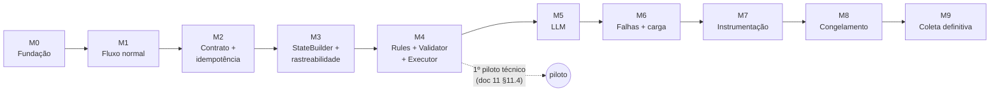

# 13 — Roadmap

> Fonte: [`CLAUDE.md`](../CLAUDE.md) §29, §48; `piloto-do-experimento.md` §28, §32, §34, §37;
> documentos 01–12 deste diretório.
>
> Este documento é a **fonte de verdade do progresso** do projeto. Ele organiza o
> desenvolvimento em **marcos** (M0–M9), cada um com um conjunto de **tasks**. A ordem dos
> marcos segue exatamente a sequência de implementação definida no `CLAUDE.md` §29 e no
> piloto §28 — não inverter sem necessidade técnica clara.

## 13.1 Como usar este roadmap

### Convenções de trabalho

| Regra | Descrição |
|---|---|
| Identificador | Cada task tem ID `Mx-Tyy` (ex.: `M1-T03`) |
| 1 task = 1 commit | Mensagem em Conventional Commits, PT-BR, com o ID ao final: `feat(orders): adiciona endpoint POST /orders [M1-T03]` |
| Status no mesmo commit | O commit que conclui a task também marca a task como ✅ neste documento — o roadmap nunca fica defasado em relação ao código |
| Branch | Commits direto na `main` local |
| Fechamento de marco | Verificar o critério de conclusão → atualizar o painel (§13.2) → commit `docs(roadmap): conclui Mx` → tag anotada `mx-<slug>` → `git push origin main --follow-tags` |
| Comunicação | Avisar o responsável sempre que uma task ou um marco for concluído |
| Honestidade | Não marcar ✅ sem entregável e verificação reais ([`CLAUDE.md`](../CLAUDE.md) §44) |

### Legenda

| Símbolo | Significado |
|---|---|
| ⬜ | Pendente |
| 🔄 | Em andamento |
| ✅ | Concluída |
| ⏸ | Bloqueada (registrar o motivo) |
| **(D)** | Exige **decisão do responsável** antes ou durante a task |
| 🔬 | **Impacto metodológico** ([`CLAUDE.md`](../CLAUDE.md) §43): a decisão precisa ser refletida em `piloto-do-experimento.md` e no TCC |

Maturidade dos entregáveis ([`CLAUDE.md`](../CLAUDE.md) §44): **implementado**, **testado**,
**planejado**, **provisório** — indicado nas tasks quando relevante.

## 13.2 Painel de status

| Marco | Objetivo | Status | Tag | Concluído em |
|---|---|:---:|---|---|
| [M0](#m0--fundação-do-repositório) | Fundação do repositório, roadmap, configuração base | ✅ | `m0-fundacao` | 2026-09-26 |
| [M1](#m1--fluxo-normal-ponta-a-ponta) | Fluxo normal Pedido → Estoque → `COMPLETED` | ✅ | `m1-fluxo-normal` | 2026-09-27 |
| [M2](#m2--contrato-de-mensagens-e-idempotência) | Envelope versionado, `event_seq`, idempotência, redelivery | ✅ | `m2-idempotencia` | 2026-09-28 |
| [M3](#m3--statebuilder-system_state-e-rastreabilidade) | `StateBuilder`, `SYSTEM_STATE`, JSONL de rastreabilidade | ✅ | `m3-rastreabilidade` | 2026-09-28 |
| [M4](#m4--rules--validator--executor) | `RulesDecisionEngine`, Validator, Executor, 5 ações, 1º piloto | 🔄 | `m4-rules` | — |
| [M5](#m5--llmdecisionengine) | Ollama + `LLMDecisionEngine` stateless | ⬜ | `m5-llm` | — |
| [M6](#m6--cenários-de-falha-e-carga) | Dataset, carga e scripts de falha dos 6 cenários | ⬜ | `m6-falhas-carga` | — |
| [M7](#m7--instrumentação-e-protocolo-experimental) | Reset, readiness, métricas, protocolo de execução | ⬜ | `m7-instrumentacao` | — |
| [M8](#m8--congelamento) | Congelamento da configuração experimental | ⬜ | `freeze-v1` | — |
| [M9](#m9--coleta-definitiva) | Coleta definitiva da amostra | ⬜ | `coleta-v1` | — |

## 13.3 Dependências entre marcos

Piloto técnico (M0–M7): dados em `data/pilot/`, `phase: PILOT`, `eligible_for_sample: false`.
Coleta definitiva (M9): dados em `data/experiment/`, `phase: EXPERIMENT`,
`eligible_for_sample: true` — somente após `freeze-v1`.

---

## M0 — Fundação do repositório

**Objetivo:** preparar o repositório para o desenvolvimento: roadmap, regras de progresso,
estrutura de diretórios, dependências, configuração experimental base e testes.
**Pré-requisitos:** documentação 01–12 consolidada. **Tag:** `m0-fundacao`.

| ID | Task | Commit | Entregáveis | Refs | Status |
|---|---|---|---|---|:---:|
| M0-T01 | Roadmap detalhado por marcos | `docs(roadmap)` | `docs/13-roadmap.md`; linha 13 no `docs/README.md` | CLAUDE §29, §48 | ✅ |
| M0-T02 | Regras de roadmap e progresso no `CLAUDE.md` | `docs(claude)` | Seção "Roadmap e registro de progresso" (§49) + item no resumo operacional (§50) | — | ✅ |
| M0-T03 | Manter `docs/ref` versionado e corrigir referências | `chore(repo)` | `.gitignore` sem `/docs/ref`; `docs/README.md` e caminho do piloto no `CLAUDE.md` corrigidos | Inconsistência I-10 | ✅ |
| M0-T04 | Esqueleto de diretórios | `chore(repo)` | `services/orders/app`, `services/inventory/app`, `shared/`, `contracts/`, `config/`, `datasets/`, `scripts/`, `data/pilot/`, `data/experiment/`, `tests/{unit,integration,contracts}`; `.gitignore` (`*.db`, execuções em `data/`, `.venv`, `__pycache__`, `.env`) | [02 §2.6](02-arquitetura.md) | ✅ |
| M0-T05 | Dependências e ambiente | `build` | `requirements.txt` por serviço; `requirements-dev.txt` (pytest); `.env.example`; imagem base Python 3.12 (**provisória** — pin no M8) | [03](03-stack-tecnologica.md), CLAUDE §34 | ✅ |
| M0-T06 | Configuração experimental e pacote comum | `feat(config)` | `config/experiment_config.yml` (piloto §31 + `task_deadline_ms` + `decision_engine`); `shared/` com carga de config, geração de IDs (`ORD_`, `TASK_`, `MSG_`, `STATE_`, `DEC_`) e timestamps UTC ISO 8601 (ms) | [03 §3.6](03-stack-tecnologica.md), I-04, RNF-022 | ✅ |
| M0-T07 | Testes base | `test` | pytest configurado; testes da carga de config e dos utilitários de `shared/` | CLAUDE §35 | ✅ |
| M0-T08 | README raiz | `docs` | `README.md` (objetivo, como subir, onde estão a documentação e o roadmap) | — | ✅ |

**Critério de conclusão**

- [x] Roadmap publicado e referenciado no índice de `docs/`.
- [x] `CLAUDE.md` contém as regras de atualização do roadmap e de aviso de conclusão.
- [x] `docs/ref` continua versionado (`git check-ignore` não o ignora).
- [x] Estrutura de diretórios criada; `data/pilot/` e `data/experiment/` separados.
- [x] `experiment_config.yml` carrega com todas as chaves do piloto §31 + `task_deadline_ms`.
- [x] `pytest` passa (19 testes, Python 3.12).

> `shared/` é uma **biblioteca** comum (contratos, IDs, tempo, config). Não compartilha banco
> nem estado em tempo de execução entre os serviços (RNF-003).

---

## M1 — Fluxo normal ponta a ponta

**Objetivo:** o caminho funcional mínimo do [`CLAUDE.md`](../CLAUDE.md) §6 funcionando,
sem LLM, sem falhas e sem carga (piloto §28 Fase 1).
**Pré-requisitos:** M0. **Tag:** `m1-fluxo-normal`.

| ID | Task | Commit | Entregáveis | Refs | Status |
|---|---|---|---|---|:---:|
| M1-T01 | Infraestrutura RabbitMQ | `feat(infra)` | `docker-compose.yml` com RabbitMQ (management); `config/rabbitmq/definitions.json` com `tcc.tasks` (direct), `tcc.dlx`, `inventory.primary`, `inventory.fallback`, `orders.events`, `tasks.dlq` | [04 §4.1](04-contrato-mensageria.md) | ✅ |
| M1-T02 | Configuração Celery nos dois serviços | `feat(messaging)` | Filas/rotas sobre `tcc.tasks`; `acks_late`, `prefetch=1`, `task_reject_on_worker_lost`; **sem `autoretry`**; envelope como argumento único da task; publicação sem rota explícita cai na DLQ | [03 §3.3](03-stack-tecnologica.md), CLAUDE §9 | ✅ |
| M1-T03 | `orders-service`: API e `orders.db` | `feat(orders)` | FastAPI; `orders`, `tasks`, `processed_events`; `POST /orders` (202; pedido inválido → 400); `GET /orders/{id}`; health check; Dockerfile e serviço `orders-api` no compose. **(D)** D-02, D-14 | RF-001–RF-004, [08](08-modelo-de-dados-mer.md) | ✅ |
| M1-T04 | `inventory-service`: worker e `inventory.db` | `feat(inventory)` | Worker em `inventory.primary`; `reservations`, `processed_messages`; reserva simulada da rota primária; publica `STOCK_RESERVATION_SUCCEEDED` em `orders.events` após o commit; Dockerfile e serviço `inventory-worker` (sem mingle/gossip/heartbeat, incompatíveis com o RabbitMQ 4) | RF-006, RF-007, RF-010 | ✅ |
| M1-T05 | Despacho inicial **provisório** | `feat(orders)` | `CONTINUE` fixo para `inventory.primary`, sem motor de decisão (`orchestration/provisional_dispatch.py`) — **provisório**, substituído em M4-T04. Tarefa gravada como `DISPATCHED` antes da publicação | RF-005 | ✅ |
| M1-T06 | Consumo de `orders.events` | `feat(orders)` | Worker Celery do Orders (serviço `orders-worker`); evento terminal de sucesso → Task e Order `COMPLETED`, sem consultar o DecisionEngine; tarefa terminal não é alterada | RF-011, [05](05-maquina-de-estados.md) | ✅ |
| M1-T07 | Smoke test do fluxo normal | `test` | `scripts/pilot/smoke_test.py` (pedidos `COMPLETED`, 1 reserva por tarefa, filas e DLQ vazias); `tests/integration` (marcador `integration`); README com o passo a passo | CLAUDE §35 | ✅ |

**Critério de conclusão** (piloto §28 Fase 1)

- [x] `docker compose up` inicializa RabbitMQ, Orders e Inventory.
- [x] `POST /orders` → RabbitMQ → Inventory → `inventory.db` → evento de sucesso → Orders → `orders.db` → `COMPLETED`.
- [x] Pedido e tarefa terminam como `COMPLETED`.
- [x] Nenhuma chamada HTTP síncrona entre os serviços; nenhum banco compartilhado.

> Verificado em 2026-09-27 a partir de ambiente limpo (`docker compose down -v`): smoke test com 3 pedidos `COMPLETED`, 1 reserva por tarefa, filas e DLQ vazias; volumes `orders-data` e `inventory-data` separados. Pendências conhecidas, tratadas nos próximos marcos: despacho inicial provisório (M4-T04) e `event_seq` do evento de retorno provisório (M2-T02).

---

## M2 — Contrato de mensagens e idempotência

**Objetivo:** envelope versionado, sequência lógica por tarefa e as duas idempotências
(transporte e negócio), com redelivery distinta de `RETRY` (piloto §28 Fase 2).
**Pré-requisitos:** M1. **Tag:** `m2-idempotencia`.

| ID | Task | Commit | Entregáveis | Refs | Status |
|---|---|---|---|---|:---:|
| M2-T01 | Schema do envelope | `feat(contracts)` | Modelos em `shared/envelope.py` (envelope + `payload` por evento); `contracts/message_envelope.schema.json` e `message_payloads.schema.json` gerados e checados por teste de contrato; consumidores rejeitam mensagem fora do contrato para `tasks.dlq`. **(D)** D-13 | [04 §4.2](04-contrato-mensageria.md) | ✅ |
| M2-T02 | `event_seq`, `attempt_number`, `message_id` | `feat(orders)` | Orders numera a trajetória (D-16): `TASK_CREATED` = 1, cada mensagem publicada e cada evento novo recebido consomem o próximo número, na mesma transação que o aplica; Inventory repete o `event_seq` da solicitação (correlação); `message_id` novo por mensagem | RF-012, RNF-016, RNF-017 | ✅ |
| M2-T03 | Idempotência de transporte | `feat(inventory)` | Verificação por `message_id` na mesma transação da reserva; `processed_messages` guarda resultado e resposta; redelivery reemite a MESMA resposta (mesmo `message_id`) sem reprocessar, o que também recupera resposta perdida entre commit e publicação; `redelivered` lido de `delivery_info` e registrado em log | RF-008, [04 §4.7.1](04-contrato-mensageria.md) | ✅ |
| M2-T04 | Idempotência de negócio | `feat(inventory)` | `reservations.task_id UNIQUE` como barreira no banco; nova tentativa lógica (novo `message_id`, mesmo `task_id`) de tarefa já reservada não cria 2ª reserva e recebe resposta nova com o resultado da reserva existente | RF-009, [04 §4.7.2](04-contrato-mensageria.md) | ✅ |
| M2-T05 | Dedupe no Orders | `feat(orders)` | `processed_events` verificado e gravado na mesma transação que numera e aplica o evento; evento repetido (mesmo `message_id`) é ignorado e não consome `event_seq`; resultado (`recorded`/`duplicate`/`unknown_task`) registrado em log | [04 §4.8](04-contrato-mensageria.md) | ✅ |
| M2-T06 | Testes de contrato e idempotência | `test` | `tests/contracts` (schema em dia com o código, envelopes e payloads inválidos); unitários de redelivery, nova tentativa e dedupe; `scripts/pilot/duplicate_message_test.py` (ao vivo: nova tentativa + 2 redeliveries → 1 reserva, estado e `event_seq` corretos, filas vazias) e `tests/integration/test_idempotency.py`. Limitação: redelivery simulada por republicação (flag `redelivered` só em reentrega real) | CLAUDE §35 | ✅ |
| M2-T07 | **(D) 🔬** Decisão sobre outbox | `docs(decisoes)` | D-04 registrada: sem outbox, publicação direta após o commit; `outbox`/`published_events` descartadas nos docs 08/09 | [08 §8.5](08-modelo-de-dados-mer.md) | ✅ |

**Critério de conclusão** (piloto §28 Fase 2)

- [x] Reenviar a mesma mensagem **não** cria uma segunda reserva.
- [x] Nova tentativa lógica com `message_id` novo **não** cria uma segunda reserva.
- [x] `message_id`, `task_id` e `event_seq` aparecem nos registros.

> Verificado em 2026-09-28 a partir de ambiente limpo: 94 testes unitários/contrato e 3 de
> integração; `duplicate_message_test` com nova tentativa e 2 redeliveries → 1 reserva por
> tarefa, `event_seq` correto no Orders, filas e DLQ vazias; `processed_messages` e
> `processed_events` correlacionam solicitação, resposta, `task_id` e `event_seq`. Decisões
> tomadas no marco: D-13, D-16, D-04. Limitação conhecida: a redelivery é simulada por
> republicação (o flag `redelivered` só aparece numa reentrega real do broker).

---

## M3 — StateBuilder, `SYSTEM_STATE` e rastreabilidade

**Objetivo:** construir o snapshot normalizado apresentado ao decisor e os artefatos de
rastreabilidade (piloto §28 Fase 3).
**Pré-requisitos:** M2. **Tag:** `m3-rastreabilidade`.

| ID | Task | Commit | Entregáveis | Refs | Status |
|---|---|---|---|---|:---:|
| M3-T01 | **(D) 🔬** Formato final do `SYSTEM_STATE` | `docs(decisoes)` | D-06 registrada: formato aninhado; `phase` = estado da tarefa com regra de `CONTINUE` em `PENDING`/`WAITING`; `decision_engine` = `RULES`/`LLM` (config, código e docs) | I-01, I-02, I-03 | ✅ |
| M3-T02 | Schema do `SYSTEM_STATE` | `feat(contracts)` | `shared/system_state.py` (modelo aninhado estrito) e `contracts/system_state.schema.json` gerado; `TaskStatus`/`TaskResult` movidos para `shared/task.py`; teste de contrato valida o exemplo do doc 06 e rejeita `READY`/`RECOVERED` e a forma plana antiga | [06 §6.2](06-modelo-de-decisao.md), RF-013 | ✅ |
| M3-T03 | Execução e metadados | `feat(observability)` | `shared/artifacts.py`: diretório derivado do `execution_id` (`PILOT_` → `data/pilot/`, `EXP_` → `data/experiment/`) e escritor JSONL com um arquivo por processo (`<artefato>.<writer>.jsonl`); `scripts/pilot/new_execution.py` aloca `PILOT_nnnn` e grava `execution_metadata.json` (`PILOT`, `eligible_for_sample: false`, desconhecidos `null`); `./data` montado nos serviços. **(D)** D-05 | RF-035, RF-036, [10 §10.3](10-rastreabilidade-e-metricas.md) | ✅ |
| M3-T04 | Eventos da tarefa | `feat(orders)` | Tabela `task_events` gravada na mesma transação que numera cada evento (`TASK_CREATED`, mensagens publicadas, eventos recebidos, `TASK_COMPLETED`; repetição com `event_seq` original e `redelivered = 1`; flag do broker registrado); `scripts/pilot/collect_artifacts.py` exporta `task_events.jsonl` e consolida os arquivos por processo. **(D)** D-01 | RF-032 | ✅ |
| M3-T05 | `StateBuilder` | `feat(orders)` | `state_builder.py`: snapshot validado pelo contrato, `state_id` único, janela K de ocorrências distintas, `elapsed_ms`, `latency_ms`, `last_result`; `queue_size` e consumidores via `queue.declare` passivo (mesma fonte para Rules e LLM); regras de `service.status` e `fallback_available` documentadas no doc 06 §6.2.4 (I-08); `states.<writer>.jsonl` gravado no ponto de decisão inicial | RF-013–RF-015, RF-031, RNF-012, RNF-019, I-08 | ✅ |
| M3-T06 | Logs estruturados | `feat(observability)` | `shared/structured_logging.py`: JSON por linha (timestamp UTC ms, nível, serviço, `execution_id`, mensagem e campos de correlação num dicionário próprio, imune a colisões como o `task_id` que o Celery injeta) em `microservices_logs.<writer>.jsonl` nos três processos; consumidores e API registram com correlação | RF-034, CLAUDE §36 | ✅ |
| M3-T07 | Registro de decisões | `feat(orders)` | `DecisionRecord` (Códigos 7–9 da metodologia: `RULES`/`LLM`, `llm_inference_ms`/`token_usage` nulos para `RULES`, `reason_code` sempre na decisão executada) e `DecisionRecorder` → `decisions.<writer>.jsonl`; disponível na `Coordination`, ligado ao Orchestrator em M4-T04 | RF-033 | ✅ |
| M3-T08 | Testes de estado e correlação | `test` | Unitários da janela K, do contrato e do `StateBuilder`; `scripts/pilot/check_traceability.py` verifica metadados, trajetória contígua por tarefa, snapshots ligados à trajetória, decisões ligadas a estados e logs da mesma execução (base da etapa 11 do protocolo); `tests/integration/test_traceability.py` roda pedidos, coleta e verifica ao vivo | RNF-007 | ✅ |

**Critério de conclusão** (piloto §28 Fase 3)

- [x] Para qualquer decisão é possível localizar o snapshot exato usado pelo decisor.
- [x] `task_events.jsonl` permite reconstruir a trajetória anterior.
- [x] `recent_events` contém somente a janela K configurada.

> Verificado em 2026-09-28 a partir de ambiente limpo (`PILOT_0005`): 170 testes
> unitários/contrato e 4 de integração; `check_traceability` sem erros (46 eventos, 10
> snapshots, 110 linhas de log). O snapshot é gravado em todo ponto de decisão e
> `check_traceability` exige que cada decisão aponte para um `state_id` da mesma tarefa; as
> decisões propriamente ditas começam a ser registradas no M4 (motor de decisão). Decisões
> do marco: D-06, D-05, D-01. Ajustes a levar ao TCC: §13.6.

---

## M4 — Rules + Validator + Executor

**Objetivo:** as cinco ações reais executadas pelo `RulesDecisionEngine`, passando pelo
Validator e Executor comuns, sem LLM (piloto §28 Fase 4). Fecha o **1º piloto técnico**.
**Pré-requisitos:** M3. **Tag:** `m4-rules`.

| ID | Task | Commit | Entregáveis | Refs | Status |
|---|---|---|---|---|:---:|
| M4-T01 | Contrato de decisão | `feat(contracts)` | `shared/decision.py`: `ProposedDecision` (o que o motor propôs, sem restrição), `Decision` executável (5 ações, target compatível com a ação), `ValidationResult`, enums de ação, `reason_code` e erros; `resolve_action` (inválida → `ABORT / INVALID_DECISION`); `contracts/decision.schema.json` | [06 §6.4](06-modelo-de-decisao.md), [12 §12.4](12-glossario.md), RF-017 | ✅ |
| M4-T02 | `RulesDecisionEngine` | `feat(orchestration)` | Interface `DecisionEngine` / `EngineOutput` comum; `RulesDecisionEngine` com a política ordenada literal (Código 4 / piloto §14.3, ajuste D-06) e limiares do config; testes de cada regra e das prioridades | [06 §6.6](06-modelo-de-decisao.md), RF-024 | ✅ |
| M4-T03 | `DecisionValidator` | `feat(orchestration)` | Validador comum do Código 6 / piloto §18 + `TERMINAL_TASK` + `MALFORMED_DECISION`; acréscimos 🔬: `CONTINUE` só para `inventory.primary` e antes do primeiro despacho, `RETRY` em `inventory.fallback` inválido (D-15) | [06 §6.9](06-modelo-de-decisao.md), RF-028, RNF-009 | ✅ |
| M4-T04 | Orchestrator e `CONTINUE` | `feat(orchestration)` | `Orchestrator.handle_decision_point` (build → decide → validate → `resolve_action` → `decisions.jsonl` → execute; `decision_time_ms` sem a construção do estado); motor escolhido por `decision_engine`; Executor `CONTINUE` (primeiro despacho com `decision_id` e `timeout_check` agendado em `orders.events`); API usa o Orchestrator e o despacho provisório de M1-T05 foi removido | [07 §7.2](07-diagramas-uml.md), RF-016, RF-018 | ✅ |
| M4-T05 | `RETRY` | `feat(orchestration)` | Executor `RETRY`: `attempt_number + 1`, tarefa `RETRYING`, `RETRY_SCHEDULED` na trajetória e despacho agendado (`orders.dispatch_attempt`) após `retry_delay_ms`; no despacho, novo `message_id` e `event_seq`, mesmo `task_id` e target, novo `timeout_check`; despacho idempotente e ignorado se a tarefa já terminou | RF-019 | ✅ |
| M4-T06 | Detector de timeout e falha reportada | `feat(orders)` | `orders.timeout_check` agendado a cada despacho: só age se a solicitação ainda é a corrente, sem resposta e sem timeout já registrado; registra `INVENTORY_TIMEOUT`, `last_result = timeout` (`fallback_failed` no fallback, D-15) e abre ponto de decisão. `STOCK_RESERVATION_FAILED` (payload com `failure_reason`) da solicitação corrente também abre ponto de decisão. Worker do Orders com prefetch sem limite (D-17) | RF-023, [04 §4.9](04-contrato-mensageria.md) | ✅ |
| M4-T07 | `WAIT` | `feat(orchestration)` | Executor `WAIT`: `wait_count + 1`, tarefa `WAITING`, `WAIT_SCHEDULED`, reavaliação agendada (`orders.reevaluate`) após `wait_delay_ms`; `attempt_number` inalterado. A reavaliação registra `WAIT_FINISHED` uma única vez e abre novo ponto de decisão; ignorada se a tarefa terminou ou a espera foi superada. Verificado ao vivo (PILOT_0008): Inventory parado → WAIT, WAIT, ABORT `SERVICE_UNAVAILABLE_LIMIT` | RF-020 | ✅ |
| M4-T08 | Rota fallback e `FALLBACK` | `feat(inventory)` | Executor `FALLBACK`: tarefa `FALLBACK_PROCESSING`, `fallback_used = 1`, `attempt_number` inalterado (D-15), `FALLBACK_SCHEDULED` e solicitação imediata para `inventory.fallback`; `reservation/fallback.py` no mesmo inventory-service e worker consumindo as duas filas. Verificado ao vivo (PILOT_0009, Inventory pausado): CONTINUE → RETRY → RETRY → FALLBACK → ABORT `FALLBACK_FAILED`; ao retomar, 4 solicitações retidas → 1 reserva | RF-021, [06 §6.5](06-modelo-de-decisao.md), I-06 | ✅ |
| M4-T09 | `ABORT` e decisão inválida | `feat(orchestration)` | `DecisionExecutor` (uma transação por ação; efeitos externos só após o commit) com `ABORT`: Task `ABORTED`, Order `FAILED`, `TASK_ABORTED` na trajetória com `decision_id` e `reason_code`; decisão inválida → `ABORT / INVALID_DECISION`; tarefa terminal não muda. Feita antes da T04, que depende do fail-safe | RF-022, RF-029 | ✅ |
| M4-T10 | **(D) 🔬** DLQ | `feat(messaging)` | D-07: falha de processamento não prevista → rejeição sem requeue → `tasks.dlq` (sem retentativa automática); consumidor bruto da `tasks.dlq` no worker do Orders registra `MESSAGE_DEAD_LETTERED` (tarefa Celery, fila de origem, motivo) e leva a tarefa a `DEAD_LETTERED` / pedido `FAILED`. Verificado ao vivo (PILOT_0010) | RF-030, I-07 | ✅ |
| M4-T11 | Testes das ações | `test` | Rules (cada regra), Validator (cada erro), Executor por ação: `WAIT` não incrementa tentativa, `FALLBACK` só quando admissível, `ABORT` terminal | CLAUDE §35 | ⬜ |
| M4-T12 | 1º piloto técnico | `chore(pilot)` | `PILOT_0001` (rules, fluxo normal) executado; checklist do doc 11 §11.4 marcado | piloto §32 | ⬜ |

**Critério de conclusão** (piloto §28 Fase 4 e §32)

- [ ] `CONTINUE`, `RETRY`, `WAIT`, `FALLBACK` e `ABORT` validados sem LLM.
- [ ] Checklist do 1º piloto técnico ([11 §11.4](11-requisitos.md)) completo.

---

## M5 — `LLMDecisionEngine`

**Objetivo:** trocar **somente** o componente que seleciona a ação (piloto §28 Fase 5).
**Pré-requisitos:** M4. **Tag:** `m5-llm`.

| ID | Task | Commit | Entregáveis | Refs | Status |
|---|---|---|---|---|:---:|
| M5-T01 | **(D) 🔬** Onde roda o Ollama | `docs(decisoes)` | D-08: no host macOS (GPU Metal) × em container (apenas CPU no macOS); registro no metadata | [03 §3.5](03-stack-tecnologica.md), RNF-021 | ⬜ |
| M5-T02 | `OllamaClient` | `feat(llm)` | `stream=false`; `temperature`, `top_p`, `num_predict`, `seed` do config; timeout. **(D) 🔬** D-09 (modo JSON do runtime) | RF-025 | ⬜ |
| M5-T03 | `PromptBuilder` | `feat(llm)` | Template versionado em `config/prompts/decision_prompt_v1.txt`; hash no metadata | [06 §6.8](06-modelo-de-decisao.md), RNF-027 | ⬜ |
| M5-T04 | `DecisionParser` | `feat(llm)` | Parser estrito, sem correção; saída malformada = decisão inválida | RF-027, CLAUDE §23 | ⬜ |
| M5-T05 | `LLMDecisionEngine` | `feat(orchestration)` | Stateless; `llm_inference_ms`; tokens só se o runtime os informar; timeout → `LLM_DECISION_TIMEOUT` → `ABORT` | RF-026, RNF-013, [06 §6.13](06-modelo-de-decisao.md) | ⬜ |
| M5-T06 | Readiness e warm-up do LLM | `feat(scripts)` | Readiness do Ollama; warm-up (`model_load_ms`, `warmup_inference_ms`); versão/digest/quantização lidos do runtime (nunca inventados) | RF-038, RF-039 | ⬜ |
| M5-T07 | Testes do LLM e de equivalência | `test` | Cliente falso: JSON inválido, target inventado, timeout → `ABORT`; mesmo `SYSTEM_STATE`, Validator e Executor para Rules e LLM | RNF-009, RNF-010, CLAUDE §35 | ⬜ |
| M5-T08 | Piloto com LLM | `chore(pilot)` | Piloto com `decision_engine: llm` no fluxo normal; avaliação da viabilidade do `llama3.1:8b` no hardware local | piloto §20.4 | ⬜ |

**Critério de conclusão** (piloto §28 Fase 5)

- [ ] O LLM troca somente o componente que seleciona a ação.
- [ ] Decisão inválida do LLM → registrada → `ABORT`, sem autocorreção e sem fallback para Rules.

---

## M6 — Cenários de falha e carga

**Objetivo:** tornar os seis cenários reproduzíveis e controláveis (piloto §28 Fase 6).
**Pré-requisitos:** M5 (fluxo + Rules + LLM funcionando). **Tag:** `m6-falhas-carga`.

| ID | Task | Commit | Entregáveis | Refs | Status |
|---|---|---|---|---|:---:|
| M6-T01 | Dataset | `feat(datasets)` | `datasets/orders_v1.json` determinístico (seed) | RNF-005 | ⬜ |
| M6-T02 | Gerador de carga | `feat(workload)` | `scripts/workload/generate_load.py` (nº de requisições, taxa, seed) | RF-040 | ⬜ |
| M6-T03 | Injeção controlada na rota primária | `feat(inventory)` | Erro transitório/latência na **rota primária**, ativados por controle externo registrado; rota fallback não afetada | piloto §35.7, [06 §6.5](06-modelo-de-decisao.md) | ⬜ |
| M6-T04 | Cenário timeout | `feat(faults)` | `scripts/faults/timeout.py` | [11 §11.3](11-requisitos.md) | ⬜ |
| M6-T05 | Cenário falha intermitente | `feat(faults)` | `scripts/faults/intermittent_failure.py` | [11 §11.3](11-requisitos.md) | ⬜ |
| M6-T06 | Cenário sobrecarga | `feat(faults)` | `scripts/faults/overload.py` | [11 §11.3](11-requisitos.md) | ⬜ |
| M6-T07 | Cenário dados inconsistentes | `feat(faults)` | `scripts/faults/inconsistent_data.py` → `invalid_data`. **(D)** D-03 | [11 §11.3](11-requisitos.md) | ⬜ |
| M6-T08 | Cenário recuperação pós-falha | `feat(faults)` | `scripts/faults/recovery.py` (stop/start do `inventory-service` → só `WAIT`/`ABORT`) | [11 §11.3](11-requisitos.md) | ⬜ |
| M6-T09 | Configuração de cenários | `feat(config)` | `config/scenarios/*.yml`; `fault_events.jsonl` | RF-041 | ⬜ |
| M6-T10 | Piloto dos cenários | `chore(pilot)` | Os 6 cenários executados em piloto com rules e llm; `FALLBACK` confirmado como realmente executável | piloto §35.7 | ⬜ |

**Critério de conclusão**

- [ ] Os seis cenários são acionáveis por script/config e registrados em `fault_events.jsonl`.
- [ ] Nenhuma perturbação aleatória não registrada.
- [ ] Degradação da rota primária é distinguível de indisponibilidade total do Inventory.

---

## M7 — Instrumentação e protocolo experimental

**Objetivo:** instrumentação comum e o protocolo operacional completo (piloto §28 Fase 7;
doc 10 §10.6).
**Pré-requisitos:** M6. **Tag:** `m7-instrumentacao`.

| ID | Task | Commit | Entregáveis | Refs | Status |
|---|---|---|---|---|:---:|
| M7-T01 | Reset do ambiente | `feat(scripts)` | `scripts/reset_environment.py`: purge de filas/DLQ, SQLite iniciais, hashes, `initial_state.json`, `reset.log` | RF-037, RNF-024 | ⬜ |
| M7-T02 | Readiness completo | `feat(scripts)` | `scripts/readiness.py` → `readiness_status` | RF-038, RNF-023 | ⬜ |
| M7-T03 | Métricas de fila | `feat(metrics)` | `queue_metrics.csv` (API de management do RabbitMQ, intervalo fixo) | RNF-020 | ⬜ |
| M7-T04 | Métricas de containers | `feat(metrics)` | `container_stats.csv` (Docker Stats) | RNF-020 | ⬜ |
| M7-T05 | **(D)** Prometheus | `docs(decisoes)` | D-10: exporters Prometheus × API de management + Docker Stats | I-09, CLAUDE §33 | ⬜ |
| M7-T06 | Executor do protocolo | `feat(experiment)` | `scripts/run_experiment.py` (TABELA 14, etapas 1–12); `execution_metadata.json` completo (commit, hashes, versões, hardware); `run_status`; `invalid_runs.csv` | RNF-005, RNF-006 | ⬜ |
| M7-T07 | Consolidação de métricas | `feat(analysis)` | `latency_metrics.csv`, `throughput_metrics.csv`, `error_metrics.csv`, `recovery_metrics.csv`, overhead decisório — calculados **somente** a partir dos arquivos | RF-042, [10 §10.4](10-rastreabilidade-e-metricas.md) | ⬜ |
| M7-T08 | Testes dos artefatos | `test` | Todos os artefatos do doc 10 §10.2 gerados e íntegros | RNF-029 | ⬜ |

**Critério de conclusão**

- [ ] Uma execução completa segue o protocolo de ponta a ponta e gera todos os artefatos.
- [ ] Instrumentação idêntica para Rules e LLM.

---

## M8 — Congelamento

**Objetivo:** congelar e versionar tudo o que define a comparabilidade (piloto §28 Fase 8, §34).
**Pré-requisitos:** M7. **Tag:** `freeze-v1`.

| ID | Task | Commit | Entregáveis | Refs | Status |
|---|---|---|---|---|:---:|
| M8-T01 | **(D) 🔬** Divergências e inconsistências | `docs(decisoes)` | Decisões pendentes (§13.4) e inconsistências (§13.5) resolvidas; `piloto-do-experimento.md` e docs atualizados | [08 §8.5](08-modelo-de-dados-mer.md) | ⬜ |
| M8-T02 | **(D) 🔬** Valores finais | `feat(config)` | D-11: `queue_high_watermark` (a partir do steady state), K, timeouts/retry/wait, dataset, carga, seeds, `N_rep`, ordem Rules/LLM | [11 §11.5](11-requisitos.md) | ⬜ |
| M8-T03 | Pin de versões | `chore(build)` | Bibliotecas, digests de imagem, Python, versão do Ollama, digest/quantização do modelo, hardware | RNF-006, RNF-026 | ⬜ |
| M8-T04 | Congelamento de prompt e Rules | `chore(freeze)` | Prompt, Rules, `reason_code`s congelados; manifesto de hashes | RNF-027, RNF-028 | ⬜ |
| M8-T05 | Ensaio geral | `test` | Execução completa (ainda `PILOT`): reset → readiness → warm-up → carga → falha → coleta | piloto §28 Fase 8 | ⬜ |
| M8-T06 | Ativação da fase experimental | `chore(config)` | `phase: experiment` no config; tag `freeze-v1` | RNF-025 | ⬜ |

**Critério de conclusão**

- [ ] Nenhum campo crítico `null` no `experiment_config.yml`.
- [ ] Tag `freeze-v1` publicada; a partir daqui nada congelado é alterado.

---

## M9 — Coleta definitiva

**Objetivo:** produzir a amostra do TCC com a configuração congelada.
**Pré-requisitos:** M8 (`freeze-v1`). **Tag:** `coleta-v1`.

| ID | Task | Commit | Entregáveis | Refs | Status |
|---|---|---|---|---|:---:|
| M9-T01 | Execuções da amostra | `chore(experiment)` | `N_rep` × 6 cenários × 2 abordagens na ordem definida → `data/experiment/` | [10 §10.6](10-rastreabilidade-e-metricas.md) | ⬜ |
| M9-T02 | Execuções inválidas | `chore(experiment)` | `invalid_runs.csv`; repetição até completar `N_rep` válidas por combinação | [06 §6.12](06-modelo-de-decisao.md) | ⬜ |
| M9-T03 | Consolidação dos resultados | `feat(analysis)` | `results.csv`, `analysis_summary.md` — apenas com dados reais | CLAUDE §42, §44 | ⬜ |
| M9-T04 | **(D)** Versionamento dos dados | `docs(decisoes)` | D-12: como versionar/publicar os dados experimentais | RNF-006 | ⬜ |

**Critério de conclusão**

- [ ] `N_rep` execuções válidas por cenário × abordagem.
- [ ] Nenhum dado de piloto na amostra.

---

## 13.4 Registro de decisões pendentes

| ID | Decisão | Opções / padrão proposto | Fechar em | Status |
|---|---|---|---|:---:|
| D-01 | Persistir `task_events` / `states` / `decisions` também em tabela | **Decidido (2026-09-28):** `task_events` em tabela (fonte da janela K e do `task_events.jsonl`, exportado ao fim da execução); `states` e `decisions` somente em JSONL | M3-T04 | ✅ |
| D-02 | Itens do pedido e da reserva | **Decidido (2026-09-27): JSON** em `orders.items_json` e `reservations.items_json`, sem tabelas de itens. Itens imutáveis após a validação; toda tentativa republica o mesmo `payload.items`; nenhuma métrica nem o `SYSTEM_STATE` consultam itens. Sem impacto metodológico | M1-T03 | ✅ |
| D-03 | Tabela `stock` no Inventory | Reserva 100% simulada × tabela `stock` (enriquece o cenário "dados inconsistentes") | M6-T07 | ⬜ |
| D-04 🔬 | Padrão outbox | **Decidido (2026-09-28): sem outbox; publicação direta após o commit.** Inventory reemite a resposta gravada em `processed_messages.response_json` na redelivery; despacho perdido do Orders é coberto pelo `timeout_check` (M4-T06). Revisável se o piloto mostrar perda | M2-T07 | ✅ |
| D-05 | Tabela `executions` | **Decidido (2026-09-28): não criar.** Metadados só em `execution_metadata.json` (metodologia §4.5, Código 12); o reset restaura o SQLite a cada repetição e `run_status` é conhecido pela bancada, não pelo serviço | M3-T03 | ✅ |
| D-06 🔬 | Formato do `SYSTEM_STATE` | **Decidido (2026-09-28):** aninhado (como o Código 4 da metodologia); `service.latency_ms`; `phase` = `TaskStatus`, com `CONTINUE` em `PENDING`/`WAITING` (substitui `READY`/`RECOVERED` — **altera o Código 4 do TCC**, §13.6); `decision_engine` = `RULES`/`LLM` em tudo, como os Códigos 7–9 e 12 | M3-T01 | ✅ |
| D-07 🔬 | Política de DLQ | **Decidido (2026-09-28):** "falhas sucessivas" = uma falha de processamento, sem retentativa automática; exceção não prevista → rejeição sem requeue → `tasks.dlq`; o worker do Orders consome a DLQ, registra `MESSAGE_DEAD_LETTERED` e marca a tarefa `DEAD_LETTERED` | M4-T10 | ✅ |
| D-08 🔬 | Localização do Ollama | Host macOS (GPU Metal) × container (CPU) | M5-T01 | ⬜ |
| D-09 🔬 | Modo JSON do runtime | Usar a restrição de formato do Ollama × apenas o prompt | M5-T02 | ⬜ |
| D-10 | Prometheus | Exporters × API de management + Docker Stats | M7-T05 | ⬜ |
| D-11 🔬 | Valores finais dos parâmetros | Ver [11 §11.5](11-requisitos.md) | M8-T02 | ⬜ |
| D-12 | Publicação dos dados experimentais | Commit no repositório × artefato de release × armazenamento externo | M9-T04 | ⬜ |
| D-13 | Envelope inválido no consumo | **Decidido (2026-09-28): rejeição sem requeue → `tcc.dlx` → `tasks.dlq`.** Envelope, `event_type` ou `payload` fora do contrato é problema de contrato, não de negócio; não vira `invalid_data`. Verificado ao vivo | M2-T01 | ✅ |
| D-14 | Valor inicial de `attempt_number` | **Decidido (2026-09-27): `1`.** A tentativa inicial é a tentativa 1 e conta dentro de `max_attempts` (`max_attempts = 3` → tentativas 1, 2 e 3). Mantém coerência com o envelope da 1ª publicação (`attempt_number: 1`) e com as regras `attempt_number < max_attempts` do Rules e do Validator | M1-T03 | ✅ |
| D-15 🔬 | Semântica de `fallback_max_attempts` | **Decidido (2026-09-28):** `FALLBACK` não incrementa `attempt_number`; com `fallback_max_attempts = 1`, timeout/falha no fallback → `last_result = fallback_failed` e `RETRY` em `inventory.fallback` é inválido (`FALLBACK_RETRY_LIMIT`) | M4-T03 / M4-T08 | ✅ |
| D-16 🔬 | Quem numera a trajetória (`event_seq`) | **Decidido (2026-09-28): o Orders.** `TASK_CREATED` = 1; cada mensagem publicada, evento novo recebido e evento interno registrado consome o próximo número; no Inventory, `event_seq` repete o da solicitação respondida (correlação). Exemplos dos docs 06, 07 e piloto §10.1 ajustados | M2-T02 | ✅ |
| D-17 | Prefetch do worker do Orders | **Decidido (2026-09-28, técnico):** prefetch sem limite (`worker_prefetch_multiplier = 0`) só no `orders-worker`. Com limite 1, as tarefas internas com atraso (timeout, nova tentativa, reavaliação), que dividem `orders.events` com os eventos, ocupavam o único slot de entrega e retinham as respostas do Inventory até vencer — observado ao vivo (resposta retida 2 s, timeouts falsos). Mensagens seguem sem ack até o processamento (reentregues se o worker cair). Vale igualmente para Rules e LLM | M4-T06 | ✅ |

Cada decisão tomada é registrada aqui (status ✅ + resumo) e, quando 🔬, também em
`piloto-do-experimento.md`.

## 13.5 Inconsistências detectadas na documentação

| ID | Inconsistência | Onde | Resolver em |
|---|---|---|---|
| I-01 | `decision_engine` grafado `RULES`/`LLM` × `rules`/`llm` | metodologia e doc 10 × docs 01, 06–09 e piloto | D-06 ✅ (maiúsculas, como a metodologia) |
| I-02 | `SYSTEM_STATE` plano com `observed_latency_ms` × aninhado com `latency_ms` | piloto §10.1 × doc 06 §6.2 | D-06 ✅ (aninhado) |
| I-03 | Rules usa `phase` `READY`/`RECOVERED`, ausentes da máquina de estados | metodologia Código 4 e piloto §14.3 × doc 05 | D-06 ✅ (`PENDING`/`WAITING`) |
| I-04 | `task_deadline_ms` está nos parâmetros do piloto, mas não no `experiment_config.yml` sugerido | piloto §14.1 × §31 | M0-T06 ✅ |
| I-05 | Default de `tasks.attempt_number`: `0` × `1` | piloto §23 × doc 09 | D-14 ✅ (piloto §23.1 atualizado para `1`) |
| I-06 | `fallback_max_attempts` definido, sem uso nas regras nem no validador | piloto §14.1, §18 | D-15 ✅ |
| I-07 | "Falhas sucessivas" da DLQ sem limite nem mecanismo | piloto §7.1, doc 04 | D-07 ✅ |
| I-08 | Origem do sinal `service.status` (`available`/`degraded`/`unavailable`) não definida | doc 06 §6.2.1 | M3-T05 ✅ (doc 06 §6.2.4) |
| I-09 | Prometheus "confirmado", sem uso concreto definido | doc 03 §3.2 | M7-T05 (D-10) |
| I-10 | `CLAUDE.md` cita `piloto-do-experimento.md` sem o caminho `docs/ref/`; `docs/README.md` diz que `docs/ref` não é versionado | `CLAUDE.md` §2, `docs/README.md` | M0-T03 ✅ |

## 13.6 Ajustes a refletir no texto do TCC

Decisões tomadas na implementação que alteram trechos do capítulo de metodologia
(`docs/ref/TCC_METODOLOGIA.pdf`). Complementa a lista do piloto §33 (espaço de ações,
`alternative_targets`, `wait_count`/`fallback_used`, `max_attempts`).

| Decisão | Trecho da metodologia | Ajuste |
|---|---|---|
| D-06 | Código 4 (`RulesDecisionEngine`), regra de fluxo normal | `phase in {"PENDING", "READY", "RECOVERED"}` → `phase in {"PENDING", "WAITING"}`; `phase` passa a ser o estado da tarefa |
| M3-T05 | Tabela 8 (campos do `SYSTEM_STATE`), coluna de origem | Recomendado detalhar a origem operacional de `service.status`, `service.latency_ms`, `messaging.queue_size`, `alternatives.fallback_available` e da janela `recent_events`, conforme o doc 06 §6.2.4 |
| M3-T07 | Códigos 7–8 (`decisions.jsonl`), campo `executed_decision` | Acrescentar `reason_code` à decisão executada (necessário para registrar `ABORT / INVALID_DECISION` e `LLM_DECISION_TIMEOUT`, como já aparece no Código 9) |
| M4-T03 | Código 6 (`DecisionValidator`) | Acrescentar: `CONTINUE` só com target `inventory.primary` e antes do primeiro despacho (`INVALID_CONTINUE_TARGET`, `CONTINUE_AFTER_DISPATCH`); `RETRY` em `inventory.fallback` inválido (`FALLBACK_RETRY_LIMIT`, D-15); saída ilegível → `MALFORMED_DECISION` |
| D-15 | Tabela de ações / semântica do `FALLBACK` | `FALLBACK` não incrementa `attempt_number`; falha ou timeout no fallback → `last_result = fallback_failed` |
| D-07 | Descrição da DLQ ("falhas sucessivas") | Definir: uma falha de processamento, sem retentativa automática, envia a mensagem à `tasks.dlq`; a tarefa passa a `DEAD_LETTERED` |

## 13.7 Achados do piloto

Observações do piloto técnico relevantes para a análise e a discussão no TCC (não são
resultados da amostra).

| Achado | Onde | Consequência |
|---|---|---|
| Tarefa abortada pode terminar com reserva efetivada | PILOT_0009 (M4-T08): Inventory pausado; após `ABORT FALLBACK_FAILED`, as solicitações retidas foram processadas e geraram 1 reserva; pedido `FAILED` | Não há ação de compensação no espaço de ações (fora do recorte). A análise deve contar esse desfecho (pedido `FAILED` com reserva em `inventory.db`) como inconsistência final, igual para Rules e LLM |
| Timers com atraso retinham eventos com prefetch 1 | PILOT_0006 (M4-T06) | Corrigido por D-17 antes de qualquer coleta; mostra a importância de medir a latência de resposta no piloto |
