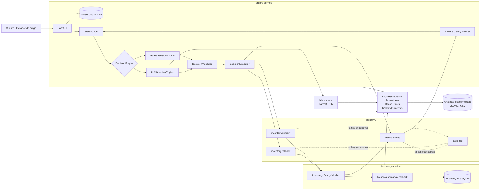
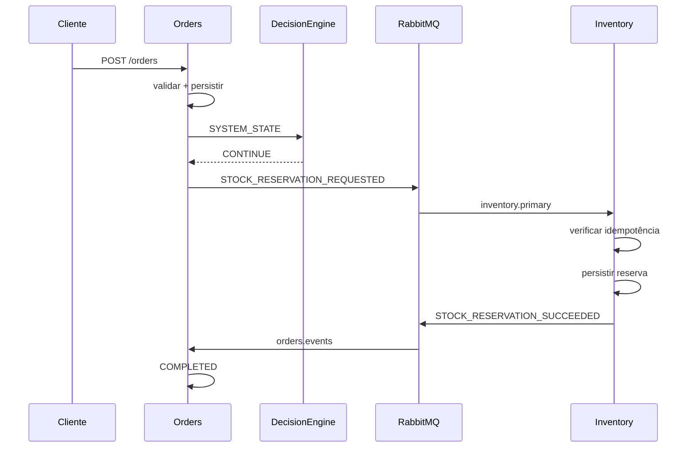
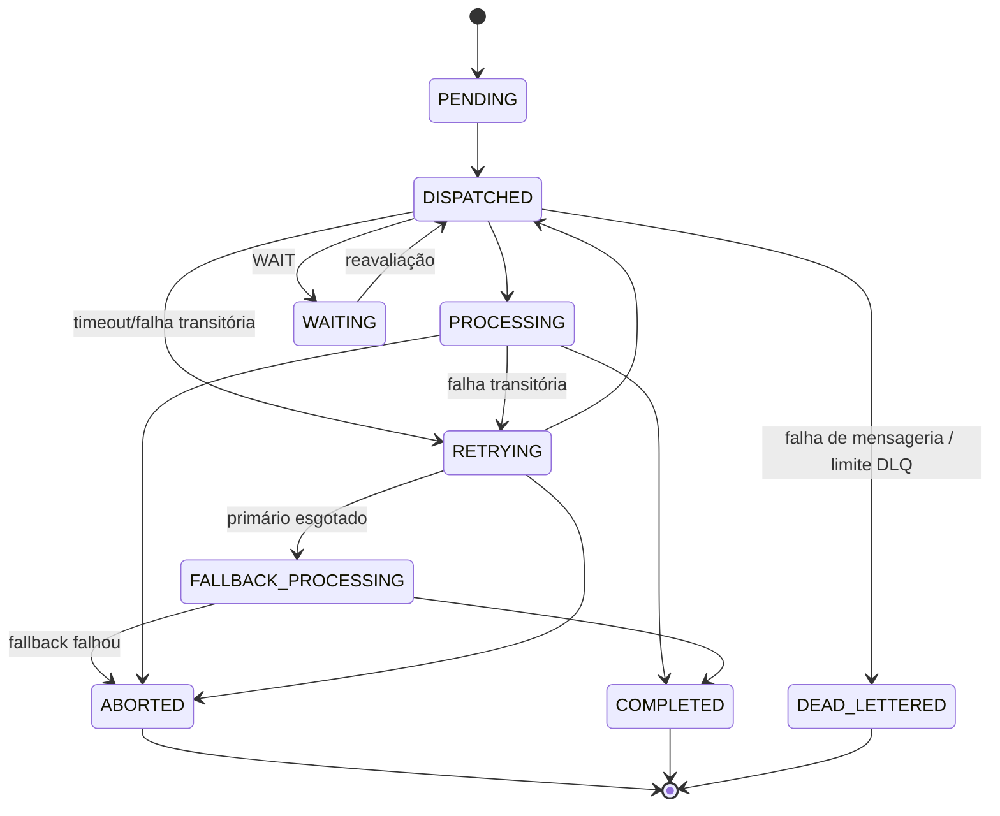

# piloto

## Documento de decisões iniciais para implementação do ambiente experimental

**Projeto:** TCC — Orquestração de tarefas assíncronas em microserviços: RulesDecisionEngine versus agente LLM  
**Finalidade deste arquivo:** transformar as definições conceituais da metodologia, especialmente as subseções 4.3.2 a 4.3.12, em decisões concretas suficientes para iniciar o desenvolvimento do ambiente e produzir o primeiro **piloto técnico**.

> **Importante:** o piloto técnico não integra a amostra definitiva do TCC. Seu objetivo é validar arquitetura, contratos, fluxo, persistência, rastreabilidade e executabilidade das decisões antes do congelamento da configuração experimental.

---

## 1. Status das definições

Para evitar confusão entre o que já está previsto na metodologia e o que está sendo fechado como decisão de implementação, este documento usa três classificações:

- **CONFIRMADO:** definição já prevista no delineamento/metodologia ou explicitamente confirmada no projeto.
- **DECISÃO DE IMPLEMENTAÇÃO:** escolha concreta adotada agora para tornar a arquitetura implementável.
- **A CONGELAR:** parâmetro que pode ser ajustado durante o piloto, mas deverá ser definido e versionado antes da primeira execução que integre a amostra do TCC.

As duas abordagens experimentais devem usar a mesma infraestrutura, o mesmo `SYSTEM_STATE`, o mesmo espaço de ações, o mesmo validador, o mesmo executor e os mesmos limites operacionais. A diferença experimental deve permanecer concentrada no mecanismo que escolhe a próxima ação:

```text
RulesDecisionEngine
        versus
LLMDecisionEngine
```

---

# 2. Stack confirmada

## 2.1 Ambiente de execução

| Elemento | Tecnologia | Status | Função |
| --- | --- | ---: | --- |
| Linguagem | Python | CONFIRMADO | Implementação dos serviços, orquestração, scripts e coleta |
| API | FastAPI | CONFIRMADO | Interface HTTP do Serviço de Pedidos e endpoints auxiliares |
| Containerização | Docker | CONFIRMADO | Isolamento dos componentes |
| Composição local | Docker Compose | CONFIRMADO | Subida padronizada do ambiente |
| Broker | RabbitMQ | CONFIRMADO | Comunicação assíncrona entre os serviços |
| Execução assíncrona | Celery | CONFIRMADO pelo projeto | Workers/tarefas Python utilizando RabbitMQ |
| Persistência Orders | SQLite | CONFIRMADO | Banco exclusivo do Serviço de Pedidos |
| Persistência Inventory | SQLite | CONFIRMADO | Banco exclusivo do Serviço de Estoque |
| Linha de base | `RulesDecisionEngine` | CONFIRMADO | Decisão determinística |
| Runtime LLM | Ollama local | CONFIRMADO pelo projeto | Execução local do modelo |
| Modelo LLM inicial | `llama3.1:8b` | DECISÃO DE IMPLEMENTAÇÃO | Modelo inicial do piloto |
| Coleta | logs estruturados/JSONL, Docker Stats, métricas RabbitMQ, Prometheus | CONFIRMADO na metodologia | Instrumentação experimental |
| Falhas | scripts Python + controle Docker Compose | CONFIRMADO | Injeção de perturbações controladas |

### 2.3 Papel do Celery

Celery é o mecanismo de execução de tarefas assíncronas sobre RabbitMQ.

Ele **não é o decisor**.

A política de negócio para `RETRY`, `WAIT`, `FALLBACK` e `ABORT` deve permanecer explícita no mecanismo de decisão. Em especial:

- não usar `autoretry_for` do Celery para implementar o `RETRY` experimental;
- diferenciar redelivery da mesma mensagem de uma nova tentativa lógica decidida pelo orquestrador;
- o Celery executa a tarefa que foi decidida;
- o `DecisionEngine` decide qual ação deverá ocorrer.

---

# 3. Componentes e responsabilidades

## 3.1 Serviço de Pedidos — `orders-service`

Responsabilidades:

1. receber uma solicitação de pedido;
2. validar os dados da solicitação;
3. persistir o pedido no seu SQLite;
4. criar e persistir a tarefa de processamento;
5. atribuir `order_id` e `task_id`;
6. manter o estado lógico do processamento do pedido;
7. coordenar os pontos de decisão;
8. construir ou solicitar a construção do `SYSTEM_STATE`;
9. chamar o mecanismo de decisão selecionado:
   - `RulesDecisionEngine`; ou
   - `LLMDecisionEngine`;
10. submeter a decisão ao validador comum;
11. executar a ação validada;
12. publicar mensagens destinadas ao Serviço de Estoque;
13. consumir os eventos de retorno do Estoque;
14. detectar ausência de resposta dentro do timeout operacional;
15. concluir ou abortar a tarefa;
16. registrar estados, decisões e eventos para rastreabilidade.

### Observação arquitetural

O orquestrador não será um terceiro microserviço.

`StateBuilder`, `DecisionEngine`, `DecisionValidator` e `DecisionExecutor` serão módulos da camada de coordenação utilizada pelo `orders-service`.

Isso preserva a arquitetura com **dois microserviços**, conforme delimitado pela metodologia.

---

## 3.2 Serviço de Estoque — `inventory-service`

Responsabilidades:

1. consumir solicitações de reserva recebidas pelo RabbitMQ;
2. validar o envelope e os dados necessários à reserva;
3. detectar reentregas;
4. garantir idempotência;
5. persistir a reserva simulada em seu próprio SQLite;
6. impedir que o mesmo `task_id` provoque reserva duplicada;
7. executar a rota primária de reserva;
8. executar a rota alternativa de fallback, quando acionada;
9. publicar evento de sucesso ou falha para Orders;
10. registrar eventos e erros para rastreabilidade.

O Serviço de Estoque **não acessa o SQLite do Serviço de Pedidos**, e o Serviço de Pedidos não acessa o SQLite do Estoque.

---

## 3.3 RabbitMQ

Responsabilidades:

- intermediar toda a comunicação assíncrona entre Orders e Inventory;
- suportar filas distintas para rota primária, fallback e eventos de retorno;
- permitir observação de mensagens pendentes;
- permitir identificação de reentregas;
- encaminhar mensagens não processáveis para DLQ segundo a política definida;
- fornecer sinais que podem compor o `SYSTEM_STATE`.

---

## 3.4 `StateBuilder`

Responsabilidades:

- receber observações e registros do ambiente;
- normalizar essas informações;
- construir um snapshot estruturado;
- atribuir `state_id`;
- selecionar somente a janela permitida de `recent_events`;
- produzir o mesmo contrato de `SYSTEM_STATE` para Rules e LLM;
- registrar o snapshot integral em `states.jsonl`.

O histórico completo da tarefa não é enviado ao LLM. O `SYSTEM_STATE` representa um recorte controlado do estado operacional.

---

## 3.5 `RulesDecisionEngine`

Responsabilidades:

- receber somente o `SYSTEM_STATE`;
- aplicar política determinística e ordenada;
- retornar exatamente o mesmo contrato de decisão utilizado pelo LLM;
- não executar a ação diretamente.

---

## 3.6 `LLMDecisionEngine`

Responsabilidades:

- receber o mesmo `SYSTEM_STATE`;
- montar o prompt fixo;
- realizar uma chamada independente ao Ollama;
- não manter memória conversacional entre pontos de decisão;
- exigir resposta estruturada;
- retornar o mesmo contrato de decisão utilizado pelo `RulesDecisionEngine`;
- registrar tempo de inferência e, quando disponíveis, tokens.

---

## 3.7 `DecisionValidator`

Responsabilidades:

- validar sintaxe;
- validar schema;
- validar ação;
- validar `target`;
- validar limites operacionais;
- impedir ações não permitidas;
- produzir resultado determinístico de validação;
- ser exatamente o mesmo para Rules e LLM.

---

## 3.8 `DecisionExecutor`

Responsabilidades:

- receber somente decisões já validadas;
- implementar semanticamente:
  - `CONTINUE`;
  - `RETRY`;
  - `WAIT`;
  - `FALLBACK`;
  - `ABORT`;
- registrar a ação efetivamente executada;
- nunca interpretar livremente uma saída do LLM.

---

# 4. Diagrama da arquitetura



## 4.1 Princípio central do diagrama

A arquitetura física é a mesma nas duas condições.

A seleção do mecanismo ocorre internamente:

```text
decision_engine = "rules"
```

ou:

```text
decision_engine = "llm"
```

Todo o restante deve permanecer equivalente.

---

# 5. Decisão 1 — Fluxo funcional Pedido → Estoque

## 5.1 Entrada mínima

Endpoint inicial:

```http
POST /orders
```

Payload:

```json
{
  "items": [
    {
      "sku": "SKU-001",
      "quantity": 2
    }
  ]
}
```

Resposta recomendada:

```http
202 Accepted
```

Exemplo:

```json
{
  "order_id": "ORD_000001",
  "task_id": "TASK_000001",
  "status": "PENDING"
}
```

## 5.2 Fluxo normal

```text
Cliente
   |
   v
POST /orders
   |
   v
Orders valida
   |
   v
Orders persiste pedido + tarefa
   |
   v
StateBuilder
   |
   v
DecisionEngine
   |
   v
CONTINUE
   |
   v
RabbitMQ -> inventory.primary
   |
   v
Inventory processa reserva
   |
   v
Inventory persiste reserva
   |
   v
RabbitMQ -> orders.events
   |
   v
Orders recebe STOCK_RESERVATION_SUCCEEDED
   |
   v
Order = COMPLETED
Task  = COMPLETED
```

Quando o evento recebido for terminal e representar sucesso, não é necessário consultar novamente o `DecisionEngine`.

---

# 6. Fluxo planejado de mensagens

## 6.1 Fluxo de sequência



## 6.2 Fluxo em caso de timeout

Timeout neste experimento significa:

> Orders publicou uma tentativa e não recebeu o evento de conclusão correspondente dentro do limite operacional.

Não significa timeout de chamada HTTP síncrona entre os serviços.

Fluxo:

```text
DISPATCH
   |
   | nenhuma resposta em timeout_ms
   v
INVENTORY_TIMEOUT
   |
   v
StateBuilder
   |
   v
SYSTEM_STATE
   |
   v
DecisionEngine
   |
   +--> RETRY
   |
   +--> WAIT
   |
   +--> FALLBACK
   |
   `--> ABORT
```

### Implementação sugerida do detector de timeout

Após cada dispatch para o Inventory, Orders agenda uma tarefa interna de verificação para ocorrer após `inventory_timeout_ms`.

Exemplo conceitual:

```python
dispatch_inventory(task)

schedule_timeout_check(
    task_id=task.task_id,
    attempt_number=task.attempt_number,
    countdown_ms=INVENTORY_TIMEOUT_MS,
)
```

Quando o timeout-check executar:

```python
if task_already_completed_or_advanced(task_id, attempt_number):
    return

emit_internal_event("INVENTORY_TIMEOUT")
build_state_and_decide(task_id)
```

Isso evita utilizar chamadas síncronas entre Orders e Inventory.

---

# 7. Decisão 2 — Contrato RabbitMQ

## 7.1 Exchanges e filas

Configuração inicial proposta:

```text
Exchange principal: tcc.tasks
Tipo: direct

Routing key / fila:
- inventory.primary
- inventory.fallback
- orders.events

Dead-letter exchange:
- tcc.dlx

DLQ:
- tasks.dlq
```

### Filas operacionais

| Fila | Consumidor | Finalidade |
| --- | --- | --- |
| `inventory.primary` | Inventory | rota normal de reserva |
| `inventory.fallback` | Inventory | rota alternativa do mesmo serviço |
| `orders.events` | Orders | retorno do Estoque e eventos internos de coordenação |
| `tasks.dlq` | análise experimental | mensagens que não puderam permanecer no fluxo normal |

## 7.2 Envelope lógico versionado

```json
{
  "schema_version": "1.0",
  "execution_id": "PILOT_0001",
  "message_id": "MSG_0192",
  "task_id": "TASK_0187",
  "event_type": "STOCK_RESERVATION_REQUESTED",
  "event_seq": 2,
  "attempt_number": 1,
  "published_at": "2026-08-27T12:00:00.000Z",
  "decision_id": "DEC_0091",
  "target": "inventory.primary",
  "payload": {
    "order_id": "ORD_0187",
    "items": [
      {
        "sku": "SKU-001",
        "quantity": 2
      }
    ]
  }
}
```

Campos metodologicamente centrais:

- `message_id`: identifica a mensagem;
- `task_id`: correlaciona todos os eventos da mesma tarefa;
- `event_type`: define semanticamente o evento;
- `event_seq`: sequência lógica por tarefa;
- `published_at`: tempo físico de publicação.

Campos adicionais de implementação:

- `schema_version`;
- `execution_id`;
- `attempt_number`;
- `decision_id`;
- `target`;
- `payload`.

## 7.3 Política de ordenação

Não haverá garantia de ordenação global do sistema.

A unidade relevante é a tarefa.

Para cada `task_id`:

```text
event_seq = 1, 2, 3, 4, ...
```

O valor deve crescer monotonicamente dentro da trajetória.

`event_seq` **não é relógio de Lamport**.

É apenas sequência lógica local da aplicação.

## 7.4 Redelivery versus nova tentativa

Esta distinção é obrigatória.

### Redelivery RabbitMQ

Mesma mensagem entregue novamente:

```text
message_id      = mesmo
task_id         = mesmo
event_seq       = mesmo
attempt_number  = mesmo
```

### `RETRY` decidido pelo orquestrador

Nova tentativa lógica:

```text
message_id      = novo
task_id         = mesmo
event_seq       = novo
attempt_number  = anterior + 1
```

---

# 8. Idempotência

É necessário proteger dois níveis diferentes.

## 8.1 Idempotência de transporte

O Inventory deve detectar reentrega pelo:

```text
message_id
```

Uma redelivery não pode duplicar o efeito já confirmado da mensagem.

## 8.2 Idempotência de negócio

Uma nova tentativa lógica possui novo `message_id`.

Portanto, proteger apenas `message_id` não é suficiente.

O Inventory também deve garantir que uma tarefa já reservada não reserve novamente.

Regra recomendada:

```text
task_id UNIQUE
```

na tabela de reserva efetivada.

Exemplo conceitual:

```sql
CREATE TABLE reservations (
    id INTEGER PRIMARY KEY AUTOINCREMENT,
    task_id TEXT NOT NULL UNIQUE,
    order_id TEXT NOT NULL,
    status TEXT NOT NULL,
    created_at TEXT NOT NULL
);
```

Assim, o caso:

```text
Inventory efetuou reserva
+
evento de resposta se perdeu
+
Orders decidiu RETRY
```

não produz uma segunda reserva.

---

# 9. Estados

## 9.1 Estados da tarefa

Estados definidos para implementação:

```text
PENDING
DISPATCHED
PROCESSING
WAITING
RETRYING
FALLBACK_PROCESSING
COMPLETED
ABORTED
DEAD_LETTERED
```

Estados terminais:

```text
COMPLETED
ABORTED
DEAD_LETTERED
```

Representação simplificada:



## 9.2 Estados externos do pedido

O domínio do pedido deve permanecer mais simples:

```text
PENDING
COMPLETED
FAILED
```

Mapeamento:

```text
Task COMPLETED     -> Order COMPLETED
Task ABORTED       -> Order FAILED
Task DEAD_LETTERED -> Order FAILED
demais estados     -> Order PENDING
```

---

# 10. `SYSTEM_STATE`

## 10.1 Princípio

`SYSTEM_STATE` é o snapshot normalizado efetivamente apresentado ao mecanismo decisório.

Rules e LLM recebem o mesmo objeto.

Exemplo inicial:

```json
{
  "state_id": "STATE_0091",
  "timestamp": "2026-08-27T12:00:02.142Z",
  "task_id": "TASK_0187",
  "phase": "RETRYING",
  "current_target": "inventory.primary",
  "service_status": "available",
  "last_result": "timeout",
  "attempt_number": 2,
  "max_attempts": 3,
  "wait_count": 0,
  "max_waits": 2,
  "queue_size": 4,
  "observed_latency_ms": 2054,
  "fallback_available": true,
  "fallback_used": false,
  "alternative_targets": [
    "inventory.fallback"
  ],
  "recent_events": [
    {
      "event_seq": 3,
      "event_type": "STOCK_RESERVATION_REQUESTED"
    },
    {
      "event_seq": 4,
      "event_type": "INVENTORY_TIMEOUT"
    }
  ]
}
```

## 10.2 Ajustes necessários em relação ao texto metodológico atual

### Ajuste A — `alternative_services`

Evitar:

```json
{
  "alternative_services": ["service_c"]
}
```

A arquitetura real possui apenas Orders e Inventory.

Usar:

```json
{
  "alternative_targets": ["inventory.fallback"]
}
```

### Ajuste B — adicionar `wait_count`

Necessário para que o decisor consiga distinguir:

```text
primeiro WAIT
```

de:

```text
limite de WAIT atingido
```

### Ajuste C — adicionar `fallback_used`

Evita execução repetida e indefinida de fallback.

### Ajuste D — `recent_events`

O histórico completo permanece em `task_events.jsonl`.

O `SYSTEM_STATE` contém somente as últimas `K` ocorrências definidas na configuração experimental.

`K` deverá ser congelado antes da coleta definitiva.

---

# 11. Decisão 3 — Espaço real de ações

O conjunto conceitual anterior continha:

```text
CONTINUE
RETRY
WAIT
FALLBACK
REDIRECT
PARALLELIZE
ABORT
```

Para a arquitetura reduzida com somente Orders e Inventory, o conjunto executável será reduzido para:

```text
CONTINUE
RETRY
WAIT
FALLBACK
ABORT
```

## 11.1 Semântica exata

### `CONTINUE`

Executar a próxima transição normal prevista.

Exemplo:

```text
PENDING
   ->
publicar STOCK_RESERVATION_REQUESTED
   ->
inventory.primary
```

### `RETRY`

Reexecutar a etapa atual no mesmo `target`.

Efeitos:

```text
attempt_number += 1
novo message_id
novo event_seq
mesmo task_id
```

### `WAIT`

Não enviar nova tentativa ao Inventory naquele instante.

Efeitos:

```text
wait_count += 1
Task -> WAITING
aguardar wait_delay_ms
reconstruir SYSTEM_STATE
consultar novamente o DecisionEngine
```

`WAIT` não incrementa `attempt_number`.

### `FALLBACK`

Trocar a rota lógica:

```text
inventory.primary
        ->
inventory.fallback
```

O fallback permanece dentro do mesmo `inventory-service`.

### `ABORT`

Encerrar a tarefa de maneira controlada.

Efeitos:

```text
Task  -> ABORTED
Order -> FAILED
```

## 11.2 Por que remover `REDIRECT`

Não existe um terceiro serviço de negócio para redirecionamento.

Mantê-lo produziria uma ação que o executor não poderia realizar de forma semanticamente válida.

## 11.3 Por que remover `PARALLELIZE`

O fluxo Pedido → Estoque não possui, no recorte atual, múltiplas subtarefas independentes cuja execução concorrente seja necessária para responder ao objetivo experimental.

DAG e paralelismo permanecem relevantes conceitualmente, mas não serão variáveis executadas neste recorte.

---

# 12. Definição do fallback

O fallback não será um terceiro microserviço.

Será uma rota alternativa do próprio Inventory:

```text
inventory.primary
inventory.fallback
```

Implementação lógica:

```python
def reserve_primary(command):
    ...

def reserve_fallback(command):
    ...
```

Ambas produzem a mesma semântica de domínio:

```text
reservar os itens para o pedido
```

mas representam caminhos operacionais distintos.

## 12.1 Limitação importante

Se o container inteiro do Inventory estiver indisponível, o fallback interno ao Inventory também estará indisponível.

Portanto:

```text
falha total do inventory-service
    -> WAIT ou ABORT
```

Já:

```text
falha/degradação da rota primária
    -> FALLBACK pode ser válido
```

Essa distinção deverá ser refletida nos scripts de falha.

---

# 13. Contrato da decisão

Rules e LLM devem retornar o mesmo formato.

```json
{
  "action": "RETRY",
  "target": "inventory.primary",
  "reason_code": "TRANSIENT_RETRY"
}
```

Campos:

| Campo | Regra |
| --- | --- |
| `action` | obrigatório |
| `target` | condicional |
| `reason_code` | obrigatório |
| texto livre | não permitido como elemento decisório |

A decisão não contém comandos de shell, código Python, consultas arbitrárias ou instruções diretas ao RabbitMQ.

---

# 14. Decisão 4 — Regras finais do `RulesDecisionEngine`

## 14.1 Parâmetros iniciais do piloto

```text
inventory_timeout_ms  = 2000
max_attempts          = 3
retry_delay_ms        = 500
wait_delay_ms         = 1000
max_waits             = 2
fallback_max_attempts = 1
recent_events         = 5
task_deadline_ms      = 60000
```

### Status

Estes valores são adequados para iniciar o piloto, mas permanecem **A CONGELAR**.

O piloto poderá revelar que algum valor inviabiliza o funcionamento normal do ambiente.

Depois do piloto:

1. ajustar somente o que for necessário;
2. justificar;
3. registrar em `experiment_config.yml`;
4. versionar;
5. não alterar durante a coleta definitiva.

## 14.2 `max_attempts` em vez de `max_retries`

Usar:

```text
max_attempts = 3
```

significa:

```text
1 tentativa inicial
+
no máximo 2 novas tentativas
```

Isso evita a ambiguidade de interpretar "3 retries" como quatro tentativas totais.

## 14.3 Política ordenada

```python
def decide(state):
    if state.task.elapsed_ms >= TASK_DEADLINE_MS:
        return Decision(
            action="ABORT",
            target=None,
            reason_code="TASK_DEADLINE_EXCEEDED",
        )

    if state.last_result == "invalid_data":
        return Decision(
            action="ABORT",
            target=None,
            reason_code="INVALID_DATA",
        )

    if state.last_result == "fallback_failed":
        return Decision(
            action="ABORT",
            target=None,
            reason_code="FALLBACK_FAILED",
        )

    if state.service_status == "unavailable":
        if state.wait_count < MAX_WAITS:
            return Decision(
                action="WAIT",
                target=None,
                reason_code="SERVICE_UNAVAILABLE",
            )

        return Decision(
            action="ABORT",
            target=None,
            reason_code="SERVICE_UNAVAILABLE_LIMIT",
        )

    if state.queue_size >= QUEUE_HIGH_WATERMARK:
        if state.wait_count < MAX_WAITS:
            return Decision(
                action="WAIT",
                target=None,
                reason_code="QUEUE_PRESSURE",
            )

        return Decision(
            action="ABORT",
            target=None,
            reason_code="QUEUE_PRESSURE_LIMIT",
        )

    if state.last_result in {"timeout", "transient_error"}:
        if state.attempt_number < MAX_ATTEMPTS:
            return Decision(
                action="RETRY",
                target=state.current_target,
                reason_code="TRANSIENT_RETRY",
            )

        if state.fallback_available and not state.fallback_used:
            return Decision(
                action="FALLBACK",
                target="inventory.fallback",
                reason_code="PRIMARY_EXHAUSTED",
            )

        return Decision(
            action="ABORT",
            target=None,
            reason_code="ATTEMPTS_EXHAUSTED",
        )

    if state.phase in {"PENDING", "READY", "RECOVERED"}:
        return Decision(
            action="CONTINUE",
            target="inventory.primary",
            reason_code="NORMAL_FLOW",
        )

    return Decision(
        action="ABORT",
        target=None,
        reason_code="UNMAPPED_STATE",
    )
```

## 14.4 `QUEUE_HIGH_WATERMARK`

Este limiar não deve ser arbitrariamente transformado em valor final antes de observar o steady state.

Para o piloto pode ser utilizado um valor provisório, por exemplo:

```text
QUEUE_HIGH_WATERMARK = 20
```

Porém:

```text
20 NÃO é ainda o valor definitivo do TCC.
```

O valor final deve ser estabelecido após observar o comportamento normal do ambiente e antes da amostra definitiva.

---

# 15. Decisão 5 — Política para decisões inválidas

## 15.1 Regra final

```text
DECISÃO INVÁLIDA
        ->
registrar
        ->
ABORT
```

Não realizar:

```text
segunda chamada ao LLM para autocorreção
```

Não realizar:

```text
fallback automático para RulesDecisionEngine
```

Não realizar:

```text
correção aproximada da ação pelo executor
```

Essas alternativas ocultariam um comportamento relevante da abordagem LLM.

## 15.2 Exemplos de decisão inválida

- JSON malformado;
- campo `action` ausente;
- `reason_code` ausente;
- ação fora do conjunto permitido;
- `target` inexistente;
- `RETRY` depois de `max_attempts`;
- `FALLBACK` quando `fallback_available = false`;
- `FALLBACK` depois de `fallback_used = true`;
- `CONTINUE` para uma tarefa terminal;
- target incompatível com a ação;
- serviço/recurso inventado pelo modelo.

## 15.3 Exemplo do registro

```json
{
  "execution_id": "PILOT_0001",
  "task_id": "TASK_0187",
  "state_id": "STATE_0091",
  "decision_id": "DEC_0091",
  "decision_engine": "llm",
  "proposed_decision": {
    "action": "RETRY",
    "target": "service_c",
    "reason_code": "RETRY"
  },
  "validation": {
    "valid": false,
    "error": "UNKNOWN_TARGET"
  },
  "executed_decision": {
    "action": "ABORT",
    "target": null,
    "reason_code": "INVALID_DECISION"
  }
}
```

---

# 16. Decisão inválida versus execução inválida

Esta separação é metodologicamente importante.

## 16.1 Decisão LLM inválida

É comportamento do mecanismo avaliado.

Exemplo:

```text
LLM inventou target
```

Consequência:

```text
decisão rejeitada
+
ABORT
+
execução continua válida para a amostra
```

Isso deve contar como resultado experimental.

## 16.2 Execução experimental inválida

Problema da bancada experimental.

Exemplos:

- RabbitMQ não iniciou;
- container necessário encerrou inesperadamente;
- Ollama não passou no readiness antes da execução;
- SQLite não foi restaurado corretamente;
- arquivo obrigatório corrompeu;
- logs essenciais não foram gerados;
- configuração inicial está inconsistente.

Consequência:

```text
run_status = INVALID
```

A ocorrência deve ser registrada e uma nova execução deverá ser feita com a mesma configuração até completar o número de execuções válidas previsto.

---

# 17. Timeout da inferência LLM

Há também diferença entre:

```text
Ollama indisponível antes do início
```

e:

```text
chamada LLM excede o timeout durante uma execução válida
```

## Antes da execução

Se falhar no readiness:

```text
run_status = INVALID
```

## Durante a execução

Se uma chamada já iniciada ultrapassar o limite:

```text
LLM_DECISION_TIMEOUT
        ->
ABORT
```

A ocorrência é comportamento operacional da abordagem LLM e não deve ser apagada da amostra.

---

# 18. `DecisionValidator`

Pseudocódigo inicial:

```python
ALLOWED_ACTIONS = {
    "CONTINUE",
    "RETRY",
    "WAIT",
    "FALLBACK",
    "ABORT",
}

ALLOWED_TARGETS = {
    None,
    "inventory.primary",
    "inventory.fallback",
}


def validate(decision, state):
    if decision.action not in ALLOWED_ACTIONS:
        return invalid("UNKNOWN_ACTION")

    if decision.target not in ALLOWED_TARGETS:
        return invalid("UNKNOWN_TARGET")

    if not decision.reason_code:
        return invalid("MISSING_REASON_CODE")

    if decision.action == "RETRY":
        if state.attempt_number >= state.max_attempts:
            return invalid("RETRY_LIMIT_EXCEEDED")

        if decision.target != state.current_target:
            return invalid("INVALID_RETRY_TARGET")

    if decision.action == "FALLBACK":
        if not state.fallback_available:
            return invalid("FALLBACK_NOT_AVAILABLE")

        if state.fallback_used:
            return invalid("FALLBACK_ALREADY_USED")

        if decision.target != "inventory.fallback":
            return invalid("INVALID_FALLBACK_TARGET")

    if decision.action in {"WAIT", "ABORT"}:
        if decision.target is not None:
            return invalid("TARGET_NOT_ALLOWED")

    return valid()
```

O mesmo código deve validar decisões Rules e LLM.

---

# 19. `DecisionExecutor`

Interface conceitual:

```python
class DecisionExecutor:
    def execute(self, decision, state):
        match decision.action:
            case "CONTINUE":
                return self.continue_flow(state)

            case "RETRY":
                return self.retry(state, decision.target)

            case "WAIT":
                return self.wait(state)

            case "FALLBACK":
                return self.fallback(state, decision.target)

            case "ABORT":
                return self.abort(state)

            case _:
                raise RuntimeError("Validated decision is not executable")
```

O executor não deve conter uma política alternativa de decisão.

Ele executa a ação; não escolhe a ação.

---

# 20. Decisão 6 — Modelo e runtime LLM

## 20.1 Configuração inicial

```yaml
llm:
  runtime: ollama
  model: llama3.1:8b
  temperature: 0.0
  top_p: 1.0
  max_tokens: 64
  seed: 42
  request_timeout_seconds: 30
  session_memory: false
  stream: false
```

### Observações

- `llama3.1:8b` é a decisão inicial para o piloto;
- a viabilidade depende do hardware local;
- a quantização efetivamente carregada deverá ser registrada;
- o digest/identificador real do modelo deverá ser registrado;
- a versão do Ollama deverá ser registrada;
- `seed` só deve constar como controle efetivo se o runtime utilizado realmente suportá-la;
- não inventar metadados que o runtime não forneça.

## 20.2 Política stateless

Cada decisão deverá reconstruir o prompt:

```text
PROMPT FIXO
+
SYSTEM_STATE atual
```

Não usar:

```text
histórico da conversa anterior do Ollama
```

A continuidade vem do `StateBuilder`, não de memória conversacional implícita.

## 20.3 Warm-up

Antes da janela medida:

```text
1 inferência de warm-up
```

Registrar:

```text
model_load_ms
warmup_inference_ms
```

A inferência de warm-up não deve contaminar as métricas das tarefas experimentais.

## 20.4 Mudança de modelo

Se o piloto mostrar inviabilidade objetiva do `llama3.1:8b`, o modelo pode ser alterado.

Porém a alteração deve ocorrer:

```text
ANTES da coleta definitiva
```

Depois:

```text
modelo
quantização
runtime
versão
parâmetros
prompt
```

devem permanecer congelados.

---

# 21. Prompt inicial do LLM

A metodologia já prevê um prompt fixo. O ajuste necessário é refletir o espaço real de cinco ações.

Modelo:

```text
PAPEL
Você atua como mecanismo de decisão de um orquestrador
em um ambiente experimental de microserviços.

OBJETIVO
Selecionar a próxima ação válida utilizando exclusivamente
o estado operacional fornecido.

AÇÕES PERMITIDAS
- CONTINUE
- RETRY
- WAIT
- FALLBACK
- ABORT

RESTRIÇÕES
- Não inventar serviços ou recursos inexistentes.
- Não ultrapassar o limite máximo de tentativas.
- Utilizar somente alternativas fornecidas no estado.
- Selecionar apenas uma ação pertencente ao conjunto permitido.
- Responder exclusivamente no formato solicitado.

ESTADO OPERACIONAL
{{SYSTEM_STATE}}

FORMATO OBRIGATÓRIO
{
  "action": "<AÇÃO>",
  "target": "<TARGET ou null>",
  "reason_code": "<CÓDIGO>"
}
```

Esse texto ainda deverá ser congelado e versionado antes da coleta definitiva.

---

# 22. Estrutura sugerida do projeto

```text
tcc-llm-orchestration/
│
├── README.md
├── docker-compose.yml
├── .env.example
├── requirements.txt
│
├── config/
│   ├── experiment_config.yml
│   ├── rabbitmq/
│   │   └── definitions.json
│   └── prometheus/
│       └── prometheus.yml
│
├── contracts/
│   ├── message_envelope.schema.json
│   ├── decision.schema.json
│   └── system_state.schema.json
│
├── services/
│   │
│   ├── orders/
│   │   ├── Dockerfile
│   │   ├── requirements.txt
│   │   └── app/
│   │       ├── main.py
│   │       ├── api/
│   │       │   └── orders.py
│   │       ├── db/
│   │       │   ├── connection.py
│   │       │   ├── models.py
│   │       │   └── repositories.py
│   │       ├── messaging/
│   │       │   ├── celery_app.py
│   │       │   ├── publisher.py
│   │       │   └── consumers.py
│   │       ├── orchestration/
│   │       │   ├── state_builder.py
│   │       │   ├── decision.py
│   │       │   ├── decision_engine.py
│   │       │   ├── rules_engine.py
│   │       │   ├── llm_engine.py
│   │       │   ├── validator.py
│   │       │   └── executor.py
│   │       ├── tasks/
│   │       │   ├── timeout_check.py
│   │       │   └── reevaluate.py
│   │       └── observability/
│   │           └── logger.py
│   │
│   └── inventory/
│       ├── Dockerfile
│       ├── requirements.txt
│       └── app/
│           ├── main.py
│           ├── db/
│           │   ├── connection.py
│           │   ├── models.py
│           │   └── repositories.py
│           ├── messaging/
│           │   ├── celery_app.py
│           │   ├── consumers.py
│           │   └── publisher.py
│           ├── reservation/
│           │   ├── primary.py
│           │   └── fallback.py
│           └── observability/
│               └── logger.py
│
├── datasets/
│   └── orders_v1.json
│
├── scripts/
│   ├── pilot/
│   │   ├── smoke_test.py
│   │   └── duplicate_message_test.py
│   ├── reset_environment.py
│   ├── readiness.py
│   ├── workload/
│   │   └── generate_load.py
│   └── faults/
│       ├── timeout.py
│       ├── intermittent_failure.py
│       ├── overload.py
│       └── inconsistent_data.py
│
├── data/
│   ├── pilot/
│   │   └── PILOT_0001/
│   └── experiment/
│
├── tests/
│   ├── unit/
│   ├── integration/
│   └── contracts/
│
└── docs/
    └── piloto.md
```

## 22.1 Regra arquitetural da estrutura

A pasta:

```text
services/orders/app/orchestration/
```

não representa um terceiro microserviço.

Ela é código interno da responsabilidade de coordenação do `orders-service`.

---

# 23. Persistência inicial sugerida

## 23.1 Orders SQLite

Tabelas mínimas:

```text
orders
tasks
processed_events
```

Exemplo conceitual:

```sql
CREATE TABLE orders (
    order_id TEXT PRIMARY KEY,
    status TEXT NOT NULL,
    created_at TEXT NOT NULL,
    updated_at TEXT NOT NULL
);

CREATE TABLE tasks (
    task_id TEXT PRIMARY KEY,
    order_id TEXT NOT NULL,
    status TEXT NOT NULL,
    current_target TEXT,
    attempt_number INTEGER NOT NULL DEFAULT 0,
    wait_count INTEGER NOT NULL DEFAULT 0,
    fallback_used INTEGER NOT NULL DEFAULT 0,
    created_at TEXT NOT NULL,
    updated_at TEXT NOT NULL
);
```

## 23.2 Inventory SQLite

Tabelas mínimas:

```text
reservations
processed_messages
```

Exemplo:

```sql
CREATE TABLE reservations (
    id INTEGER PRIMARY KEY AUTOINCREMENT,
    task_id TEXT NOT NULL UNIQUE,
    order_id TEXT NOT NULL,
    status TEXT NOT NULL,
    route TEXT NOT NULL,
    created_at TEXT NOT NULL
);

CREATE TABLE processed_messages (
    message_id TEXT PRIMARY KEY,
    task_id TEXT NOT NULL,
    processed_at TEXT NOT NULL
);
```

---

# 24. Eventos mínimos

Conjunto inicial recomendado:

```text
ORDER_CREATED
TASK_CREATED

STOCK_RESERVATION_REQUESTED
STOCK_RESERVATION_SUCCEEDED
STOCK_RESERVATION_FAILED

INVENTORY_TIMEOUT
TRANSIENT_ERROR

WAIT_SCHEDULED
WAIT_FINISHED

RETRY_SCHEDULED
FALLBACK_SCHEDULED

TASK_COMPLETED
TASK_ABORTED
MESSAGE_DEAD_LETTERED
```

O conjunto deverá permanecer estável durante a coleta definitiva.

---

# 25. Rastreabilidade

Arquivos já previstos metodologicamente:

```text
states.jsonl
task_events.jsonl
decisions.jsonl
microservices_logs.jsonl
queue_metrics.csv
container_stats.csv
fault_events.jsonl
execution_metadata.json
invalid_runs.csv
```

Também estão previstas métricas derivadas/arquivos de consolidação para:

```text
latência
P95
throughput
taxa de erro
tempo de recuperação
CPU
RAM
tamanho de fila
tempo de decisão
tempo de inferência
tokens, quando disponíveis
```

## 25.1 `states.jsonl`

Deve responder:

> O que exatamente o decisor sabia naquele instante?

Campos centrais:

```text
execution_id
task_id
state_id
timestamp
SYSTEM_STATE integral
recent_events efetivamente enviados
```

## 25.2 `decisions.jsonl`

Deve responder:

> O que o mecanismo propôs, o que o validador decidiu e o que foi efetivamente executado?

Campos centrais:

```text
execution_id
task_id
state_id
decision_id
decision_engine
proposed_decision
validation
executed_decision
decision_time_ms
llm_inference_ms
tokens, se disponíveis
```

## 25.3 `task_events.jsonl`

Deve permitir reconstruir a trajetória:

```text
execution_id
task_id
message_id
event_seq
event_type
service
timestamp
redelivered
attempt_number
```

---

# 26. Metadados do piloto

Cada piloto deve produzir `execution_metadata.json`.

Exemplo:

```json
{
  "execution_id": "PILOT_0001",
  "phase": "PILOT",
  "eligible_for_sample": false,
  "decision_engine": "rules",
  "scenario_id": "NORMAL_FLOW",
  "code_commit": null,
  "runtime": {
    "python": null,
    "docker": null,
    "rabbitmq": null,
    "celery": null,
    "ollama": null
  },
  "llm": {
    "model": "llama3.1:8b",
    "model_digest": null,
    "quantization": null,
    "temperature": 0.0,
    "top_p": 1.0,
    "max_tokens": 64,
    "seed": 42,
    "session_memory": false
  },
  "readiness_status": null,
  "run_status": null,
  "invalid_reason": null
}
```

Campos desconhecidos devem permanecer `null` até serem obtidos de maneira confiável.

---

# 27. Separação entre piloto e experimento

Estrutura obrigatória:

```text
data/
├── pilot/
└── experiment/
```

Todo piloto:

```json
{
  "phase": "PILOT",
  "eligible_for_sample": false
}
```

Toda execução definitiva:

```json
{
  "phase": "EXPERIMENT",
  "eligible_for_sample": true
}
```

Nunca mover manualmente arquivos de `pilot` para `experiment`.

---

# 28. Sequência prática de desenvolvimento

## Fase 1 — infraestrutura mínima

Objetivo:

```text
Docker Compose
+
RabbitMQ
+
Orders
+
Inventory
+
2 SQLite
```

Critério de conclusão:

```text
POST /orders
   ->
RabbitMQ
   ->
Inventory
   ->
inventory.db
   ->
evento de sucesso
   ->
Orders
   ->
orders.db
   ->
COMPLETED
```

Ainda sem:

- LLM;
- falhas;
- carga;
- análise estatística.

---

## Fase 2 — idempotência e contrato de mensagens

Implementar:

- `message_id`;
- `task_id`;
- `event_seq`;
- `attempt_number`;
- prevenção de reserva duplicada;
- teste manual de redelivery;
- teste de nova tentativa lógica.

Critério:

> reenviar a mesma mensagem não pode criar uma segunda reserva.

---

## Fase 3 — State Builder e rastreabilidade

Implementar:

- `state_id`;
- `SYSTEM_STATE`;
- `recent_events`;
- `states.jsonl`;
- `task_events.jsonl`;
- `decisions.jsonl`.

Critério:

> para qualquer decisão deve ser possível localizar o snapshot exato usado pelo decisor e reconstruir a trajetória anterior.

---

## Fase 4 — `RulesDecisionEngine`

Implementar:

- interface comum;
- regras ordenadas;
- `Decision`;
- `DecisionValidator`;
- `DecisionExecutor`;
- cinco ações reais.

Validar primeiro:

```text
CONTINUE
RETRY
WAIT
FALLBACK
ABORT
```

sem LLM.

---

## Fase 5 — LLM

Implementar:

```text
Ollama
+
llama3.1:8b
+
prompt fixo
+
parser JSON
+
DecisionValidator comum
```

Critério:

> o LLM deve trocar somente o componente que seleciona a ação.

---

## Fase 6 — falhas e carga

Somente depois de fluxo + Rules + LLM funcionarem.

Implementar scripts para os cenários já previstos:

- execução normal;
- sobrecarga;
- falha intermitente;
- timeout;
- dados inconsistentes;
- recuperação pós-falha.

---

## Fase 7 — instrumentação experimental

Completar:

- Prometheus;
- Docker Stats;
- métricas RabbitMQ;
- geração de CSV/JSONL;
- tempos de decisão;
- tempo de inferência;
- CPU/RAM;
- fila;
- P95;
- throughput;
- taxa de erro;
- tempo de recuperação.

---

## Fase 8 — congelamento

Antes da amostra definitiva:

- congelar `experiment_config.yml`;
- congelar dataset;
- congelar modelo/digest;
- congelar quantização;
- congelar runtime e versão;
- congelar prompt;
- congelar `SYSTEM_STATE`;
- congelar `recent_events = K`;
- congelar Rules e limiares;
- congelar timeout/retry/wait;
- congelar scripts de falha;
- definir `N_rep`;
- definir seeds;
- definir ordem Rules/LLM;
- versionar commit e imagens;
- testar reset;
- testar readiness;
- testar geração de todos os arquivos.

---

# 29. Requisitos funcionais consolidados

> Estes requisitos são uma consolidação de engenharia das definições metodológicas e das decisões iniciais registradas neste documento. A metodologia não os apresenta originalmente como uma especificação formal de requisitos numerados.

## RF-001 — Criar pedido

O sistema deve disponibilizar uma operação para criação de pedido contendo uma lista de itens e quantidades.

## RF-002 — Validar pedido

Orders deve validar a solicitação antes de iniciar a tarefa.

## RF-003 — Persistir pedido

Orders deve persistir o pedido exclusivamente em seu SQLite.

## RF-004 — Criar tarefa

Orders deve criar uma tarefa associada ao pedido e atribuir um `task_id` único.

## RF-005 — Publicar reserva de forma assíncrona

Orders deve solicitar reserva ao Inventory por RabbitMQ, sem chamada síncrona direta entre os microserviços para a etapa de negócio.

## RF-006 — Consumir solicitação de reserva

Inventory deve consumir a mensagem da fila correspondente.

## RF-007 — Persistir reserva

Inventory deve persistir a reserva simulada exclusivamente em seu SQLite.

## RF-008 — Garantir idempotência de mensagem

Inventory deve detectar uma redelivery pelo `message_id`.

## RF-009 — Garantir idempotência de negócio

Inventory deve impedir mais de uma reserva efetiva para o mesmo `task_id`.

## RF-010 — Publicar resultado da reserva

Inventory deve publicar evento de sucesso ou falha para Orders.

## RF-011 — Processar retorno do estoque

Orders deve consumir os eventos de Inventory e atualizar a tarefa e o pedido.

## RF-012 — Identificar sequência lógica

Todos os eventos pertencentes a uma tarefa devem possuir `event_seq` monotonicamente crescente.

## RF-013 — Construir estado operacional

O `StateBuilder` deve construir um `SYSTEM_STATE` normalizado a cada ponto de decisão.

## RF-014 — Identificar o snapshot

Cada estado apresentado ao decisor deve possuir `state_id` único.

## RF-015 — Limitar histórico de contexto

`recent_events` deve conter somente a janela de eventos definida pela configuração experimental.

## RF-016 — Disponibilizar duas estratégias de decisão

O sistema deve permitir selecionar `RulesDecisionEngine` ou `LLMDecisionEngine`.

## RF-017 — Utilizar contrato de decisão único

Ambos os mecanismos devem retornar o mesmo schema de decisão.

## RF-018 — Implementar `CONTINUE`

O executor deve continuar o fluxo normal quando essa ação for validada.

## RF-019 — Implementar `RETRY`

O executor deve criar nova tentativa lógica no mesmo target, respeitando `max_attempts`.

## RF-020 — Implementar `WAIT`

O executor deve aguardar o período configurado e provocar nova avaliação sem incrementar `attempt_number`.

## RF-021 — Implementar `FALLBACK`

O executor deve permitir a troca de `inventory.primary` por `inventory.fallback` quando a ação for válida.

## RF-022 — Implementar `ABORT`

O executor deve encerrar controladamente a tarefa.

## RF-023 — Detectar timeout operacional

Orders deve detectar ausência de evento de conclusão do Inventory dentro do intervalo configurado.

## RF-024 — Aplicar política determinística Rules

`RulesDecisionEngine` deve aplicar regras e prioridade fixas durante o experimento definitivo.

## RF-025 — Consultar LLM local

`LLMDecisionEngine` deve consultar o Ollama utilizando o `SYSTEM_STATE` corrente.

## RF-026 — Operar LLM sem memória conversacional

Cada ponto de decisão LLM deve realizar chamada independente.

## RF-027 — Exigir resposta estruturada

A saída do LLM deve ser analisada como objeto de decisão estruturado.

## RF-028 — Validar decisões

Toda decisão deve passar pelo `DecisionValidator` comum.

## RF-029 — Abortar decisão inválida

Uma decisão inválida deve ser registrada e transformada em `ABORT`, sem autocorreção por nova inferência e sem fallback para Rules.

## RF-030 — Encaminhar mensagens não processáveis à DLQ

Mensagens que excedam a política de processamento definida devem poder ser encaminhadas à `tasks.dlq`.

## RF-031 — Registrar estados

O sistema deve gerar `states.jsonl`.

## RF-032 — Registrar eventos

O sistema deve gerar `task_events.jsonl`.

## RF-033 — Registrar decisões

O sistema deve gerar `decisions.jsonl`.

## RF-034 — Registrar logs dos serviços

O sistema deve gerar logs estruturados dos microserviços.

## RF-035 — Registrar metadados da execução

Cada execução deve possuir `execution_metadata.json`.

## RF-036 — Distinguir piloto de amostra

Execuções de piloto devem possuir `eligible_for_sample = false`.

## RF-037 — Suportar reset experimental

Antes da coleta definitiva deve existir procedimento capaz de restaurar RabbitMQ/DLQ e os dois bancos SQLite para o estado inicial definido.

## RF-038 — Suportar readiness

O sistema deve verificar se os componentes necessários estão prontos antes de iniciar uma execução válida.

## RF-039 — Suportar warm-up do LLM

A abordagem LLM deve realizar warm-up antes da janela principal de medição.

## RF-040 — Suportar cenários controlados

O ambiente deve permitir posteriormente a execução dos cenários definidos pela metodologia: normal, sobrecarga, falha intermitente, timeout, dados inconsistentes e recuperação pós-falha.

## RF-041 — Suportar injeção de falhas

Os cenários de falha devem poder ser acionados por scripts Python e/ou controle do Docker Compose, conforme o delineamento.

## RF-042 — Coletar métricas

A implementação definitiva deve permitir coleta das métricas definidas na metodologia.

---

# 30. Requisitos não funcionais consolidados

## RNF-001 — Equivalência experimental

Rules e LLM devem operar sobre a mesma topologia, mesmos serviços, mesmas filas, mesmos bancos e mesmas políticas comuns.

## RNF-002 — Isolamento da variável principal

A principal diferença entre as condições experimentais deve ser o mecanismo de seleção da ação.

## RNF-003 — Isolamento de persistência

Cada microserviço deve possuir banco próprio, sem acesso direto ao banco do outro serviço.

## RNF-004 — Comunicação assíncrona

A coordenação Pedido → Estoque deve usar RabbitMQ.

## RNF-005 — Repetibilidade

Código, configurações, dataset, estado inicial, seeds controláveis e políticas deverão ser registrados e mantidos estáveis na coleta definitiva.

## RNF-006 — Reprodutibilidade documental

Versões, commit, imagens, runtime, modelo, parâmetros e arquivos gerados devem ser suficientes para reconstrução posterior do ambiente dentro das limitações descritas no TCC.

## RNF-007 — Rastreabilidade

Deve ser possível correlacionar:

```text
execution_id
task_id
state_id
decision_id
message_id
event_seq
```

## RNF-008 — Auditabilidade da decisão

Deve ser possível identificar:

```text
estado observado
->
decisão proposta
->
resultado da validação
->
ação executada
```

## RNF-009 — Mesmo validador

Rules e LLM devem utilizar exatamente o mesmo mecanismo de validação.

## RNF-010 — Mesmo executor

Rules e LLM devem utilizar exatamente o mesmo executor.

## RNF-011 — Espaço de ações equivalente

As duas abordagens devem possuir o mesmo conjunto de ações executáveis.

## RNF-012 — Contexto controlado

O tamanho e a política de `recent_events` devem ser iguais nas duas abordagens.

## RNF-013 — LLM stateless

O runtime não deve introduzir memória conversacional implícita entre decisões.

## RNF-014 — Segurança de execução

O LLM não deve produzir nem executar diretamente comandos arbitrários no ambiente.

## RNF-015 — Fail-safe de decisão

Ação inválida deve ser contida por validação determinística e término controlado.

## RNF-016 — Ordenação por tarefa

O projeto não deve pressupor ordenação total global das mensagens.

## RNF-017 — Não confundir `event_seq` com relógio lógico

`event_seq` é sequência de aplicação por tarefa e não implementação de relógio de Lamport.

## RNF-018 — Idempotência

Reentregas e novas tentativas não devem duplicar efeitos persistentes.

## RNF-019 — Observabilidade equivalente

A coleta que alimenta o `StateBuilder` deve ser equivalente para Rules e LLM.

## RNF-020 — Mensurabilidade

A arquitetura deve permitir medir, no mínimo:

- latência média;
- latência P95;
- throughput;
- taxa de erro;
- tempo de recuperação;
- CPU;
- RAM;
- tamanho da fila;
- tempo de decisão;
- tempo de inferência LLM;
- quantidade de decisões/chamadas;
- tokens, quando disponíveis de forma confiável.

## RNF-021 — Execução local controlada

O experimento deve ser executável localmente com Docker Compose e runtime LLM local.

## RNF-022 — Configuração versionada

Parâmetros experimentais devem possuir fonte de verdade versionada em `experiment_config.yml`.

## RNF-023 — Readiness obrigatório

Nenhuma execução definitiva deve iniciar antes de os componentes obrigatórios passarem na verificação de prontidão.

## RNF-024 — Reset entre repetições

Uma repetição definitiva não pode herdar filas, DLQ, reservas ou estados transitórios da execução anterior.

## RNF-025 — Piloto fora da amostra

Dados usados para desenvolvimento, calibração e depuração não podem integrar a amostra do TCC.

## RNF-026 — Modelo congelado durante a coleta

Modelo, versão/digest, quantização, runtime e parâmetros de geração devem permanecer constantes.

## RNF-027 — Prompt congelado

O template do prompt deve permanecer constante durante a coleta definitiva.

## RNF-028 — Rules congelado

A política e os limiares do `RulesDecisionEngine` devem permanecer constantes durante a coleta definitiva.

## RNF-029 — Instrumentação não deve alterar a variável experimental

A instrumentação deve ser comum às duas abordagens e não pode conceder a uma delas informações operacionais adicionais.

## RNF-030 — Delimitação de escopo

O projeto não se compromete a implementar:

- Kubernetes;
- escalabilidade horizontal real;
- consenso distribuído;
- Byzantine Fault Tolerance;
- ordenação total global;
- relógio de Lamport;
- durable execution completa;
- checkpoint/restart transparente do orquestrador;
- múltiplos agentes;
- DAG dinâmico executável;
- Airflow como componente experimental;
- plataforma especializada de Chaos Engineering.

---

# 31. Configuração experimental sugerida

Arquivo:

```text
config/experiment_config.yml
```

Versão inicial:

```yaml
experiment:
  phase: pilot
  repetitions: null
  execution_order: null

messaging:
  inventory_timeout_ms: 2000
  max_attempts: 3
  retry_delay_ms: 500
  wait_delay_ms: 1000
  max_waits: 2
  fallback_max_attempts: 1
  queue_high_watermark: 20

context:
  recent_events_limit: 5

llm:
  runtime: ollama
  runtime_version: null
  model: llama3.1:8b
  model_digest: null
  quantization: null
  temperature: 0.0
  top_p: 1.0
  max_tokens: 64
  seed: 42
  session_memory: false
  request_timeout_seconds: 30
  stream: false

workload:
  dataset: datasets/orders_v1.json
  requests: null
  rate_per_second: null
  seed: null

fault:
  type: none
  seed: null
```

Durante o piloto valores `null` poderão ser preenchidos à medida que o ambiente for validado.

Antes da coleta definitiva não devem permanecer campos críticos indefinidos.

---

# 32. Critério de conclusão do primeiro piloto técnico

O primeiro piloto estará concluído quando, no mínimo:

- [ ] `docker compose up` inicializar RabbitMQ, Orders e Inventory.
- [ ] Orders responder ao endpoint de criação de pedido.
- [ ] Orders persistir pedido e tarefa.
- [ ] Uma mensagem versionada chegar à `inventory.primary`.
- [ ] Inventory processar a mensagem.
- [ ] Inventory persistir uma reserva.
- [ ] Inventory publicar evento de sucesso.
- [ ] Orders consumir o evento.
- [ ] Pedido terminar como `COMPLETED`.
- [ ] Tarefa terminar como `COMPLETED`.
- [ ] A mesma mensagem reenviada não duplicar a reserva.
- [ ] Os `message_id`, `task_id` e `event_seq` aparecerem nos registros.
- [ ] `states.jsonl` registrar o estado apresentado ao decisor.
- [ ] `decisions.jsonl` registrar a decisão.
- [ ] `task_events.jsonl` permitir reconstruir a trajetória.
- [ ] `execution_metadata.json` conter `"phase": "PILOT"`.
- [ ] `eligible_for_sample` estar explicitamente como `false`.

Não é requisito deste primeiro marco:

- [ ] executar carga final;
- [ ] executar amostra estatística;
- [ ] definir `N_rep`;
- [ ] provocar todas as falhas;
- [ ] concluir análise comparativa;
- [ ] congelar todos os limiares.

---

# 33. Ajustes necessários no texto/metodologia antes do congelamento definitivo

## 33.1 Espaço de ações

Substituir a lista conceitual:

```text
CONTINUE, RETRY, WAIT, FALLBACK, REDIRECT, PARALLELIZE, ABORT
```

pela lista efetivamente implementada:

```text
CONTINUE, RETRY, WAIT, FALLBACK, ABORT
```

A alteração deve ser aplicada de maneira consistente:

- no prompt;
- na tabela de ações;
- no contrato de decisão;
- nos exemplos;
- no validador;
- no executor;
- no `RulesDecisionEngine`.

## 33.2 Fallback

Substituir exemplos com:

```text
service_c
```

por:

```text
inventory.fallback
```

E substituir, quando aplicável:

```text
alternative_services
```

por:

```text
alternative_targets
```

## 33.3 Estado operacional

Adicionar:

```text
wait_count
fallback_used
```

ao contrato final do `SYSTEM_STATE`, caso a implementação siga a política deste documento.

## 33.4 Terminologia retry

Preferir:

```text
max_attempts
```

em vez de `max_retries`, registrando explicitamente que a tentativa inicial conta dentro do limite.

---

# 34. Pontos ainda pendentes para fechar antes da coleta definitiva

O projeto já pode começar a ser implementado, mas estes itens ainda precisam ser congelados depois do piloto:

1. versão exata do Python;
2. versões das bibliotecas;
3. versões/imagens Docker;
4. versão do RabbitMQ;
5. versão do Celery;
6. versão do Ollama;
7. digest/identificador exato do modelo;
8. quantização efetiva;
9. hardware utilizado;
10. `QUEUE_HIGH_WATERMARK` final;
11. `recent_events_limit = K` final;
12. dataset final;
13. volume de carga;
14. taxa de requisições;
15. seeds;
16. duração/intensidade de cada falha;
17. `N_rep`;
18. ordem de execução Rules/LLM;
19. política completa de reset;
20. critérios automáticos de readiness;
21. hashes/commit da configuração congelada.

Nenhum desses pontos impede a construção do piloto normal.

---

# 35. Anotações metodológicas importantes

## 35.1 O piloto não é uma repetição experimental

O piloto:

- valida o código;
- permite descobrir bugs;
- permite testar a viabilidade do modelo;
- permite ajustar parâmetros provisórios;
- permite confirmar o comportamento normal;
- não participa da análise estatística.

## 35.2 Uma decisão LLM ruim é dado

Se o LLM:

- inventar um serviço;
- ultrapassar limite;
- produzir JSON inválido;
- escolher ação incompatível;

isso deve ser registrado como comportamento da abordagem.

Não descartar a execução apenas porque a decisão foi ruim.

## 35.3 Uma falha da bancada não é dado do mecanismo

Se o RabbitMQ não sobe ou o banco não foi resetado, há falha experimental.

Esse caso deve ser invalidado e registrado separadamente.

## 35.4 Rastreabilidade não é checkpoint

Os arquivos:

```text
states.jsonl
decisions.jsonl
task_events.jsonl
```

permitem reconstrução posterior da trajetória.

Eles não significam que o orquestrador consiga retomar automaticamente uma execução interrompida exatamente do ponto anterior.

Durable execution completa está fora do escopo.

## 35.5 Snapshot pode envelhecer

O `SYSTEM_STATE` é construído em um instante.

Especialmente durante uma inferência LLM, o ambiente pode mudar antes de a decisão ser executada.

Os timestamps permitem observar essa defasagem, mas o TCC não pretende implementar protocolo formal de snapshot distribuído.

## 35.6 Modelo local não significa determinismo perfeito

`temperature = 0` reduz variabilidade, mas não autoriza pressupor decisões idênticas em toda circunstância.

A repetição experimental continua necessária.

## 35.7 Fallback deve ter significado operacional real

Não basta criar uma fila com outro nome que executa exatamente a mesma rota sujeita à mesma falha.

Os scripts de falha deverão permitir diferenciar:

```text
rota primária degradada
```

de:

```text
Inventory completamente indisponível
```

para que `FALLBACK` represente uma ação realmente executável.

---

# 36. Base metodológica utilizada neste documento

Este arquivo foi consolidado a partir do documento **Metodologia.pdf** anexado ao projeto e das decisões concretas tomadas para tornar implementáveis as definições previstas no capítulo 4.

Particularmente relevantes:

- Seção 4.3 — Arquitetura Simulada;
- Subseção 4.3.1 — escolha do caso Pedido + Estoque;
- Subseções 4.3.2 a 4.3.12 — observabilidade, estado, decisão, LLM, validação, execução, rastreabilidade e equivalência experimental;
- Seção 4.4 — cenários experimentais;
- Subseção 4.4.1 — controle de repetibilidade e reprodutibilidade;
- Seção 4.5 — métricas e coleta;
- Seção 4.6 — limitações metodológicas.

O documento metodológico estabelece, entre outros pontos:

- ambiente local por Docker Compose;
- dois microserviços;
- persistência SQLite independente;
- RabbitMQ;
- identificação por `message_id`, `task_id`, `event_type`, `event_seq` e `published_at`;
- ordenação lógica por tarefa;
- State Builder;
- `SYSTEM_STATE`;
- equivalência de observação entre Rules e LLM;
- prompt fixo;
- LLM stateless;
- decisão estruturada;
- validador comum;
- executor comum;
- logs estruturados;
- rastreabilidade;
- métricas de desempenho e resiliência;
- controle de repetibilidade;
- reset;
- readiness;
- warm-up;
- metadados;
- separação entre execução válida e inválida;
- injeção de falhas por scripts próprios;
- delimitação explícita do ambiente como simulação controlada.

As escolhas `llama3.1:8b`, redução para cinco ações, nomenclatura das filas, `alternative_targets`, `wait_count`, `fallback_used`, estrutura de diretórios e regras operacionais detalhadas constituem **decisões de implementação do piloto** derivadas desse delineamento e devem ser validadas no piloto antes do congelamento da configuração definitiva.

---

# 37. Próximo marco

A implementação deve começar pelo menor caminho funcional completo:

```text
Docker Compose
    +
RabbitMQ
    +
Orders/FastAPI
    +
orders.db
    +
Inventory/Celery
    +
inventory.db
    +
mensagem de reserva
    +
evento de retorno
    =
PEDIDO COMPLETED
```

Somente após esse caminho estar estável deve-se incorporar progressivamente:

```text
idempotência
-> StateBuilder
-> rastreabilidade
-> RulesDecisionEngine
-> Validator
-> Executor
-> Ollama/LLM
-> falhas
-> carga
-> instrumentação final
-> congelamento experimental
-> repetições da amostra
```

Esse é o ponto de partida prático para o desenvolvimento.
